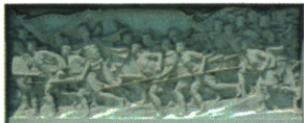

## 讲解

### 判据

材料出现起义、封王节制、攻占南京改名时，分别想到爆发、初步政权组织、定都三个节点。判断依动作及意义，而不是只背地点名；同一运动可以经过多地，重要地点不一定都是都城。

### 流程

1. 找主语和动词：1851金田武装起义、建号为爆发，后称天王不单独更换开端。
2. 见洪秀全封五王与节制关系，定为永安建制；它建立分工指挥，故有初步政权意义。
3. 核东王以下限定，不让节制范围扩至天王，称号也不当五块领土分封地图。
4. 见1853年3月南京改名天京并作为都城，定为政权中心确立；天京不要写成天津。
5. 按动作接意义而后排时序：形成组织可在定都前，定都也不等清统治已推翻。三项各有证据，不能由后来的都城倒改起义地。

## 例题

**原资料（J3-S02、S03，非独立题）：**攻克永安后，洪秀全封杨秀清为东王、萧朝贵为西王、冯云山为南王、韦昌辉为北王、石达开为翼王，东王以下诸王受东王节制，初步建立政权组织。1853年3月攻占南京，改名天京并定都。

**完整分析补写：**封王和节制关系建立权力分工及指挥关系，说明起义军已经开始组织政权；南京作为都城，则是以后确立统治中心的另一节点。原“东王以下”限定节制范围，不能把洪秀全天王也列成东王下属。金田是起义地，永安是初步建政权的节点，南京是后来都城；三个地点分别回答爆发、建制、定都的问题，天京也不是天津或清政府的北京。

**原资料（J3-S01，非独立题）：**鸦片战争失败加深清政府统治危机；剥削加重，统治阶级与劳动群众矛盾日益尖锐，农民反抗不断。1843年洪秀全创立拜上帝会，并与冯云山到广西传教，两年多发展会众两千多人。1851年1月11日，在广西桂平金田村发动武装起义，建号太平天国，军队称太平军，不久洪秀全称天王。

**原图说明（J3-S05，非独立题）：**人民英雄纪念碑《金田起义》浮雕再现上述起义的历史瞬间；原评价认为运动虽失败，却沉重打击清统治和外国侵略势力，加速封建王朝灭亡。

**完整分析补写：**战争失败与剥削加重说明矛盾为什么加剧，拜上帝会及传教说明分散的不满怎样得到组织，1851年的武装行动才是起义爆发。三层不能互相代替：有矛盾不等于起义已发生，1843年建会也不等于1851年建号。浮雕是后来对历史的艺术表现，不能把画面当当天现场摄影，或从人物数量推参加起义总人数。原作用评价不等于清朝在1851年立即灭亡。

## 易错

金田、永安、南京不互换；天王封东王不等东王能节制天王；有都城不同于全国取得胜利。

### 来源定位

- J3-S01：full.md（历史扫描分册101-150），L1661–L1669，金田起义背景拜上帝会准备与1851爆发；6484926a-d709-4079-96ba-4a8c4b0a1b00_origin.pdf，实际PDF第27页。
- J3-S02：full.md（历史扫描分册101-150），L1671–L1674，永安封王节制关系与初步政权；6484926a-d709-4079-96ba-4a8c4b0a1b00_origin.pdf，实际PDF第27页。
- J3-S03：full.md（历史扫描分册101-150），L1676–L1678，1853南京改天京都城；6484926a-d709-4079-96ba-4a8c4b0a1b00_origin.pdf，实际PDF第27页。
