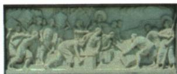

## 讲解

### 判据

纪念浮雕先用中文题注认事件，评价要接行动保护权益，不以动态群像便判战争。原题事件和评价两个任务分别答，销烟与战事、艺术再现与当场记录各需区分。

### 流程

1. 题注人民英雄纪念碑虎门销烟，确定事件而非按英文battle猜炮台战。
2. 事件配1839林则徐虎门公开销毁收缴鸦片，补行动对象。
3. 输入害健康财政防务，销毁反毒害与走私，说明保护民众国家权益的意义。
4. 按原答禁烟伟大胜利、反侵略意志与林民族英雄评价，不以一个称号省依据。
5. 浮雕是纪念艺术，人物数形态不作当时现场统计，销烟成功不证明全战获胜或所有走私绝迹。图注提供识别、原行动提供评价，二类证据不混。

### 方法依据与边界

题注定位事件，行动和背景提供评价依据，艺术图像本身不提供精确现场人员统计。虎门公开销毁走私鸦片针对非法贸易危害，体现维护权益与抗侵略立场；评价正义性要说明行动对象和目的，不能只凭后来发生战争便归罪禁烟。图的纪念意义可讲，不能将雕塑写成事件发生时的照片。

## 例题

**原题（J1-S05）：**此浮雕描述了哪一事件？你对该事件有何评价？

**原答案完整保留：**1839年林则徐下令将收缴鸦片在虎门海滩当众销毁。这是中国人民禁烟的伟大胜利，显示中华民族反抗外来侵略的坚强意志，林则徐是当之无愧的民族英雄。

**完整解析补写：**中文题注已标虎门销烟，先用题注确定事件，再联系1839禁烟行动。销毁收缴的鸦片回应走私危害，保护民众和国家权益，行动说明反侵略意志，支持原积极评价及人物称号。浮雕为纪念艺术，不是1839现场摄影，不能从刻画人物数量算现场全部人数；识图不沿自动英文battle scene误当虎门炮台抗英战斗。两者都有虎门和林关人物线索，但禁烟1839与战争1840后不同事件。

**原禁烟资料（J1-S02，非独立题）：**鸦片泛滥灾难促治理，1838年底道光派林则徐钦差到广东查禁；1839年6月3日至25日主持在虎门海滩当众销毁收缴鸦片。原意义为禁烟伟大胜利、反侵略坚强意志。

**分析补写：**派遣官员、查禁收缴、公开销毁是过程，打击的是走私和毒害，不是中国向英国发动战争。英国后来借禁烟出兵，不能由先后关系把侵略责任归于禁烟正当防卫，英国开市场的长期目的另见原原因。一次销烟成功不证明全国鸦片立即永久禁绝或后来战争已胜；原胜利具体指禁烟斗争的这次行动。

## 易错

销烟1839、战争1840起分开；原胜利在禁烟行动范围；纪念碑现代制作不改所纪念事件时代，也不当现场摄影。

### 来源定位

- J1-S02：full.md（历史扫描分册101-150），L1439–L1447，道光派林则徐禁烟与1839虎门销烟过程意义；6484926a-d709-4079-96ba-4a8c4b0a1b00_origin.pdf，实际PDF第23页。
- J1-S05：full.md（历史扫描分册101-150），L1464–L1476，人民英雄纪念碑虎门销烟浮雕原题事件评价与原答；6484926a-d709-4079-96ba-4a8c4b0a1b00_origin.pdf，实际PDF第23页。
