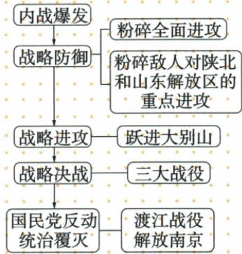

## 讲解

### 是什么

辽沈、淮海、平津是1948年9月至1949年1月战略决战中的三大战役，分别影响东北、长江中下游以北及华北。三大战役共同使国民党军主力基本被消灭，是全国胜利加速的重大军事条件。

### 怎么来的

战争不仅争取地盘，还要解决对方继续作战的主要兵力。三大战役在重要区域集中打击主力，改变全国力量对比，后续进军面对的主要阻力随之削弱，因此地域战果能影响全国进程。军队按战役任务行动，并非名称永远只对应一处：东北野战军在辽沈、平津表内都出现。平津中的北平和平解放兼顾城市人民与文物保护，不意味着整场决战没有武力作战。

### 什么时候能用

配对题须同时核名称、时间、部队、战果，材料问全国影响则解释主力削弱与继续战争能力。淮海原最大评价限定三大战役；原无详尽统计表不补歼敌计算。“基本”在主力、华北范围中必须保留。

## 例题

本课此项没有另列匹配的独立题；下面以完整原表或原陈述作辨析，不增加试题数量。单元原题另行接齐。

**原三大战役完整表（Y21-S06）：**

| 名称 | 原时间 | 参战部队 | 原战果 |
| --- | --- | --- | --- |
| 辽沈战役 | 1948年9—11月 | 东北野战军 | 解放东北全境 |
| 淮海战役 | 1948年11月至1949年1月 | 中原野战军、华东野战军 | 长江中下游以北广大地区获得解放 |
| 平津战役 | 1948年11月至1949年1月 | 东北野战军、华北军区部队 | 使华北全境基本解放 |

原总意义：国民党军队主力基本被消灭，大大加速全国胜利。原边栏（Y21-S07）说明：淮海是三大战役中规模最大、歼敌数量最多、政治影响最大、战争样式最复杂的战役；和平解放城市是北平，和平解放避免不必要伤亡、保护文物古迹。

**完整分析补写：**首先核同一军队可以参与不同战役：东北野战军既在辽沈列，也在平津列，不能只凭其名称排除其中一个。再按战果地区分别确定各战役，三处重要兵力集团遭到打击，使敌军继续进行全国战争的能力大幅削弱，故影响不只是一城得失。原“主力基本”不等全部敌军清零，原“华北全境基本”也不能删“基本”。淮海比较保留“三大战役中”的范围，原未提供三战详尽人数表，不能据此自造歼敌数字。北平是当时城名，后来称北京，不能理解为两座地理上完全不同的城市。

**原解放战争进程图（Y21-S11）：**

**按原图还原：**内战爆发后进入战略防御，粉碎全面进攻、粉碎陕北山东重点进攻都置于这个阶段；跃进大别山对应战略进攻，三大战役对应战略决战，渡江解放南京对应国民党反动统治覆灭。原图左列顺序是阶段或结果，右列是相应行动，不能把每一条横线都读成相邻事件直接因果。自动识别将“粉碎全面进攻”接到“内战爆发”单独节点，已按原图归回战略防御。

**完整分析补写：**同是人民解放军作战，阶段功能不同：防御时削弱来犯力量；向对方控制区战略进攻改变战场布局；战略决战集中解决主要军事力量；渡江进一步攻向统治中心。全过程不能只背几个事件名，也不能因防御中有主动进攻就否认其全国阶段仍属防御。

## 易错

东北野战军参两战不矛盾；北平为当时北京的名称，不能因现代城名误写历史题。三战主力基本消灭不等全部残余已消失。

### 来源定位

- Y21-S06：full.md（历史扫描分册151-200），L1856–L1862，三大战役时间部队战果及主力基本消灭；7315c71c-e0f3-499f-a65f-f5d33fed3468_origin.pdf，实际PDF第33页。
- Y21-S07：full.md（历史扫描分册151-200），L1891–L1897，淮海限定比较与北平和平原解释；7315c71c-e0f3-499f-a65f-f5d33fed3468_origin.pdf，实际PDF第33页。
- Y21-S11：full.md（历史扫描分册151-200），L1899–L1920，进程原图与自动图错接全面进攻；7315c71c-e0f3-499f-a65f-f5d33fed3468_origin.pdf，实际PDF第33页。
