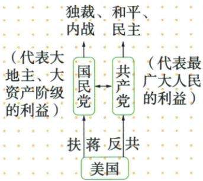

## 讲解

### 是什么

本课把1946年6月国民党军队围攻中原解放区作为全面内战爆发标志；1946年10月占领张家口则是全面进攻达到最高峰。一个回答全面战争何时爆发，一个回答这一轮进攻发展到什么程度。

### 怎么来的

原背景把不执行和平协议、美国支持和基本完成部署连接起来：军事准备使原本谋划的内战转为大规模行动，围攻中原是其具体表现。其后国民党军队继续占地，张家口的失守被原书用于标识攻势高峰。日期必须同动作和地点一起判断，不能只按“都在1946年”合并事件。

### 什么时候能用

用于全面内战起点、高峰和战前部署材料。政治局势图可帮助区分主张和支持方向，但不能仅凭箭头推具体兵力与援助额；“全面内战爆发”也不等此前绝无局部冲突。

## 例题

本项原资料没有另列匹配的独立题。下面完整保留原表或原陈述作辨析，不将它另计为一道试题。

**原内战三项（Y20-S03）：**背景：国民党不执行政协协议，在美国支持下基本完成内战部署。爆发：1946年6月围攻中原解放区，发动全面内战。高峰：1946年10月占领华北解放区重镇张家口，全面进攻达到最高峰。

**原局势图（Y20-S05）：**

**读图与解析补写：**原图把国民党概括为代表大地主、大资产阶级利益，其主张为独裁、内战；共产党概括为代表最广大人民利益，其主张为和平、民主。图下方美国的“扶蒋反共”箭头指向国民党。先确认这三个主体，再按文字说明读支持方向，不能照自动识别将美国说成代表广大人民，或将和平主张移给国民党。图概括的是本书对战后政治局势的解释，不能单凭一个箭头编造具体援助数额。

**时序分析补写：**美国支持与部署属于发动全面内战的条件；围攻中原解放区是本课所列全面内战爆发标志；占领张家口是其后全面进攻高峰。6月和10月不仅日期不同，事件功能也不同。原“全面”限定战争规模阶段，不能推断1946年6月以前任何地方都完全没有军事冲突。

## 易错

中原不是张家口，爆发不是高峰。图中的美国支持箭头不能倒读为共产党支持美国，也不能把美国替换为人民利益代表。

### 来源定位

- Y20-S03：full.md（历史扫描分册151-200），L1747–L1753，全面内战部署中原爆发与张家口高峰；7315c71c-e0f3-499f-a65f-f5d33fed3468_origin.pdf，实际PDF第31页。
- Y20-S05：full.md（历史扫描分册151-200），L1761–L1779，抗战胜利局势原图与错误自动图解；7315c71c-e0f3-499f-a65f-f5d33fed3468_origin.pdf，实际PDF第31页。
