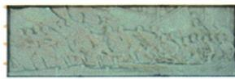

## 讲解

### 判据

遇到纪念碑《胜利渡长江》图或百万雄师过江，先辨史实对象，再解释南京的政治地位与覆灭意义，不凭几条帆船认任意渡河。

### 流程

1.图注限定人民英雄纪念碑的渡江浮雕，这是艺术再现，保原20余人说明。

2.原文连接1949四月百万三路横渡长江和南京解放，图中少量人物不改变所表现的战役规模。

3.南京作为统治中心，其解放说明原反动统治覆灭，政治意义有地点功能依据。

4.将政治标志与残余武装、后续地域工作分开，原退台内容完整保留；不能说所有问题当日结束。

## 例题

本课此项没有另列匹配的独立题；下面以完整原表或原陈述作辨析，不增加试题数量。单元原题另行接齐。

**原渡江战役（Y21-S08）：**1949年4月，人民解放军百万雄师兵分三路横渡长江，解放南京，宣告国民党反动统治覆灭；国民党残余势力退往台湾。

**原常考图片与说明（Y21-S12，未另设问）：**

原说明：《胜利渡长江》表现百万雄师渡长江的历史场景，整幅虽只有20余人、数只帆船、几朵浪花，却有千军万马、千帆竞渡的气势。

**完整分析补写：**先用图注明确这是纪念碑艺术作品，再以渡江动作联系1949年战役与南京解放；图中人物个数是艺术表现的选择，不能拿20余人否定实际战役“百万雄师”的规模。南京是国民党统治中心，解放南京因此具有宣告其反动统治覆灭的政治意义。这个意义并不证明所有残余武装当日全部消失、所有地区问题同日已解决；原紧接残余退台，本身就表明仍有后续。

### 第七单元原第5题完整原题原答与逐项依据

**单元跨语文原题（加工编号5，原页未写数字题号，Y7-Q05，原标2023湖南张家界中考）：**“钟山风雨起苍黄，百万雄师过大江。虎踞龙盘今胜昔，天翻地覆慨而慷。宜将剩勇追穷寇，不可沽名学霸王。天若有情天亦老，人间正道是沧桑。”该诗反映的历史事件是（ ）。

A.南京解放；B.跃进大别山；C.百团大战；D.淞沪会战。

**原答案A。完整原解：**材料出自《七律·人民解放军占领南京》，“过大江”指横渡长江；1949年4月人民解放军渡江、解放南京，宣告国民党反动统治覆灭。

**完整推理补写：**先抓能定位的“百万雄师过大江”，将军队规模、渡长江动作与课文1949渡江联系；再由诗题和钟山、虎踞龙盘所在南京确认城市，不只用“战斗激烈”匹配任何战争。原“天翻地覆”表达重大变化，结合南京统治中心的解放解释政治意义，但诗歌艺术语言本身不是各路兵力或战役每日时间的统计证据。余勇与追击也不能改成诗题已经陈述所有残余武装当日被清零。

**四项完整解析补写：**

- A（对）：百万渡长江、钟山南京及原诗题均与1949南京解放一致，动作与地点共同支持。

- B（错）：刘邓1947强渡黄河跃大别山，未对应原诗南京渡长江的动作地点与政治标志。

- C（错）：1940百团为八路军破袭交通及据点，不是1949百万渡长江南京解放。

- D（错）：1937淞沪为上海抗战会战，军队行动、地点和战争阶段与南京解放不符。

考试年份地区及中考、节选等标签按原书记录，未另行核定真题身份。

## 易错

现代纪念作品不能冒称1949现场照片；只据浮雕人数计算总兵力，是把艺术表达换成统计记录。

### 来源定位

- Y21-S08：full.md（历史扫描分册151-200），L1864–L1864，渡江三路南京解放与残余退台；7315c71c-e0f3-499f-a65f-f5d33fed3468_origin.pdf，实际PDF第33页。
- Y21-S12：full.md（历史扫描分册151-200），L1922–L1928，胜利渡长江浮雕原图图注20余人艺术说明；7315c71c-e0f3-499f-a65f-f5d33fed3468_origin.pdf，实际PDF第33页。
- Y7-Q05：full.md（历史扫描分册151-200），L2026–L2038，无原数字题号跨语文诗歌四项原解原A；7315c71c-e0f3-499f-a65f-f5d33fed3468_origin.pdf，实际PDF第35页。
