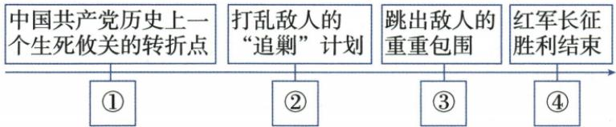

## 错法

都是长征胜利进展便将四渡赤水、渡金沙作用互换，中央到吴起便说三大主力全完。错在直接作用和参与范围没核。

## 正解

原赤水等机动打乱追剿，金沙跳出包围，两行动作用逐句配。吴起1935十月为中央陕北会师，最终1936十月会宁等为一二四三大主力，后者才宣全长征结束。两个同十月仍保年份，等地区不压每支全同地点；阶段进展重要却不能代替全体标志。

## 例题

本条没有另列独立题；以下按原陈述或完整表格分析，陈述不增算题量。

**原前后历程（Y15-S04、S06，非独立题）：**开始突围西进，冲破四道封锁线渡湘江，进贵州强渡乌江，攻克遵义。后毛泽东指挥四渡赤水、佯攻贵阳、威逼昆明，打乱追剿计划；挥师北进渡金沙江，跳出重重包围；强渡大渡河、飞夺泸定桥；过雪山草地，突破腊子口进入甘肃。

**完整分析补写：**路线题不能只背河名，要把行动与直接作用配对。四渡赤水等机动作战使敌方难按原计划追剿，渡金沙江则是跳出重重包围的节点，两个原作用不能交换。大渡河、泸定桥为继续前进中的渡河通道和战斗任务，雪山草地为自然环境困难，腊子口为后续突破节点；军事障碍和自然困难不属于同类原因，解释要分清。原文是概括历程，不提供每支部队每一日详细路线，不能将所有红军主力说成全程同一天同一路；“四渡”也不推每次都从同一地点渡、各次损失完全相同。

初期湘江、乌江在遵义前，赤水金沙等在后，先后需要本课原段互证。打乱追剿不等敌军从此永久不追，跳出当时包围也不等长征马上全部结束；最终会师须另按1935、1936区别。

**原完整会师表与易错（Y15-S07、S09，非独立题）：**1935年10月，中共中央带中央红军到陕甘根据地吴起镇，与陕北红军会师。1936年10月，红二、红四方面军到甘肃会宁等地区，与前来接应的红一方面军会师；三大主力会师宣告长征胜利结束。原易错明确结束标志是会宁会师，不是吴起镇会师。

**完整分析补写：**吴起是中央红军到达后的节点，1936会师涵盖三大主力，评价范围不同，因此前者不能替全体长征结束标志。两者同在10月但年份相差一年，不能省年份。原“会宁等地区”保留地点范围，不将二、四全部具体会师压成同一个地点同一天；原书会宁会师是对三大主力会师的概括名称。1935的中央与陕北、1936的一二四主力分别写明，不能把1935参与者改成三大主力全齐。两次会师都是重要进展，后一次作为全体结束标志不否前次的胜利意义。

### 单元原题4四格作用与选择直接反证

**单元原题4（原书标签：2024山东青岛中考，未另核真题身份）：**在“重走长征路·忆峥嵘岁月”的研学活动中，某同学制作了以下路线图（部分）。下列与图中①②③④处对应正确的是（ ）

A. ①渡过金沙江  
B. ②遵义会议  
C. ③四渡赤水  
D. ④会宁会师

**原答：D。原详解完整保留：**1935年1月遵义会议是生死攸关转折，①遵义会议；其后四渡赤水打乱追剿，②四渡赤水；渡金沙江跳出重重包围，③渡金沙江；1936年10月会宁会师宣告长征结束，④会宁会师。

**逐项解析补写：**先将原图每格功能转为事件，不能把选项里的熟悉事件都当正确。A：①原格生死转折，对应遵义，不是金沙，故错。B：②是打乱追剿，对应四渡赤水，不是会议，故错。C：③跳出重围对应金沙，不是赤水，故错。D：④全体结束对应1936三主力会宁等，正确。1935吴起仅中央红军阶段节点，不能替④。

原图已对实际14页：四个作用格沿同一线路排列，各自下连编号。自动Mermaid拆成四组独立箭头，丢失原图结构，正文保压缩原图；这是部分作用路线，不能从图扩成所有主力全程同路同日或计算里数。

### 来源定位

- Y15-S06：full.md（历史扫描分册151-200），L749–L751，四渡赤水金沙大渡泸定雪山草地腊子口历程；7315c71c-e0f3-499f-a65f-f5d33fed3468_origin.pdf，实际PDF第12–13页。
- Y15-S07：full.md（历史扫描分册151-200），L753–L755，吴起与会宁等三主力完整会师表；7315c71c-e0f3-499f-a65f-f5d33fed3468_origin.pdf，实际PDF第13页。
- Y15-S09：full.md（历史扫描分册151-200），L807–L809，错排课末侧栏会师结束界限；7315c71c-e0f3-499f-a65f-f5d33fed3468_origin.pdf，实际PDF第13页。
- Y5-Q04：full.md（历史扫描分册151-200），L803–L865，部分路线图选择题4跨页题干原图四项自动图；7315c71c-e0f3-499f-a65f-f5d33fed3468_origin.pdf，实际PDF第13–14页。
- Y5-A04：full.md（历史扫描分册151-200），L833–L837，选择题4原完整四节点解析及原答D；7315c71c-e0f3-499f-a65f-f5d33fed3468_origin.pdf，实际PDF第14页。
