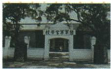

## 错法

看到“加入国民党”便以为共产党整个取消并入，或看到黄埔合作成果便答它标志正式建立。容易混淆，是只抓加入、合作两个词，省掉行为主体和节点功能。

## 正解

原主体是共产党员个人，同时保持共产党思想、政治、组织独立；革命同盟扩大力量，不等所有利益思想完全同一。1923年中共三大决定，1924年1月国民党一大正式建立，5月黄埔为成果。要同时读主体、独立性、日期和意义，不能用熟悉的军校图片顶替题问的大会标志。

## 例题

资料没有为本条另列独立题；以下保留原书陈述、表格或配图作辨析材料，不另计题量。

**原资料（Y13-S01、S02，非独立题）：**1923年6月，中共三大在广州召开，正式决定同孙中山领导的国民党合作，建立革命统一战线。共产党员以个人身份加入国民党，把国民党改造为工人、农民、小资产阶级和民族资产阶级的革命同盟。孙中山经历多次反对北洋军阀斗争失败，认识到必须改组国民党、注入新鲜血液。原易错提示明确：共产党员保持思想上、政治上和组织上的独立性，合作不是两党合并。

1924年1月，国民党一大在广州召开，孙中山主持；李大钊、林伯渠、毛泽东、瞿秋白等共产党员参加。大会对三民主义作出新解释，实际上确立联俄、联共、扶助农工三大政策。原书以国民党一大作为第一次国共合作正式建立的标志，国民革命由此开始。

**完整分析补写：**先区分双方为什么寻求合作：共产党此前工运受镇压，认识到需要更多同盟者；孙中山也需要改组政党、扩大力量。共同反对军阀的目标使合作有现实基础。再区分程序：中共三大是共产党作出合作决定，国民党一大则使改组和合作正式落实，不能把“决定合作”提前讲成已经正式建立。最后核对方式：党员个人加入国民党，并不取消共产党的组织和政治独立；革命同盟是扩大支持范围，也不表示参加的各阶级从此利益和思想完全一致。

**原黄埔表及图片（Y13-S03、S04，非独立题）：**苏联和中国共产党给予帮助。1924年5月，孙中山在广州黄埔创办中国国民党陆军军官学校，又称黄埔军校。孙中山兼任军校总理，廖仲恺任党代表，蒋介石任校长，周恩来不久后担任政治部主任。军校培养大批军事、政治人才，为国民革命军建立和随后北伐作准备。

原书称这是国共合作的重要成果，还提到常与郑州二七纪念塔、南昌起义绘画组合，表现从单枪匹马到合作再到对立。本课没有同时给出另外两张题图，因此只保留黄埔原图与这段说明，不补造一道三图题。

**完整分析补写：**先由图片原说明识别黄埔军校，再联系苏联、共产党帮助与不同领导职务，说明合作有具体组织和人才培养成果。军事训练提供作战人员，政治教育和组织工作有助于联系共同目标，这些准备支持革命军与北伐，不能反推军校成立当日北伐已经开始。正式合作标志是同年1月国民党一大，军校是5月的成果。孙中山的“总理”在此是军校职务，不能换作某届国家政府总理；原“周恩来不久后”保留先后，不把所有人员任职都定在同一天。旧址照片可识地点，不等1924创办当天的现场照片。

### 单元原题1与各不合选项的具体错位

**单元原题1（原书标签：2024河南中考，未另核真题身份）：**1924年，李大钊代表中国共产党在某次会议上发言并指出：共产党员的加入，是为贡献于国民革命事业而来的。该会议的召开标志着（ ）

A. 工人运动的高涨  
B. 国共合作的实现  
C. 黄埔军校的建立  
D. 北伐战争的爆发

**原答：B。原详解完整保留：**1924年1月，国民党一大在广州召开，李大钊等共产党员参加大会领导和组织工作；国民党一大标志两党合作正式建立。

**逐项解析补写：**看到1924、李大钊和党员加入，接国民党一大改组合作，题问会议标志。A：工运高潮本课前段为1922初至1923春及京汉罢工，不是此会原意义；不能说此前不存在工运。B：大会正式建立合作，人物、年份、党员加入与标志均合，正确。C：黄埔是同年5月合作成果，军校创办不是这次大会的正式标志，时间同年不使事件相同。D：北伐1926年7月开始，属于后续行动，不与1924会混同。中共三大1923决定合作为前一步，也不替换题中正式会议；党员个人加入且保持党独立，不是两党合并。

### 来源定位

- Y13-S01：full.md（历史扫描分册151-200），L452–L483，党内合作方式与中共三大双方合作背景；7315c71c-e0f3-499f-a65f-f5d33fed3468_origin.pdf，实际PDF第8页。
- Y13-S02：full.md（历史扫描分册151-200），L485–L489，国民党一大标志内容意义；7315c71c-e0f3-499f-a65f-f5d33fed3468_origin.pdf，实际PDF第8页。
- Y13-S03：full.md（历史扫描分册151-200），L456–L461，黄埔原图职务创办成果与人才准备；7315c71c-e0f3-499f-a65f-f5d33fed3468_origin.pdf，实际PDF第8页。
- Y13-S04：full.md（历史扫描分册151-200），L491–L495，黄埔军校完整表；7315c71c-e0f3-499f-a65f-f5d33fed3468_origin.pdf，实际PDF第8页。
- Y5-Q01：full.md（历史扫描分册151-200），L767–L777，国民党一大选择题1原题四项答案完整详解；7315c71c-e0f3-499f-a65f-f5d33fed3468_origin.pdf，实际PDF第13页。
- Y5-A01：full.md（历史扫描分册151-200），L819–L823，选择题1原详解及原答B；7315c71c-e0f3-499f-a65f-f5d33fed3468_origin.pdf，实际PDF第13页。
