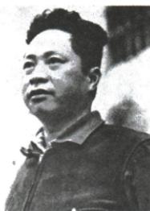

## 讲解

### 是什么

叶挺是国民革命军第四军独立团团长，独立团以共产党员为骨干，在北伐中发挥先锋作用，其战斗贡献为第四军赢得铁军美誉。团与军是所属不同层级。

### 怎么来的

革命组织、军事培养需要通过战场行动表现，本课独立团的骨干、英勇作战和屡破强敌是党员先锋作用的具体例证。独立团为第四军所属单位，团的贡献与全军称誉可以相接，却不能把团长身份提升成军长或把所有北伐军都叫铁军。原画像需靠原人物说明识别，不能单凭衣着推出姓名；履历1924赴苏、次年回国提供时间线，“次年”由1924确定为1925。“其间加入共产党”限定学习期间，没有精确到赴苏当天。评价先锋说明重要作用，不说明整个北伐仅靠叶挺一人就能成功。

### 什么时候能用

人物题结合画像原说明与部队作用，原因题可用作党员先锋的具体依据。未给的某场战斗人数、职务、入党具体日期不自行写为原证据。

## 例题

资料没有为本条另列独立题；以下保留原书陈述、表格或配图作辨析材料，不另计题量。

**原叶挺画像及介绍（Y13-S11，非独立题）：**

叶挺（1896—1946），广东惠阳人。1924年8月下旬赴苏联学习，其间加入中国共产党；次年回国，任国民革命军第四军独立团团长。独立团以共产党员为骨干，是北伐军主力先锋，屡破强敌，为第四军赢得“铁军”美誉；叶挺成为北伐名将。原书提示常将画像与北伐胜利进军联系考查。

**完整分析补写：**先凭原说明确认人物，不能只凭衣着猜所有军人姓名；再接独立团的所属和作用：团属于第四军，党员骨干与英勇战斗支持先锋作用，其贡献使第四军获得美誉。所属层级是“第四军—独立团”，贡献与称誉的对象不同，不能把团长改成全军军长或把全部北伐军都叫铁军。画像和介绍能够支持人物、部队、时期的联系，不证明所有战役都由叶挺一人决定。原“其间加入”只限定赴苏学习期间，不把入党时间精确到赴苏同一天；“次年”根据前句1924年，指1925年。

### 北伐第四军与井冈会师后第四军不凭序号合并

**原创建及会师（Y14-S06，非独立题）：**1927年10月，毛泽东率起义部队到井冈山，开始创建中国第一个农村革命根据地，拉开城市转农村、建立根据地序幕。1928年4月，朱德、陈毅率南昌起义部分队伍和湘南工农武装，与毛泽东的工农革命军会师。合编中国工农革命军第四军，不久改称中国工农红军第四军；会师后武装斗争使井冈根据地巩固、扩大。

**完整分析补写：**先区分建立和会师：根据地在1927年开始创建，会师在1928年加强已有力量，不把会师改为首次创建。会师双方有不同来源，朱陈一方包括南昌部分队伍和湘南武装，毛一方为工农革命军；部分二字不能删成南昌全部队伍都到同一地点。联合后合编有利统一组织行动，支持根据地巩固，不能只背人物却不说明部队力量为何增强。

军名按先后变化，第四军序号相同不等它与北伐时期国民革命军第四军为同一性质、同一时点的机构。本课后面说1930年赣南闽西中央根据地面积最大，井冈山“第一个”按创建先后，中央“最大”按规模，两类不能互换。

### 第17课叶挺新四军长与北伐独立团長不同阶段

**原军队改编（Y17-S05，非独立题）：**中国工农红军主力改编国民革命军第八路军，朱德总指挥、彭德怀副总指挥；长征后留在南方八省的游击队改编国民革命军陆军新编第四军，叶挺军长。

**完整分析补写：**共同抗日需要军队在全国军事组织中有适合合作的名义，改编调整番号、对外组织关系，使革命武装参与联合抗战，不等党取消自身组织领导。来源必须两栏配：八路军红军主力，新四军南方留存游击队，不能说新四军全部是中央红军刚完成长征回来。朱彭正副职分开，叶挺新四军军长与北伐时第四军独立团团长属于不同时期、不同部队层级；新编第四军不能只因第四序号就合井冈工农第四军或北伐第四军。党外合作是政党之间联合，名义军改与党组织独立属于不同层次。原本段未给编制、师数和改名具体日，不补为题条件。

## 易错

团长不是全军军长；独立团贡献为第四军称誉，不将军团同名；次年有前句年份依据，其间不是同日。

### 来源定位

- Y13-S11：full.md（历史扫描分册151-200），L544–L556，叶挺原像生卒履历独立团第四军铁军；7315c71c-e0f3-499f-a65f-f5d33fed3468_origin.pdf，实际PDF第9页。
- Y13-S05：full.md（历史扫描分册151-200），L463–L469，北伐胜利原因原设问及五点原答；7315c71c-e0f3-499f-a65f-f5d33fed3468_origin.pdf，实际PDF第8页。
- Y14-S06：full.md（历史扫描分册151-200），L637–L647，井冈根据地创建与会师来源名称影响；7315c71c-e0f3-499f-a65f-f5d33fed3468_origin.pdf，实际PDF第11页。
- Y17-S05：full.md（历史扫描分册151-200），L1131–L1138，第二次合作背景军队来源改编职务正式建立；7315c71c-e0f3-499f-a65f-f5d33fed3468_origin.pdf，实际PDF第20页。
