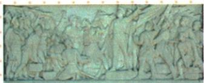

## 讲解

### 是什么

失败的客观原因是反动势力打击、叛变与合作破坏；主观原因是党缺乏经验、理论与实际结合不足及右倾机会主义错误。教训分别涉及革命领导、掌握武装和斗争方式。

### 怎么来的

敌方暴力打击是外部压力，自身判断、组织和应对能力则影响能否主动抵抗，两层需一起看。原党年幼经验不足，不只是年龄标签，而是认识国情、判断合作中的利益冲突、应对危机的能力仍需发展；右倾机会主义在此指妥协退让造成主动性不足，不用作所有右派的统一定义。失败说明合作口号不能代替现实自主条件：领导权使革命力量能确定目标与行动，掌握武装使其有抵抗镇压的力量，坚持武装斗争使力量能够转化为斗争行动。三项各有功能，相互支持；不能只答一个“武装”便省掉领导与行动方式。

### 什么时候能用

区分敌方行为与自身应对，不能把全部失败只归一方。教训联系本课具体镇压，不凭它反推1921已确立后来完整道路，也不补原表未列的会议、兵力或个人责任。

## 例题

资料没有为本条另列独立题；以下保留原书陈述、表格或配图作辨析材料，不另计题量。

**原失败原因与教训表（Y13-S13，非独立题）：**客观方面，中外反动势力联合绞杀，国民党内反动集团叛变，国共合作遭破坏；主观方面，年幼的中国共产党缺乏革命理论修养、实践经验，还不善于把马克思主义基本原理与中国实际结合，犯右倾机会主义错误，在危急时刻陷入被动。教训是坚持无产阶级对革命的领导权、掌握革命武装、坚持武装斗争。

**完整分析补写：**先区别来自敌方的打击和自身应对不足。反动集团掌握强制力量并破坏合作，群众组织、革命者受到直接压制；党缺乏经验、对实际局势和利益冲突的判断与应对不足，就难以主动防范这种危险。本课“右倾机会主义”可理解为妥协退让造成革命主动性不足，不能把它当一切右派思想的通用定义，也不能据此说党在此前没有任何贡献。

再从失败条件推出教训：只有共同口号和合作关系，未必足以保障革命自主；保持领导权有助于决定目标和行动，掌握武装使革命力量有抵抗镇压的实际条件，坚持武装斗争说明不能只寄希望于对方不会动用暴力。三项相连但不同：谁作决定、有没有力量、怎样使用斗争方式，不可只背“武装”一词。党内合作要求独立性与失败后强调领导、武装并不矛盾，前者讲组织政治原则，后者进一步强调原则需要现实力量支持。本课没有另列具体会议决议、兵力比例或某人的全部责任，不自行添为原题条件。

### 第14课独立武装与根据地建设回应失败教训

**原起义陈述（Y14-S01、S02，非独立题）：**反动派血腥屠杀引起共产党和群众反抗，大革命失败使党认识到掌握革命武装的重要性。1927年8月1日南昌起义，周恩来、贺龙、叶挺、朱德、刘伯承等领导。原意义是打响武装反抗国民党反动派第一枪，标志党独立领导革命战争、创建人民军队、武装夺取政权的开端。原易错明确，起义时党领导的军队仍称国民革命军，尚未明确提出自己军队的名称。

原浮雕说明：以起义部队的一支表现宏大场景，刻画21个人物形象，以神态表现信心、希望。

**完整分析补写：**从遭受镇压到组织武装反抗，说明党不再仅依靠原合作关系保护革命，而开始独立领导革命战争。意义中的第一枪限定“武装反抗国民党反动派”，不是中国历史第一场战争，也不是此前从无革命军队。创建开端说性质和领导实践的开始，不要求起义当天军队名称就已改成红军。浮雕是纪念艺术，21指作品形象数，不是起义参与总人数；图可联系纪念主题，不能把雕刻当当日现场照片或凭造型认每个真实人物。

**原定义与实践（Y14-S07、S12、S14，非独立题）：**工农武装割据是在共产党领导下，以武装斗争为主要形式、土地革命为中心内容、农村革命根据地为战略阵地的三者结合。井冈山实践为打土豪、分田地，开展土地革命，建立工农民主政权，坚持游击战争。原土地革命限定1927—1937年党在农村根据地开展打土豪、分田地、废封建剥削、满足农民土地要求的革命；其他领导人随后在各地建立发展根据地。

**完整分析补写：**武装斗争抵抗敌方进攻，给土地革命、政权活动提供保护；土地革命回应农民利益，有助得到群众参与，使武装不是孤立行动；根据地提供持续组织、生产和斗争的阵地，使前两项有稳定依托。三者相互支持，都在共产党领导下，不能只把割据解释成军队占山，或将土地革命换成单纯军事战役。割据在这里指敌方统治包围中的局部革命政权与阵地，不等旧军阀为私人地盘混战；建立地方革命力量与最终全国革命目标相接。原土地革命的时段、地点、主体有限定，不将其与其他时期每次土地政策都混为同一事件，也不由“土地革命”一词判断所有土地马上共有化。

### 单元原题2最主要教训及原没有武装表述范围

**单元原题2：**国民革命运动的失败给中国共产党的最主要教训是（ ）

A. 坚持对革命的领导权，掌握革命武装力量  
B. 建立革命统一战线，坚持武装斗争  
C. 制定正确的革命路线和纲领  
D. 与右倾机会主义路线决裂

**原答：A。原详解完整保留：**中国共产党没有独立领导革命战争，没有掌握革命武装力量，使党在大革命危急时刻被动。这是失败留下的最深刻教训。

**逐项解析补写：**看到最主要教训，连接叛变镇压时为何难主动应对。A：独立领导和掌握武装直指自主决策、抵抗力量两个关键条件，最贴原主旨。B：统一战线、武装斗争有意义，但合作已经实践，选项未突出独立领导与掌握力量，不能替原最深刻教训，也不把建立联盟说成完全错误。C：正确路线纲领有必要，但本课前二大已明确反帝反封建民主纲领，不能将失败归为从未有任何正确纲领；本题最主要针对领导、武装。D：纠正右倾错误必要，是主观问题之一，表述仍未完整概括独立领导和实际武装条件，故不如A。

**原解析的范围：**“没有独立领导、没有掌握”强调没有形成足以自主领导全局、应对镇压的条件，不能扩大成共产党完全没有参加任何军事政治工作、党员没有任何部队作用；原叶挺独立团、黄埔政治工作和北伐先锋贡献必须保留。教训同时有坚持武装斗争，A是原选项最合，不为追求字面全抄另改题目。

## 易错

合作原则上的独立需要实际能力支持，不等两党合并；党有贡献与犯错误可以同时成立，不因错误否定前面全部活动。

### 来源定位

- Y13-S13：full.md（历史扫描分册151-200），L564–L566，国民革命主客观失败原因与领导武装教训；7315c71c-e0f3-499f-a65f-f5d33fed3468_origin.pdf，实际PDF第10页。
- Y13-S08：full.md（历史扫描分册151-200），L518–L528，反动集团叛变原因表现结果与社会性质；7315c71c-e0f3-499f-a65f-f5d33fed3468_origin.pdf，实际PDF第9页。
- Y13-S01：full.md（历史扫描分册151-200），L452–L483，党内合作方式与中共三大双方合作背景；7315c71c-e0f3-499f-a65f-f5d33fed3468_origin.pdf，实际PDF第8页。
- Y14-S01：full.md（历史扫描分册151-200），L586–L608，南昌军队名称与浮雕原图21形象说明；7315c71c-e0f3-499f-a65f-f5d33fed3468_origin.pdf，实际PDF第10页。
- Y14-S02：full.md（历史扫描分册151-200），L610–L619，南昌起义背景时间人物完整意义；7315c71c-e0f3-499f-a65f-f5d33fed3468_origin.pdf，实际PDF第10页。
- Y14-S07：full.md（历史扫描分册151-200），L649–L654，工农武装割据实践三者定义土地革命限期；7315c71c-e0f3-499f-a65f-f5d33fed3468_origin.pdf，实际PDF第11页。
- Y14-S12：full.md（历史扫描分册151-200），L691–L697，土地革命限期武装割据三者与临时中央政府定义；7315c71c-e0f3-499f-a65f-f5d33fed3468_origin.pdf，实际PDF第11页。
- Y5-Q02：full.md（历史扫描分册151-200），L779–L789，失败教训选择题2原题四项；7315c71c-e0f3-499f-a65f-f5d33fed3468_origin.pdf，实际PDF第13页。
- Y5-A02：full.md（历史扫描分册151-200），L825–L827，选择题2原详解及原答A；7315c71c-e0f3-499f-a65f-f5d33fed3468_origin.pdf，实际PDF第13页。
