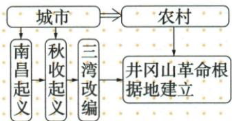

## 讲解

### 是什么

秋收起义1927年9月由毛泽东在湘赣边界发动，打出工农革命军旗帜。攻城受挫后，改向敌方统治薄弱山区，是保存力量、调整道路的行动。

### 怎么来的

行动原来瞄准中心城市，县城战斗挫折暴露敌方控制和双方力量条件；若机械重复原计划，会继续损耗力量。改变行动区域是为了使革命力量能够生存、组织群众，而非放弃革命目标。山区统治薄弱留下组织和根据地建设空间，后续再结合土地革命、武装与政权工作形成农村道路。这是从实际结果调整策略，不是先有现成完整路线再机械执行。原图概括城市向农村，不推南昌和秋收全部队伍同一行程；两次起义的领导地点仍分开。

### 什么时候能用

解释转向需写受挫、保存力量和农村条件三环。原开始比较顺利不能删，放弃当前攻长沙不等以后永不进入城市。

## 例题

本条没有另列匹配的独立题；按原陈述、完整表格或图示展开辨析，不把它们增算成试题。

**原秋收完整表及示意（Y14-S04、S10，非独立题）：**1927年9月，毛泽东在湘赣边界发动秋收起义，打出工农革命军旗帜。开始比较顺利，攻打浏阳等县城受严重挫折；为保存力量，放弃攻打中心城市长沙计划，转向敌人统治薄弱的山区。

**原图核对与完整分析补写：**原图上方城市指向农村，下方连列南昌起义、秋收起义、三湾改编和井冈山根据地建立；自动提取的Mermaid把三湾也画成城市直接分支，不能准确表达原图连接，正文采用原图。图是道路转向的概括，不能将连列读成南昌和秋收是同一次起义、所有部队始终同一路行军。

先看为何改计划：中心城市受敌方控制，原攻城受挫；继续原目标会增加损失，保存力量就需要改变行动区域。再看转向依据：山区敌人统治薄弱，给组织、群众工作和根据地建设留下条件。转向是结合实际调整，并不是最终目标改成永远不进城市；农村包围城市是先建设力量再谋取政权的道路。不能将受挫说成起义从第一刻全无进展，原表明确开始比较顺利。

## 易错

南昌军名与秋收旗帜有不同记录；原图流程不能当所有部队同路，更不能照抄错误自动图连线。

### 来源定位

- Y14-S04：full.md（历史扫描分册151-200），L628–L630，秋收起义旗帜受挫放弃长沙转山区；7315c71c-e0f3-499f-a65f-f5d33fed3468_origin.pdf，实际PDF第10页。
- Y14-S10：full.md（历史扫描分册151-200），L667–L683，城市农村原示意图及错误自动Mermaid；7315c71c-e0f3-499f-a65f-f5d33fed3468_origin.pdf，实际PDF第11页。
