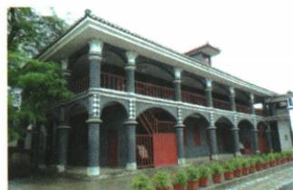

## 讲解

### 判据

会址题先用原说明认会议；问地位连接长征危急和纠错后的行动条件，不能只答建筑名或把开始说完全形成。

### 流程

1.原图说明遵义，会议1935一月政治局扩大，非凭任意两层楼外形判断。2.第五失利初期危急解释为何需解决军事组织错误。3.肯定毛主张、增选常委、取消博古李德最高军事指挥权，说明指挥方向改变。4.两开始、三挽救接生存发展转折，原地位完整答生死攸关转折点。5.原常委不拓国家主席或总书记，纠错不等当日所有问题自动解决；会址图不证明现场细节。

## 例题

**课内原图问答（Y15-S02）完整保留：**

图中会议在中国共产党历史上具有怎样的地位？

**原答：**1935年1月召开的遵义会议是中国共产党历史上一个生死攸关的转折点。

**原完整会议表（Y15-S05）：**1935年1月，中央在遵义召开政治局扩大会议，集中解决博古等军事、组织上“左”的错误，肯定毛泽东正确军事主张，增选其为中央政治局常委，取消博古、李德军事最高指挥权。开始确立以毛为主要代表的马克思主义正确路线在中央领导地位，开始形成以毛为核心的第一代中央领导集体；危急中挽救党、红军、中国革命，为生死攸关转折。

**完整解析补写：**先以图片原说明确认遵义，而不凭所有两层建筑都猜同一会议；再接第五次失利、长征初期危急，说明“生死攸关”的背景。会议纠正军事组织错误、改变最高军事指挥，使红军能够调整行动，后续机动作战、跳出包围体现转折后的实践条件，因此地位不是只凭一个地名背诵。原两处“开始”说明逐步形成，不改成1935年1月当天全部领导机制和以后的革命任务都已经完成；增选常委不等当选国家主席或全国总书记。会址今日图片是纪念地点载体，不证明会议现场所有人与发言细节。

## 易错

题问地位不答单一地址；两个开始保，不将政治局扩大换全国代表大会。

### 来源定位

- Y15-S02：full.md（历史扫描分册151-200），L716–L730，遵义会址原图与地位原问原答；7315c71c-e0f3-499f-a65f-f5d33fed3468_origin.pdf，实际PDF第12页。
- Y15-S05：full.md（历史扫描分册151-200），L745–L747，遵义会议完整内容两开始三挽救地位；7315c71c-e0f3-499f-a65f-f5d33fed3468_origin.pdf，实际PDF第12页。
- Y15-S04：full.md（历史扫描分册151-200），L739–L743，第五次失利战略转移1934十月初期路线；7315c71c-e0f3-499f-a65f-f5d33fed3468_origin.pdf，实际PDF第12页。
