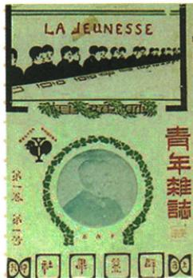

## 错法

见北大和新青年同阵地就说陈北京创刊，或因文化铺垫五四用巴黎失败当1915文化起因。错误在空间、时间和因果层次被关联二字合并。

## 正解

原1915上海青年杂志、后新青年，北大为另一重要传播教学阵地；两个载体相联不等同地点。文化背景是政治挫折与思想束缚认识，巴黎1919直接触发五四；思想铺垫先在、具体触发后来，不能逆时因果。封面模糊数字不用错识1986或1987，年依正文而非猜小字。

## 例题

**原兴起表（Y11-S01，非独立题）：**辛亥失败与民国初政治混乱，先进知识分子认识需思想文化革新、脱封建束缚、培养独立人格救民族危亡；1915陈独秀上海创《青年杂志》，后改《新青年》，运动发端。陈胡适李大钊鲁迅等为主要撰稿人、大多任教北大；最重要阵地新青年与北大。

**原发刊词摘句（Y11-S04）：**《敬告青年》号召自主非奴隶、进步非保守、实利非虚文、科学非想象的新思想批判传统改造中国。

**完整分析补写：**政治制度虽变而社会观念仍束缚独立判断，知识分子因此把救国探索推进思想文化；不是说辛亥从没任何成果。自主与科学强调人格判断与依据，刊物能传播讨论、大学能汇聚教学研究，两个阵地作用互补。1915上海创刊与后来北大阵地不同，不因大学在北京改创刊为北京；先青年后新青年顺序保，大多不改全部。封面用于识刊，模糊版次年代不猜，自动识别1986、1987无清晰图文依据不用，年份据原正文1915。

**原意义（Y11-S03，非独立题）：**新文化动摇封建道德礼教统治地位，掀思想解放潮流、民主科学洗礼，对随后五四作思想宣传铺垫。

**完整分析补写：**刊物大学传播与白话普及，使独立人格、反专制和科学判断较易进入青年讨论，动摇旧礼教作为不可质疑权威，有利后来青年参与公共救亡。思想铺垫不同直接触发，五四原导火线巴黎外交失败，不能两者互替。动摇不是当时全部旧思想已经消失，洗礼是观念传播概括不是统计每人同认同；新文化1915兴起不同1919五四，关联不等同一个事件。

### 来源定位

- Y11-S01：full.md（历史扫描分册151-200），L9–L13，新文化兴起背景标志人物阵地完整表；7315c71c-e0f3-499f-a65f-f5d33fed3468_origin.pdf，实际PDF第1页。
- Y11-S03：full.md（历史扫描分册151-200），L17–L21，文学革命胡陈两文白话与意义；7315c71c-e0f3-499f-a65f-f5d33fed3468_origin.pdf，实际PDF第1页。
- Y11-S04：full.md（历史扫描分册151-200），L29–L66，青年封面敬告青年摘句与内容原图；7315c71c-e0f3-499f-a65f-f5d33fed3468_origin.pdf，实际PDF第1页。
- Y11-S06：full.md（历史扫描分册151-200），L23–L27，五四导火线时地口号初期镇压完整表；7315c71c-e0f3-499f-a65f-f5d33fed3468_origin.pdf，实际PDF第1页。
