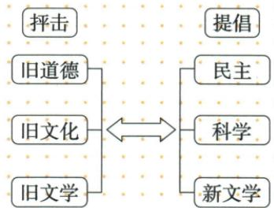

## 错法

将德先生赛先生当真实人物，或文学文题相似就交换胡陈、把狂人给李胡。错误在形象称谓、论说文章小说和具体作者未逐项核对。

## 正解

德为民主、赛为科学，两方向分别反专制愚昧，真实代表人物回陈胡李鲁。胡1917文学改良刍议主白话语言，陈文学革命论倡新文学，鲁狂人小说批礼教，李孔子宪法反国教，各载体对象不同。作品谈思想仍需辨作者行为，不能由同有文学或批旧就认为都同一文；白话渐普及也不等全国立即全不用文言。

## 例题

**原内容（Y11-S02，非独立题）：**批尊孔复古逆流，李大钊《孔子与宪法》反孔教国教，鲁迅白话《狂人日记》揭封建礼教吃人本质、号召推黑漆漆吃人社会。民主与科学两口号，前者反专制、后者反愚昧，陈称德先生、赛先生。原图左抨旧道德旧文化旧文学，右提民主科学新文学。

**完整分析补写：**李将尊孔与宪法关系作政治文化批判，鲁以文学揭旧礼教压迫，两种表达形式不同但都指向旧束缚。吃人是作品批判压迫礼教的表达，不能理解本图已统计某种生物行为。民主科学回答政治自主与认识方法，德赛是形象称谓，不是两位独立运动领导者。原图左为批判对象、右为新方向，自动将旧道德文化接提倡、旧文学生出民主科学均错，按原图恢复；也不由批某旧制度就说中国所有传统每项都必错。

**原文学革命（Y11-S03，非独立题）：**1917胡适新青年发表《文学改良刍议》，主白话作新文学语言；陈独秀接发《文学革命论》，推陈腐雕琢艰涩旧文学、建新鲜平易通俗新文学；倡导后白话新文学渐普及。

**完整分析补写：**语言平易让更多人可阅读讨论新观念，形式改进与思想传播相联，不只是改几个字；胡主张语言、陈提出文学更新方向，人物作品逐配，不能因为两文都文学就互换。渐普及非1917所有人立即不再用文言，白话也不意味着文章不需严谨表达；原新鲜通俗是倡导方向，不将所有古典文学都无价值当原结论。狂人日记鲁为批礼教白话小说，不能换胡的论说文章。

### 来源定位

- Y11-S02：full.md（历史扫描分册151-200），L15–L17，抨旧道德文化李孔宪鲁狂人及民主科学；7315c71c-e0f3-499f-a65f-f5d33fed3468_origin.pdf，实际PDF第1页。
- Y11-S03：full.md（历史扫描分册151-200），L17–L21，文学革命胡陈两文白话与意义；7315c71c-e0f3-499f-a65f-f5d33fed3468_origin.pdf，实际PDF第1页。
