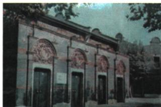
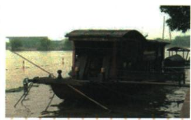

## 错法

原配红船就说照片为1921原船原人，或建党精神紧邻会议便当当日第五决议。错在纪念复制与现场原始证据、评价文字与会议条文不同类型。

## 正解

原明确红船复制品，照片能联系纪念主题地点，不证明当日人物细节；会址今日影像也不是会议当时摄影。建党四组与红船三组是精神评价，原一大四项是党名纲领工作机构，旁列不等同句决议。说明各组涵义可以，但必须保它是历史总结；不从图形没有的文字造原文或每条通过程序。

## 例题

**原精神（Y12-S04，非独立题）完整保留：**伟大建党精神坚持真理、坚守理想，践行初心、担当使命，不怕牺牲、英勇斗争，对党忠诚、不负人民。红船精神开天辟地敢为人先首创、坚定理想百折不挠奋斗、立党为公忠诚为民奉献。原配上海会址与嘉兴红船复制品。

**完整分析补写：**建党四组分别强调理论信念、目标责任、面对困难的行动、组织与人民服务责任；红船三组从创立新组织的首创、持续实践的奋斗、公共人民目的的奉献总结，两类关联但名称条数不能互换。精神概括为历史评价，不等本课提供1921大会以完全同句表决通过的文件，不能用后来叙述形式倒作原会议条文。原红船是复制纪念载体，能联系会议地点与精神主题，不直接证明当时每个细节；上海会址照片可识纪念地点，不能因建筑今日影像就称1921原照。

**原一大完整表（Y12-S07，非独立题）：**1921七月二十三上海，后移浙江嘉兴南湖游船；毛泽东何叔衡董必武陈潭秋王尽美邓恩铭李达等，代表全国50多党员，共产国际马林等出席。定党名中国共产党；第一个纲领奋斗目标推资产政权、建无产专政、实现共产主义；中心工作领导组织工运；中央局陈独秀书记。意义标志党诞生，开天辟地革命面貌新、形成建党精神。

**完整分析补写：**名称纲领提供组织身份与目标，中心工作确定眼前行动方向，领导机构负责协调，使各早期组织形成全国党组织表达；因此大会作为成立标志不同此前各地早期组。代表人数与全国党员总数口径不同，50多指被代表党员不是50多个到会代表，原等名单不自补完整人数。开会上海与后移南湖是同会先后地点，不当两次一大；书记当选与谁出席为不同记录，不能因毛为代表便换书记为毛，也不能仅由当选反推必亲自在场。红船原注明复制品，今天配图不是1921现场原照，不从照片推会议当时每个人姓名。

### 来源定位

- Y12-S04：full.md（历史扫描分册151-200），L184–L208，上海会址建党精神及红船复制品精神；7315c71c-e0f3-499f-a65f-f5d33fed3468_origin.pdf，实际PDF第3–4页。
- Y12-S07：full.md（历史扫描分册151-200），L227–L231，一大时间地点代表完整四项内容意义；7315c71c-e0f3-499f-a65f-f5d33fed3468_origin.pdf，实际PDF第4页。
