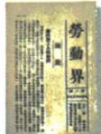
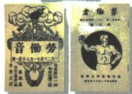

## 讲解

### 是什么

五四促马克思传播同工运结合、为党思想干部准备；精神爱国进步民主科学，爱国为核心。准备为认识人员条件发展，不是1919组织已成立。

### 怎么来的

群众尤其工人参与使知识分子认识集体组织力量，传播新观念有机会与社会实践相连，支持理论讨论向工人运动结合。思想准备是认识理论发展，干部准备是参与人员经验发展，两者提供后来的政治组织条件，不能只说日期到就自然建党。爱国来自捍卫主权救亡目标，进步民主科学说明追求社会改进政治自主理性方法，核心强调驱动力而非删除其他三项。爱国不等拒所有外国思想，马克思传播本例已显示可借新理论思考本国问题；重大贡献仍同直接胜利未完任务分别评价。

### 什么时候能用

意义题用思想工运人员联系给依据，精神题四项全列后明确核心；原没有全体人信仰比例不编。

## 例题

本条无另列匹配独立题，按原陈述或原表图分析；唯一课内浮雕进程问答在相应条目完整保留。

**原五四意义精神（Y11-S10，非独立题）：**社会进步、马克思主义传播及其与工运结合；为党成立思想干部准备；旧向新转折。五四精神爱国进步民主科学，核心爱国主义。

**完整分析补写：**群众尤其工人参与显示组织力量，新思想传播由青年知识讨论向社会实践联系，为后来政治组织提供理论认识与参与干部，所以准备不只是纪念日期。思想准备与干部准备分别是观念和人员发展，不能说1919已召开1921党大会。爱国为反侵略救亡的核心，进步民主科学说明行动方向和判断方法，核心一个不等精神只剩一个词；四项不可把科学换盲从或把爱国说成排斥所有外国知识。重大作用保直接胜利与任务未完，不用转折抹之前探索。

### 马克思主义与工人宣传的具体渠道接党成立条件

**原背景途径（Y12-S01、S02）：**1917俄十月革命胜使先进知识分子见曙光，五四后新刊多、更多接受马克思。1919新青年马克思研究专号刊李大钊《我的马克思主义观》较系统介绍。1920三月李发起最早研究团体马克思学说研究会，五月陈上海马克思主义研究会，后各地多团体。五四使知识分子识工人力量，陈调查上海劳工团体如中华工业协会；帮组工会、劳动补习与识字班、工人生活刊物、通俗宣传，启阶级觉悟，马克思与工运开始结合。

**课内原图问答（Y12-S03）完整保留：**

共产党早期组织创办的工人刊物。这些刊物表明了共产党早期组织的什么工作重点？

**原答：**向工人阶级宣传马克思主义，启发工人阶级觉悟。

**完整解析补写：**先看劳动相关刊名与原说明工人刊物，确定读者工人，而非只认封面是报纸便推全国每个阶层；再接工会学校调查与通俗语言，说明理论传播要联系劳动生活、帮助工人理解自身处境和组织行动。故工作重点为向工人宣传启觉悟，图与课文互证，不凭图宣已经所有工人加入党或党早期团体等全国组织大会。个人介绍、团体研究、社会宣传为不同层次，可相接但不互换人物年份；封面模糊小字不猜发行量或日期。

## 易错

核心一项不是只剩一项，准备非成立；新文化两口号与五四四精神有关但不可互改数量。

### 来源定位

- Y11-S10：full.md（历史扫描分册151-200），L118–L130，五四性质意义思想干部与精神；7315c71c-e0f3-499f-a65f-f5d33fed3468_origin.pdf，实际PDF第2页。
- Y12-S01：full.md（历史扫描分册151-200），L158–L166，十月革命五四背景个人团体研究传播；7315c71c-e0f3-499f-a65f-f5d33fed3468_origin.pdf，实际PDF第3页。
- Y12-S02：full.md（历史扫描分册151-200），L168–L172，调查工会学校刊物向工人宣传原举措结果；7315c71c-e0f3-499f-a65f-f5d33fed3468_origin.pdf，实际PDF第3页。
- Y12-S03：full.md（历史扫描分册151-200），L174–L182，工人刊物原图原问原答；7315c71c-e0f3-499f-a65f-f5d33fed3468_origin.pdf，实际PDF第3页。
