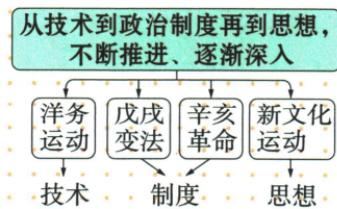
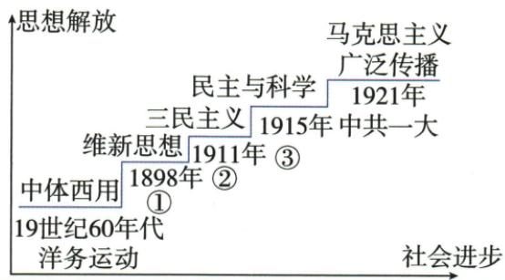

## 讲解

### 是什么

原四探索洋务器物、戊戌辛亥制度、新文化思想文化；三思想潮流为戊戌辛亥新文化。两表统计对象不同，主要学习取向不等每运动只有一种作用。

### 怎么来的

器物探索主要问武器生产技术，制度探索问怎样组织政治权力，思想文化探索问人怎样摆脱旧束缚形成独立判断，救亡认识因既有不足向深层推进。戊戌君主立宪与辛亥共和都在制度层，改良借清和革命推清的路径仍不同，不能只见西方制度就合一。辛亥改制度也极大思想解放，洋务器物亦需教育人才，原三次思想表与四探索表由此非一一同数。图是主要取向概括，不说前者以后没再发展或所有人立刻同转向；性质阶级口号人物各列读，不将所有救国全当同组织同阶级。

### 什么时候能用

比较先定层次还是思想影响统计口径，原图两制度括号务必核；自动把辛亥接思想或漏新文化不用，原表提供全列互证。

## 例题

本条无另列匹配独立题，按原陈述或原表图分析；唯一课内浮雕进程问答在相应条目完整保留。

**原三次思想解放表（Y11-S11，非独立题）：**戊戌变法图强君主立宪、思想文化广而持久影响；辛亥推清建资产共和国、极大思想解放；新文化民主科学、动摇旧礼教掀解放潮流。

**原四探索七列（Y11-S12）完整保留：**器物洋务、地主自救、地主洋务派、自强求富、学西方技术、奕䜣李鸿章张之洞等；制度戊戌、资产改良、维新派、变法图强、君主立宪、康梁等；制度辛亥、资产民主革命、革命派、三民民主共和、民主共和制、孙黄等；思想文化新文化、思想解放、部分先进知识分子、民主科学、思想文化学习、陈胡李等。

**完整分析补写：**四探索按主要取向，从生产武器技术到政治制度再到文化观念，问题认识逐步深入；戊戌与辛亥都在制度层，分别改良保清与革命推清共和。原图括号把两者共列制度，自动漏新文化思想连线、误把辛亥单配思想均不采用。主要层次不是每事仅一种作用：辛亥在制度层仍有思想解放，洋务技术仍需要人才教育；三次思想潮流与四次探索统计口径不同，不能说洋务绝没思想影响或硬塞进原三次名单。领导性质口号人物逐列配，不因都救亡就全属同阶级政党，不把部分先进知识分子说全部国民都领导。

### 原阶梯材料题据年思想辨事件并说明深入

**单元原题3（原书标2023江苏盐城中考节选，未另核真题身份）：**思想解放推动社会进步。阅读材料，回答问题。

材料：

（1）写出材料中①②③分别代表的历史事件。
（2）据材料并结合所学知识，概括近代中国向西方学习的历程和特点。

**原答：**（1）①戊戌变法，②辛亥革命，③新文化运动。（2）历程学习西方技术→学习政治制度→学习思想文化；特点由表及里、由浅入深。

**逐问完整解析补写：**图①在1898维新思想处，年份与君主立宪取向配戊戌；②在1911三民处配辛亥；③在1915民主科学处配新文化，不把图末1921中共一大移到1915。原自动识别将1915连中共一大、各年都挂维新均错，核原阶梯恢复。第二问先读19世纪60年代洋务中体西用、技术器物；再1898和1911分别立宪共和，两者共政治制度；最后1915民主科学为思想文化，形成三层历程。由表及里不是只背修辞：从可见武器生产技术，到政治权力安排，再到人格认识和文化观念，问题认识更深。图纵轴思想解放横轴社会进步、阶梯为概括，不是精确数值与每个运动绝对社会排名；主要取向也不否辛亥思想影响，旧方法并不自此全部消失。题两小问中第一三处填空、第二历程特点两项共5任务，原答全保。

## 易错

辛亥制度非只思想，戊辛都制度非同政治路径；四探索非三潮流同名单，主要层次不是唯一路径作用。

### 来源定位

- Y11-S05：full.md（历史扫描分册151-200），L68–L86，近代探索层次原图及自动错配；7315c71c-e0f3-499f-a65f-f5d33fed3468_origin.pdf，实际PDF第1页。
- Y11-S11：full.md（历史扫描分册151-200），L136–L142，三次思想解放比较完整表；7315c71c-e0f3-499f-a65f-f5d33fed3468_origin.pdf，实际PDF第2页。
- Y11-S12：full.md（历史扫描分册151-200），L144–L146，近代四探索完整七列比较表；7315c71c-e0f3-499f-a65f-f5d33fed3468_origin.pdf，实际PDF第3页。
- Y4-Q03：full.md（历史扫描分册151-200），L302–L344，三节点四层次阶梯原图题两问原答；7315c71c-e0f3-499f-a65f-f5d33fed3468_origin.pdf，实际PDF第6页。
