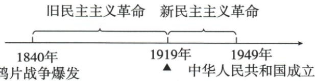

## 讲解

### 判据

新旧分期题先看领导发展与民主革命任务，不以新字断社会性质；开端、准备、组织成立是不同事件。

### 流程

1.原1840—1919旧、1919—1949新先读时期界线，五四为转折开端。2.工人成主力和马克思与工运结合支持领导力量发展，不以原学生起点否后阶段工人作用。3.新定义人民大众反帝封建官僚资本，保整个时期范围，不说五月每句口号都已逐字三者完整。4.新旧仍为民主革命任务相关，新阶段不等1919社会已社会主义或总任务完；胜利社会性质分开。5.党1921成立另为组织节点，1919思想干部准备不可改已成立领导大会；前后条件相接而非同年。

## 例题

本条无另列匹配独立题，按原陈述或原表图分析；唯一课内浮雕进程问答在相应条目完整保留。

**原定义时期（Y11-S09，非独立题）：**新民主主义革命为无产阶级领导、人民大众、反帝国主义封建主义官僚资本主义；1919五四至1949新中国为新民主主义革命时期，1840鸦片战争至1919为旧民主主义。原五四为旧向新转折点、新革命开端。

**完整分析补写：**新旧都属民主革命阶段、需解决民族人民任务，区别关键领导力量发展而非社会已变为社会主义。工人扩大阶段成主力、马克思主义与工人运动结合、思想干部准备支持转折，不能以新字说中国1919已完成全任务。定义三种反对对象概括整个时期，不必每个1919口号逐字含三者；开端又不同组织成立，原共产党1921，不把党提前为五月四已经成立。1919转折作为分期界线前后接，不把旧新阶段理解两套完全无联系事件，原年范围不用于算每阶段精确到日的长度。

**原五四意义精神（Y11-S10，非独立题）：**社会进步、马克思主义传播及其与工运结合；为党成立思想干部准备；旧向新转折。五四精神爱国进步民主科学，核心爱国主义。

**完整分析补写：**群众尤其工人参与显示组织力量，新思想传播由青年知识讨论向社会实践联系，为后来政治组织提供理论认识与参与干部，所以准备不只是纪念日期。思想准备与干部准备分别是观念和人员发展，不能说1919已召开1921党大会。爱国为反侵略救亡的核心，进步民主科学说明行动方向和判断方法，核心一个不等精神只剩一个词；四项不可把科学换盲从或把爱国说成排斥所有外国知识。重大作用保直接胜利与任务未完，不用转折抹之前探索。

### 第12课比较按领导根本差别并保相同任务性质

**原新旧完整比较（Y12-S10，非独立题）：**异：旧1840—1919鸦片战争始，主要资产领导、三民等，建资产共和国走资本主义；有胜利但反帝封建任务未完社会未改，此面失败。新1919—1949五四始、无产领导马克思等，以建立人民民主专政的社会主义社会为目标，新革命胜终半殖民半封建。相同：发生半殖民半封建，任务反帝封建、资产阶级民主革命范畴。

**完整分析补写：**根本区别领导阶级，任务性质并非因此换为社会主义革命；旧主要资产为两类比较概括，不可给1840—1919所有个别地主农民行动一律贴资产标签，原此前林洋务太平材料已不同。新表社会主义社会为前途目标，不说明1919转折或1949新民主胜当日已完成全部社会主义制度建设；民主阶段任务、以后发展方向和社会变化节点分开。相同革命性质看所解决民主任务，不用领导无产反推立即变社会主义革命。旧有局部胜与任务受挫可两面评价，三民等与马克思等也保思想发展范围，不说每个阶段每人只一种思想。

### 单元原题1时间轴三角以年份与转折双判

**单元原题1（原书标2023江苏盐城中考，未另核真题身份）：**时间轴能帮助我们更好地学习历史。下图中“▲”处应填写的内容是（ ）

A.五四运动；B.北伐战争；C.遵义会议；D.中共七大。

**原答案A。原解：**1919五四为旧民主走向新民主转折；1926北伐开始、1935遵义、1945党七大延安。

**逐项解析补写：**图1840鸦片战争至1919为旧，1919至1949新中国为新，▲在1919界线，需同时配年份与转折作用。A五四1919、工人主力与思想工运联系支持新阶段，故选。B北伐原解1926在新阶段内部，不是开端；C遵义1935也是内部重要会议，日期不配界线；D七大1945延安同样不是1919。B–D未选不等没有历史意义，只是不符本位置和年份，不能只见革命大事便填任一。1949为原分期终点不是党成立1921或社会主义全建成年份，两个时期任务性质又不能由新字误判。

## 易错

新民主主义不是社会主义同义，开端不是党成立；定义全期不能倒填每一早期具体行动。

### 来源定位

- Y11-S09：full.md（历史扫描分册151-200），L102–L104，未完成任务与新旧革命定义时期；7315c71c-e0f3-499f-a65f-f5d33fed3468_origin.pdf，实际PDF第2页。
- Y11-S10：full.md（历史扫描分册151-200），L118–L130，五四性质意义思想干部与精神；7315c71c-e0f3-499f-a65f-f5d33fed3468_origin.pdf，实际PDF第2页。
- Y11-S13：full.md（历史扫描分册101-150），L2963–L3017，单元导图五四开端及正确中共条件层级；6484926a-d709-4079-96ba-4a8c4b0a1b00_origin.pdf，实际PDF第50页。
- Y12-S10：full.md（历史扫描分册151-200），L252–L254，新旧革命六异三同完整比较；7315c71c-e0f3-499f-a65f-f5d33fed3468_origin.pdf，实际PDF第5页。
- Y4-Q01：full.md（历史扫描分册151-200），L262–L292，分期轴五四转折选择及原答原解；7315c71c-e0f3-499f-a65f-f5d33fed3468_origin.pdf，实际PDF第5页。
