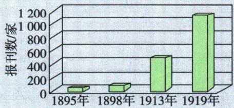

## 讲解

### 判据

原图数据判断看轴单位年份、是否标精确值、变化与时期史实是否相合；作者身份与个人直觉都不能直接替原材料和统计口径。

### 流程

1.原轴年份1895、1898、1913、1919及单位家，先确定统计对象报刊，不将家数当发行量人数。2.图无独立柱标值，只读可确认趋势和末近1200，自动精确表不用，不算精确倍数。3.以新文化民主科学宣传、五四新刊和马克思传播核后段增长背景，解释C的合理性；维新宣传只说明早段一部分，不担保所有数字。4.查证据层次，学者身份可指向出处却不是正确充分条件，感觉不可能也不证错误。5.趋势合理与数值全真分开，进一步需定义地域时间存续口径与原统计互证，原页未给登记，不编作者来源或把原C抬成全部精数已独立核实。

## 例题

**单元新考法原题（原书标2024贵州黔西南中考，未另核真题身份）：**下图是1895—1919年中国报刊数量统计图。根据史料实证核心素养，说法合理的是（ ）

A.这个数据是对的。戊戌变法中需要大力宣传新思想。
B.应该是对的。因为这个统计图出自一位学者的著作。
C.这是符合史实的。新文化运动兴起后出现大量报刊。
D.这个数据不对。1919年不可能增加这么多的报刊。

**原答案C。原解：**1915新文化兴起后大量宣传民主科学报刊，尤其1917十月革命使先进知识分子见曙光，五四后新思想新文化刊物雨后春笋、马克思广传。

**逐项解析补写：**先核横轴1895、1898、1913、1919，纵轴报刊数家、刻度0至1200；初两年远低200、后两年明显增加，末柱接近1200。原图无各柱独立标值，不采用自动表100、150、600、1200作精确数据，也不以近似图算准确倍数。A维新确有宣传新思想背景，可解释早段某些变化，但不足验证全时期每一数值，不能因此宣布整图数据全对；排除不否维新宣传作用。B作者身份本身不替统计口径和原始资料核查，学者著作可作线索但非精确正确保证。C新文化五四后报刊大量出现与后段趋势有原课史实支持，在原四种理由中最合背景判断，故保原C。D仅凭不可能否增长，没有证据，不能直觉否定。

**证据边界：**本题把趋势符合史实与精确数值可信放在同一讨论中。C提供的是历史背景对增长趋势的支持，也不能单独证明每个数都精确；继续验证需明确报刊定义、地域、存续或新办口径、原统计材料及独立互证。原页未列统计出处及这些口径，登记缺口，保原图原答不自行填作者、精确数或改定数据真伪。

## 易错

数量不是发行量，符合背景不是精确全证；排A不否维新思想宣传，原无口径不造表恢复精确值。

### 来源定位

- Y4-Q04：full.md（历史扫描分册151-200），L346–L370，报刊统计图史料实证四选择原答原解；7315c71c-e0f3-499f-a65f-f5d33fed3468_origin.pdf，实际PDF第6页。
