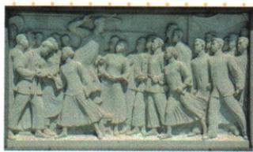

## 讲解

### 判据

原图问斗争进程，需要地点、参加范围和主要力量前后变化；静态纪念图只能辨主题，具体变化要结合原课文。

### 流程

1.五月四北京学生起点确立前阶段，六月五上海工罢商罢和三罢全国扩说明后阶段。2.地点北京→上海答中心转移，不写原北京再无人活动。3.十几个商业中心答范围扩大，不把它同地点变化当完全同一条依据。4.学生→工人答主力变化，学生先发可仍作先锋，工人成主力不等所有学生商人退场。5.依此给原答三点并逐接课文证据，浮雕只作纪念主题，不从衣服造型辨每人姓名或直接读日期；三罢按群体分别配。

## 例题

**课内原图问答（Y11-S08）完整保留：**

人民英雄纪念碑《五四运动》浮雕。观察图片，谈谈五四运动斗争进程的特点。

**原答：**斗争中心由北京转移到上海，运动范围扩大；运动主力由学生转变为工人阶级。

**原过程依据（Y11-S07）：**北京学生爱国运动获全国声援，1919六月五上海工罢、商罢，学生罢课工罢商罢风潮席卷十几个商业中心；工成为主力、中心北京转上海。

**完整解析补写：**先读五月四北京学生起点，再接六月五上海工人与商人参加，地点变说明中心转移、全国十几个城市说明范围扩，参加者中工成为主力说明力量变化。三罢分别工罢工、学生罢课、商人罢市，不能全称工人罢课。浮雕为纪念表现，主题可认，但仅静态雕像不能独立读出地点时序，原答需结合课文先后和参与力量；不把每个造型认确切姓名。成为主力不等学生商人从此全部退出，中心上海也非北京没有活动。

## 易错

中心主力范围要分别答，工人非罢课商非罢工；静态图不证明时间表，先锋和主力不是互斥角色。

### 来源定位

- Y11-S07：full.md（历史扫描分册151-200），L106–L116，五四口号镇压罢课及扩大发展结果；7315c71c-e0f3-499f-a65f-f5d33fed3468_origin.pdf，实际PDF第2页。
- Y11-S08：full.md（历史扫描分册151-200），L88–L100，五四浮雕原问答进程特点；7315c71c-e0f3-499f-a65f-f5d33fed3468_origin.pdf，实际PDF第2页。
