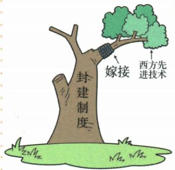

## 错法

见失败自救便删除所有进步性，或把原单纯引技术不成功扩成技术任何时代都没有价值。错在成败、作用和适用条件间跳跃，用总体目标未成抹去原已发生的具体工业交通教育变化。

## 正解

失败判整体求强求富目标，自救判推动主体目的，进步判实际局部变化，三者标准不同。原政治腐败、制度限制和外部挤压说明只引技术未足以改变整体处境，不证明技术本身无效。嫁接示意强调制度与技术关系，原启示要求管理和生产关系相适应；因此应一边保局部作用，一边讲清总体不足，不以一句成功或失败包办全部对象。

## 例题

**原设问（Y4-S01）：**为什么说洋务运动是一次失败的封建统治阶级的自救运动？

**原答案两点完整保留：**根本原因是未改变封建制度；学习西方仅限科学技术，不可能使中国走上富强道路，也没有改变中国一步步沦为半殖民地半封建社会的现状。

**原认识（Y4-S07，非独立题）：**军事工业、民用工业、交通运输业等有一定程度发展，客观促进民族资本主义产生；政治腐败和外国势力挤压使求强求富目标未实现。

**完整解析补写：**自救看推动主体和维护清统治的目的，失败看整体求强求富目标没有实现。制度腐败、管理限制与外部挤压并未只靠新技术解决，因此有工业发展仍不能保证整体目标成功。原嫁接图把西方先进技术接在封建制度树干上，是保制度而引技术的比喻，不是生物学实验或实际改制统计。原“单纯技术不可能成功”放在本次制度和环境条件下理解，不能改成技术学习任何时期都没有价值，也不能由总体失败否定已经出现的局部发展。

**原设问（Y4-S11）：**洋务运动对中国近代化探索的有益启示。

**原答案三点完整保留：**不改变封建制度，单纯引进西方先进技术是不可能成功的；要防止办事官员贪污腐败、中饱私囊；注意体制变革，使生产关系适应生产力发展。

**完整解析补写：**第一点由引进技术未解决原制度限制解释，强调整体改革条件；第二点由管理腐败妨碍资金和资源有效运用解释；第三点说明机器、技术和生产能力改变，需要组织管理及人与人的生产关系相适应。生产力可先理解为人、工具技术形成的生产能力，生产关系为生产中所有、组织和分配等关系。三点不能只抄一句学技术，更不能把不成功夸大为本次没有任何工业教育成果；启示是根据历史处境提取的认识，不是未经条件的万能必胜公式。

### 来源定位

- Y4-S01：full.md（历史扫描分册101-150），L1932–L1952，洋务根本目的易错与失败自救原设问两点；6484926a-d709-4079-96ba-4a8c4b0a1b00_origin.pdf，实际PDF第32页。
- Y4-S07：full.md（历史扫描分册101-150），L1984–L1987，洋务发展进步与目标未实现评价；6484926a-d709-4079-96ba-4a8c4b0a1b00_origin.pdf，实际PDF第32页。
- Y4-S11：full.md（历史扫描分册101-150），L2014–L2018，洋务近代化启示原设问三点；6484926a-d709-4079-96ba-4a8c4b0a1b00_origin.pdf，实际PDF第33页。
