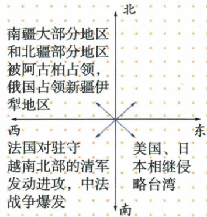

## 讲解

### 是什么

原课以1865阿古柏入侵、1871俄占伊犁为危机背景，1875左宗棠受命督新疆军务，按先北后南、缓进急战收复。1878恢复除伊犁以外的新疆领土；伊犁大部分后来经谈判恢复，仍有割地赔款代价。

### 怎么来的

不同侵略者和地区使恢复途径不同。对阿古柏力量的军事行动按北南方向推进，俄占伊犁却未在同一军事结果内被全部收回，需要随后外交谈判。先北后南是方向次序，缓进急战是准备推进与交战节奏，两种判据不相互否定；原书未细述策略全部保障条件，不能凭四字虚造具体后勤计划。成果带范围和代价限定说明成功不是一个无条件的全字：恢复主要地区有意义，失地和赔款也需如实保留。清内海防塞防争论则是资源关注不同边疆的背景，不由争论两个词就推两地只能永久选一处治理。

### 什么时候能用

问军复结果保除伊犁以外，问伊犁保谈判、大部分与代价，问建省另用1884。阿古柏不是俄军的别名，侵略势力不等新疆各族人民；原各族反抗不能抹掉，方向图不提供作战距离。

## 例题

**原新疆表（Y4-S09，非独立题）：**1865年浩罕国军事头目阿古柏侵入，占南疆大部和北疆部分；英俄支持侵略，俄1871年占伊犁；各族人民反抗，清内有海防、塞防之争。1875年任左宗棠钦差督办新疆军务，采取先北后南、缓进急战，先复北疆，再攻达坂城向南。1878年消灭阿古柏侵略势力，收复除伊犁以外新疆领土；随后通过艰难谈判收回伊犁大部分，但仍割地和大量赔款。

**完整分析补写：**阿古柏与俄分别控制的地区不能混成同一支力量，军事收复与对俄谈判也不同渠道。先北后南说明方向顺序，缓进急战说明推进准备与交战节奏的区别，并不互相矛盾；原未详军事部署，不能给原题虚造军粮距离。1878结果有伊犁例外，后来谈判又是大部分恢复且有代价，所以保卫成果与领土损失可以并存，不夸成所有领土无代价收回。

**原图（Y4-S12，非独立题）：**西北为阿古柏占南疆大部北疆部分、俄占伊犁；东南为美国、日本相继侵台；南方为法国进攻驻越北清军、中法战事。图有北南西东方向标记，文字位于对应方向区域。

**完整分析补写：**这是危机方向与事件的示意，不是等比例疆界地图。西北新疆不换成东南台湾，南方越北也不等法国只在一处作战；正文还有马尾、淡水、镇海等战场。图中文字阅读需对原位置，自动识别把西北、东南等拆散不能作为可靠顺序，原图不提供可量面积距离和各战场兵力。

### 第二单元排序题的1878节点仍保伊犁例外

**新考法原题（JU2-Q5；原书标核心素养·时空观念、2024贵州黔南中考，未另核真题身份）：**九年级某历史兴趣小组对中华民族反抗列强侵略相关知识梳理，以下史事按时间先后排列正确的是（）。

A.左宗棠收复新疆→虎门销烟→黄海海战→廊坊阻击战

B.廊坊阻击战→黄海海战→虎门销烟→左宗棠收复新疆

C.黄海海战→虎门销烟→廊坊阻击战→左宗棠收复新疆

D.虎门销烟→左宗棠收复新疆→黄海海战→廊坊阻击战

**原答案：D。原解题思路完整保留：**虎门1839，左收复新疆1878，黄海1894，廊坊1900。

**逐项解析补写：**A错误，1878置1839前，第一组已逆序，后两正确也不能挽回全链。B错误，1900在1894前且1839又后置，不是升序。C错误，1894置1839前，1900又置1878前，有两处逆序。D正确，1839→1878→1894→1900全部递增，对应事件也准确。

**判断链与边界：**每事配年份→从早到晚列基准→逐项查首个逆序与余下→D。1878为原军复节点仍保除伊犁以外，后谈判与1884建省不可替代；黄海1894非1895威海全覆；廊坊1900非1901辛丑。原排序只问时间，不将反侵略主题当哪次必胜的证据。

## 易错

1878不改成全部伊犁一并无偿收复；先北后南不是先东后西；缓进急战不解释为从来不作战；阿古柏与各族人民身份不能混。

### 来源定位

- Y4-S09：full.md（历史扫描分册101-150），L2002–L2004，新疆阿古柏俄伊犁海塞防策略军复外交建省完整表；6484926a-d709-4079-96ba-4a8c4b0a1b00_origin.pdf，实际PDF第33页。
- Y4-S12：full.md（历史扫描分册101-150），L2020–L2045，中后19世纪边疆危机方向分布原图；6484926a-d709-4079-96ba-4a8c4b0a1b00_origin.pdf，实际PDF第33页。
- JU2-Q5：full.md（历史扫描分册101-150），L2500–L2509，四反侵略史事排序四项原详解D；6484926a-d709-4079-96ba-4a8c4b0a1b00_origin.pdf，实际PDF第41页。
