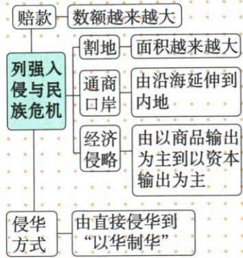

## 讲解

### 是什么

原图分赔款、割地、口岸、经济形式、侵华方式五趋势，说明民族危机不断加深。图是总体方向概括，不是每约具所有条款、每一步每数都单调上升的定律。

### 怎么来的

赔款扩大经济压力，割地与口岸增加领土和贸易渠道损害，投资设厂加深生产经营控制，利用清压反帝使政治控制更深。这些方面共同构成主权与社会处境变化，不能只看某一指标。辛丑无割地开埠仍严重损主权、三干涉后辽东返还仍有代价，反证每约每项都必增的机械理解。赔款单位和本金本息又不同，图未给兑换依据不可直接算倍率；由商品到资本为主非贸易消失，由直接到以华制华非外国此后不再直接侵略。原箭头与分支按实际图核，自动遗漏赔款结果不得作为完整五趋势。

### 什么时候能用

整体趋势适合跨约归纳，具体题须以条款时点范围判。不能从面积概述给未列数值，也不能因个别地区收回断所有危机已减。

## 例题

**原图（Y7-S10，非独立题）完整保留：**赔款数额越来越大；割地面积越来越大；通商口岸由沿海延伸内地；经济侵略由商品输出为主到资本输出为主；侵华方式由直接侵华到以华制华。自动识别漏赔款结果分支，并把赔款指向整个民族危机，不采用该自动箭头。

**完整分析补写：**图为近代侵略加深的方面概述，不是每一个条约都具有五条且每次每数必增的公式。辛丑无割地开埠仍深损主权，说明要合看政治军事外交经济控制；赔款比较须注意银元银两、本金本息口径，图没有换算依据。以华制华强调利用清政府压中国人民，不能推外国从此从不直接用兵；商品资本的为主也不等旧方式消失。面积越来越大是总体概括，不由图把归还辽东等时点变化删掉，更不能给未画的面积数值。

### 近代条约总体危机与不直接比赔款倍率

**单元原题2（JU2-Q2；原书标2024山东青岛中考，未另核真题身份）：**通过下表可知（）。

| 条约 | 原表信息 |
|---|---|
| 南京条约 | 开广州福州厦门宁波上海通商；割香港岛给英国；赔2100万银元 |
| 马关条约 | 赔日本军费白银2亿两；开沙市重庆苏州杭州；日本可在通商口岸设厂 |
| 辛丑条约 | 赔白银4.5亿两；保证严禁人民各种反帝活动；东交民巷使馆界 |

A.开放的通商口岸都集中在沿海地区

B.这三个条约都开放了通商口岸

C.条约都严重侵害了中国的领土主权

D.中华民族危机不断加深

**原答案：D。原解题思路（JU2-A2）完整保留：**三约反映民族危机不断加深，中国逐步陷半殖民地半封建社会；被迫口岸由沿海深入内地；辛丑没有开放通商口岸，没有割领土，却为近代赔款最庞大、主权丧失最严重的不平等条约。

**逐项解析补写：**A错误，马关重庆等体现深入腹地，不能由南京沿海五口概括全部。B错误，原比较明确辛丑不新开通商口岸，使馆界不是通商口岸。C按原题条款分类口径不是原答案；原解析用辛丑无割地，意在排除把三约都归割地损失。须保下面的措辞疑点，不能反讲辛丑完全不损在国内空间的自主权。D为原答案，经济渠道、赔款负担与政府禁反帝政治控制呈加深趋势，最能概括三列整体变化。

**原题措辞疑点与讲解边界：**领土主权不严格等同割地；驻兵、使馆界排除本国居住和治理等也可损害国家在其领土内自主行权。外交部旧约说明将驻兵等特权列为严重主权损害，并称东交民巷为列强国中国，故不把C说成历史上绝不可能成立。原D及原详解保留，C是否按狭义割地或较广空间主权理解有措辞问题，不重新宣布唯一新答案；本题按材料系列整体主题选原D。[核查依据](https://www.mfa.gov.cn/ziliao_674904/zt_674979/dnzt_674981/qtzt/zggcddwjw100ggs/jszgddzg/202208/t20220824_10750407.shtml)

**判断链：**三约按先后比较→沿海到内地、投资生产、政治控制加深→D。赔款单位银元与两不同，4.5亿为本金，原表不支持直接计算由南京到辛丑增加几倍；未列马关割地也不等马关原约没有割地，部分条款表与全部文本不同。

## 易错

五方向各有指标，无一项替代全部；没有割地不等没主权损害；资本输出为主、以华制华不改成唯一路径。

### 来源定位

- Y7-S10：full.md（历史扫描分册101-150），L2406–L2426，近代侵略五趋势原图含赔款分支；6484926a-d709-4079-96ba-4a8c4b0a1b00_origin.pdf，实际PDF第39页。
- JU2-Q2：full.md（历史扫描分册101-150），L2470–L2479，南京马关辛丑原表及四选项跨页；6484926a-d709-4079-96ba-4a8c4b0a1b00_origin.pdf，实际PDF第40–41页。
- JU2-A2：full.md（历史扫描分册101-150），L2454–L2456，危机加深口岸腹地辛丑无割开原详解D；6484926a-d709-4079-96ba-4a8c4b0a1b00_origin.pdf，实际PDF第40页。
