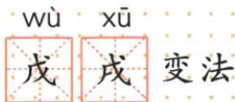

## 讲解

### 判据

见戊戌百日或OCR戊重复，先分年名和时段两依据；字符校对须读音含义与原格图一起核，不能照识别文字把所有字写相同。

### 流程

1.1898取戊戌干支，戊wù天干戌xū地支，年名与1895公车不交换。2.戍shù卫戍、戎róng戎装分别理解，不当异体字。3.百日为概称，精确103按首尾均含，6月20天加7月31、8月31、9月21。4.103计整段改革时期，不说每个地方政策执行同日数。5.发现OCR与原格图、口诀冲突，保原件并在加工记录写恢复位置，不能把错误识别当原书原字。

## 例题

**原名称与易写字（Y6-S08、S09，非独立题）按原页恢复：**1898为农历戊戌年，故称戊戌变法；历时103天，又称百日维新。戊读wù，天干甲乙丙丁戊；戌读xū，地支亥字前位戌；戍读shù，队伍防守去卫戍；戎读róng，身穿戎装守边疆。原易错句为“戊、戌不要错写成戍”；OCR错把戌、戍都识作戊，按实际37页恢复。

**完整分析补写：**戊戌为年名与两个干支用字，百日为103天阶段的常用概称，不与原精确天数矛盾。自6月11日至9月21日按首尾两天均计：6月剩20天，加7月31天、8月31天、9月21天，共103天；这只解释命名时期，不保证各地每条措施执行103天。戊、戌、戍、戎字形相近但读音含义不同，不是可互换异体字；把戊戌写成戍戌会改成年名之外的错字。原格图能核戊戌笔形，口诀另核戍戎。

## 易错

精确100与103不是同一表述，概称可以保；首尾计法要声明；戍不是戌，字形恢复与历史来源分开说明。

### 来源定位

- Y6-S08：full.md（历史扫描分册101-150），L2300–L2313，戊戌戍戎字形读音原格图口诀；6484926a-d709-4079-96ba-4a8c4b0a1b00_origin.pdf，实际PDF第37页。
- Y6-S09：full.md（历史扫描分册101-150），L2315–L2319，六君子全名单戊戌年103天百日命名；6484926a-d709-4079-96ba-4a8c4b0a1b00_origin.pdf，实际PDF第38页。
