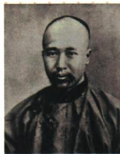

## 讲解

### 判据

原图题问康开新方，先定位人物，再把诊病措辞还原到民族危机与救国办法；所问为主张，不只报运动名称。

### 流程

1.读图注康有为，原图片说明只为人物识别，不推拍摄日期。2.读病症已变说明原方法不足应对变化局势，联系甲午条约危机。3.读旧方与背景单学洋务技术不足，说明新方需要制度改革。4.按原问答变法图强并解释图强为救亡发展方向，不改成真实药方或武装革命。5.可联系后来戊戌运动验证人物路线，但区分1895主张与1898措施开始，不能混日期。

## 例题

**原图题及设问（Y6-S06）完整保留：**图注康有为。1895年，康有为上书痛陈“病症已变而犹用旧方”。为此，康有为开出的“新方”是什么？

**原答案：**变法图强。

**完整解析补写：**先用图注定位康，不只以服饰猜人物；病症、旧方、新方为社会处境和救国方法的比喻。结合公车背景，单纯洋务技术不足以应对加深危机，主张转向制度变革，因而新方为变法图强。这里不是实际诊病开药，也不是孙中山武装革命或门户开放照会。原问主张答变法图强，若要说明所参与运动可联系后来戊戌，但不能拿运动名代替本题所问的新方法而不给解释。照片为原资料画像载体，不声称拍摄当日就是上书现场。

## 易错

照片服饰不足作唯一识别，图注才是原证据；新方问主张，运动问活动，不能无解释互替；比喻不是医学史原题。

### 来源定位

- Y6-S06：full.md（历史扫描分册101-150），L2272–L2286，康有为原照片及旧方新方原设问答案；6484926a-d709-4079-96ba-4a8c4b0a1b00_origin.pdf，实际PDF第37页。
- Y6-S01：full.md（历史扫描分册101-150），L2229–L2235，公车词义背景经过未上达与序幕完整表；6484926a-d709-4079-96ba-4a8c4b0a1b00_origin.pdf，实际PDF第37页。
- Y6-S11：full.md（历史扫描分册101-150），L2328–L2332，洋务戊戌领导重点性质目的作用五项对比；6484926a-d709-4079-96ba-4a8c4b0a1b00_origin.pdf，实际PDF第38页。
