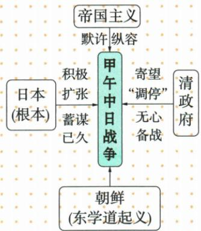

## 讲解

### 判据

见东学道起义、起义平后继续增兵与四方面原因图，先辨日本为什么挑战争，再辨利用什么机会，最后看列强和清的环境。不能把紧挨开战的事件一律称根本原因。

### 流程

1.圈日本长期扩张与觊觎朝鲜，这是推动行动的目标，原图还明确日本根本。2.圈1894起义与日本出兵，作为利用机会；再用平息后仍增兵检查是否只为平乱，原事实反证该说法。3.分别记帝国主义默许、清寄望调停，它们影响局势却不是同一主体的目的。4.按问根本、直接或背景选择对应层，不以列举四项替代关系解释。5.若使用图先核原位置与正文先后，自动识别错误箭头不倒置因果；甲午名称再独立解释为年名，勿混原因。

## 例题

**原资料与原图（Y5-S01、S06，非独立题）：**日本对朝鲜觊觎已久，征服朝鲜是其企图侵略中国、称霸世界的重要步骤。1894年朝鲜东学道起义，日本乘机出兵；起义平息后继续增兵，蓄意挑起战争。1894年是农历甲午年，因而得名。原图四面分别为日本积极扩张、蓄谋已久（根本），帝国主义默许纵容，清政府寄望调停、无心备战，朝鲜东学道起义。

**完整分析补写：**日本长期扩张目标与充分准备解释为什么利用朝鲜事件挑起战争，起义是可利用的机会，平息后仍增兵反证并非只为平息起义。列强态度与清政府应对是外部环境和对手处境，不能把四面因素全说成同一主体的侵略目的。原图在中央配置战争、四面配置因素，自动识别把战争指向日本扩张等，不作为因果依据；正文的先后关系才是核对依据。甲午为年份命名，战争延至1895年，不推全部战役都在1894。

## 易错

导火机会不是侵略正当理由；日本扩张意图在起义之前，不能说战争导致蓄谋；原图没有各因素数量比例，不为排根本臆算百分比。

### 来源定位

- Y5-S01：full.md（历史扫描分册101-150），L2100–L2108，日本扩张朝鲜东学道起义与甲午名称；6484926a-d709-4079-96ba-4a8c4b0a1b00_origin.pdf，实际PDF第34–35页。
- Y5-S06：full.md（历史扫描分册101-150），L2138–L2154，战争爆发原因原图与错误自动箭头；6484926a-d709-4079-96ba-4a8c4b0a1b00_origin.pdf，实际PDF第35页。
