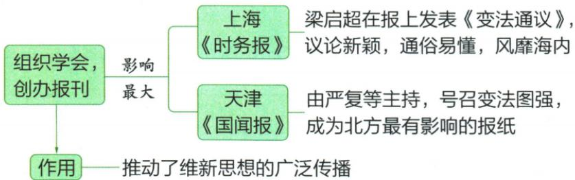

## 讲解

### 判据

看到报刊树图要分城市、报名、发表者或主持者、作品，不能把图上相邻词全视为同一级报纸。作用题还需说明为什么宣传能扩大认同。

### 流程

1.原图上支上海时务，下支天津国闻，先把地名与报纸对应。2.上支梁发表变法通议，下支严复等主持，人物角色不同不互换。3.通俗议论让主张较易被读懂，学会交流和报刊持续传播扩大讨论，补上传播到启蒙的环节。4.最大影响限定维新报刊语境，北方范围保留，不升级永恒世界第一。5.思想影响与政治控制分开，用后来的政变反证宣传广泛便一定成功；原没有发行数字则只作定性解释。

## 例题

**原图（Y6-S02，非独立题）完整保留：**组织学会、创办报刊，影响最大有上海《时务报》与天津《国闻报》。梁启超在时务报发《变法通议》，议论新颖、通俗易懂、风靡海内；国闻报由严复等主持，号召变法图强，为北方最有影响报纸；作用推动维新思想广泛传播。

**完整分析补写：**学会组织交流，报刊让主张反复传播给读者，通俗议论降低理解门槛，因而可扩思想影响。城市、报名、作者主持者逐项对应：梁与时务、严复等与国闻不能交换；“等”不解释为唯一一人。影响最大与北方最有影响均为原维新语境下评价，不改成中国全部历史所有报纸永远排第一。宣传扩大认同不等宣传者已掌国家实权，也不等仅因有报纸政变就不可能发生。自动图经原位置核对后仍采用原图，避免把独立作用节点误作另一报刊名称。

## 易错

发表文章非皇帝发诏；报刊名称不由城市随意交换；主持等字不删，广泛非所有人无条件信同一主张。

### 来源定位

- Y6-S02：full.md（历史扫描分册101-150），L2237–L2252，维新宣传学会时务国闻城市作者与作用原图；6484926a-d709-4079-96ba-4a8c4b0a1b00_origin.pdf，实际PDF第37页。
