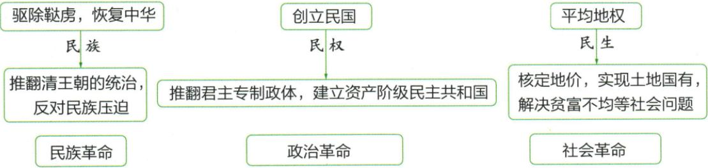

## 讲解

### 是什么

民族民权民生为同盟四纲的另一表达，前两句归民族、创民国归民权、平均地权归民生，分别涉及压迫统治、政治制度和经济社会问题。指导思想为行动方向，不证明纲领已经实现。

### 怎么来的

四句与三类数量不同因为两句合在同一民族问题，不能机械每句一主义再补第四民。民族说明反对何种统治压迫，民权说明以什么政治制度代替，民生说明如何调整土地等利益，三类互相补充却不互换。原图标民族政治社会革命为其纲领分类，不由民权有民字便当日常生计，也不由民生平均便当人口分田。早期三民原未明确反帝及彻底土地革命，说明目标仍有局限，不能凭指导二字升为解决所有问题，也不将后来的再解释倒填本课初纲。

### 什么时候能用

对应题看政治经济对象，纲领评价同时保作用局限。原图没有实施程度或群众支持率，不计算已实现几成，也不以后来同名主义直接改1905原文。

## 例题

本课无匹配独立设问，以下按原陈述、原表或原图分析，不包装为补编题。

**原内容与关系（Y8-S07、S09，非独立题）：**三民为民族、民权、民生，是同盟会纲领另一表达、资产阶级革命指导思想。图前两句驱除鞑虏恢复中华合对应民族，创立民国对应民权，平均地权对应民生；下方分别标民族革命、政治革命、社会革命。原提醒三民未明确提反帝、未提出彻底反封建土地革命纲领。

**完整分析补写：**四句纲领并非四个主义，因前两句合答推翻压迫统治的问题；民权回答建什么政治制度，民生回答经济社会贫富问题，三类各有侧重。指导思想是提供行动方向，不等纲领已全面实现；原图革命类别为该纲领的表达，不能无条件套后来不同年代同名概念。民族二字不能自动补成明确反一切帝国主义，民生也不能自动补没收均分田地；原局限限定本课早期表达，不将以后重新解释后的纲领混入1905原表。

### 第13课新解释按同一三维续发展并构成合作基础

**原对比表（Y13-S10，非独立题）：**

| 项目 | 旧三民主义 | 新三民主义 |
| --- | --- | --- |
| 民族主义 | 推翻清王朝统治，反对民族压迫 | 突出了反对帝国主义的内容 |
| 民权主义 | 推翻君主专制，建立资产阶级民主共和国 | 民主权利应为一般平民共有，基础更广 |
| 民生主义 | 平均地权，解决贫富不均等社会问题 | 平均地权、节制资本两大原则，维护工农利益 |
| 联系 | 新三民主义是旧三民主义的继续与发展，是国共合作的政治基础 | 不是另起一套毫无联系的三项名称 |

**完整分析补写：**民族一栏看反对对象，旧三民主义本条主要反清与民族压迫，新解释突出反帝，使共同反帝任务有政治依据；民权一栏看权利由谁享有，新解释扩大到一般平民，不能只答都要共和国而遗漏社会基础变化；民生一栏看如何处理经济利益，平均地权被保留，新增节制资本并关注工农。三项分别改变反对对象、权利基础和经济政策，因而称继续与发展。合作政治基础指民主革命中存在可以共同推进的任务，不证明新三民主义已经等于马克思主义、双方所有长远目标完全相同。联俄、联共、扶助农工是三大政策，名称和三民主义的三个项目也不能互换。

## 易错

三类不是四类；驱除鞑虏范围不扩整个满族；平均地权非天朝分地，民族二字不自动等明确反帝。

### 来源定位

- Y8-S07：full.md（历史扫描分册101-150），L2642–L2649，三民主义内容指导作用及反帝土地局限；6484926a-d709-4079-96ba-4a8c4b0a1b00_origin.pdf，实际PDF第44页。
- Y8-S09：full.md（历史扫描分册101-150），L2659–L2663，三民详内容与四纲对应原嵌表图；6484926a-d709-4079-96ba-4a8c4b0a1b00_origin.pdf，实际PDF第44页。
- Y13-S10：full.md（历史扫描分册151-200），L540–L542，新旧三民主义三维完整对比；7315c71c-e0f3-499f-a65f-f5d33fed3468_origin.pdf，实际PDF第9页。
- Y13-S02：full.md（历史扫描分册151-200），L485–L489，国民党一大标志内容意义；7315c71c-e0f3-499f-a65f-f5d33fed3468_origin.pdf，实际PDF第8页。
