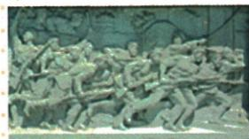

## 讲解

### 是什么

武昌起义1911十月十日晚工程营革命党人首先举事，主要力量革命倾向湖北新军；次日湖北军政府推黎都督，三镇与各省响应。省宣布独立为脱清统治，不是脱中国。

### 怎么来的

清调湖北新军入川使武昌守备减弱，原组织文学社共进会在反清思想影响下谋划，时机与组织准备相结合促进举事。首先发动和后来推都督是不同动作，不能由黎任职反推他先发，也不能由孙领导广义革命改现场人物。汉阳汉口响应说明局部武昌起义扩大至三镇，各省脱清又削弱朝廷统治，支持革命发展；原一半以上不等全部。反清独立是改政治隶属，不是现代国家分裂意义，必须按当时清政权对象读。

### 什么时候能用

用于起义背景力量过程或省响应；首发工程营与主要新军为不同尺度但可同在。浮雕主题可依原说明识别，纪念艺术不提供现场军力人数和个人姓名。

## 例题

本条无另列匹配独立题，按本课原陈述、表或图解释；课内原材料题集中见约法条目。

**原武昌完整表（Y9-S02，非独立题）：**背景1911九月清调湖北新军到四川镇保路运动，武昌空虚；同盟反清思想影响下文学社共进会谋划。主要力量湖北新军中倾向革命士兵。1911十月十日晚新军工程营革命党人首先起义，一夜占武昌，汉阳汉口新军响应、武汉三镇胜。十月十一日成立湖北军政府，推新军将领黎元洪都督。十一月下旬全国一半以上省宣布独立支持革命；1911农历辛亥，故称辛亥革命。

**完整分析补写：**新军调离造成武昌守备减弱，是起义的有利时机，革命组织谋划和思想影响提供行动准备，不能只说空虚必然自发革命。首先发动者是工程营革命党人，主要力量为新军革命倾向士兵，推举黎为都督是后来政府安排，不反推黎或孙亲自首先举事。三镇响应与各省脱清发展使局部起义扩大；这里各省独立为脱离清朝统治，不是脱离中国另建外国，原一半以上也不同全部。农历年名对应1911，不把国号建立1912改作武昌年份。

**原图说明（Y9-S06）：**写实与寓意结合，表现起义军攻打总督衙门典型场面、推翻封建帝制的伟大力量与历史发展趋势。图为后来的纪念性浮雕，不是1911现场摄影；可配原说明辨主题，不能仅凭造型辨每人姓名、人数军力或推断原未列战斗细节。

## 易错

1911武昌不同1912建民国；孙非原现场首发；黎都督非副总统同一时刻职位；三镇非所有省。

### 来源定位

- Y9-S02：full.md（历史扫描分册101-150），L2679–L2681，武昌背景新军过程黎都督省响应完整表；6484926a-d709-4079-96ba-4a8c4b0a1b00_origin.pdf，实际PDF第44–45页。
- Y9-S06：full.md（历史扫描分册101-150），L2716–L2726，武昌起义纪念碑浮雕原图及说明；6484926a-d709-4079-96ba-4a8c4b0a1b00_origin.pdf，实际PDF第45页。
