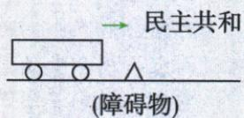

## 讲解

### 判据

材料说潮流、思想解放、众怒或护国，要用实际观念利益行动解释因果；抽象潮流不是无需人的独立外力。

### 流程

1.辛亥共和法律思想挑战专制，是复辟难获认同的观念基础，不只写潮流四字。2.二十一条让权求日支持损国家利益，接引众怒的政治支持变化，不能把外援说成全国赞同。3.护国军起兵给军事压力，是反对变为实际制约的环节，与观念因素相补。4.多因连接解释取消帝制，原三月取消早于六月死，死亡不能作唯一先因。5.原违潮流为上述方向概括，有史实才有解释，胜复辟不等以后无阻碍；若使用小车比喻，惯性只类比观念持续，不以物理定律证明政治结果必然。

## 例题

本课无匹配独立设问，以下依原陈述或表格分析；单元末原题另行接齐，不将分析计补编题。

**原复辟败因（Y10-S06，非独立题）：**违历史潮流；辛亥极大促进思想解放；护国战争；二十一条出卖国家利益引众怒。

**完整分析补写：**潮流用共和观念与反复辟行动具体说明，不当没有人的自动力量。辛亥共和法律思想挑战皇权，社会难接受倒退；二十一条让个人外援图谋损民族利益，进一步失支持；护国军反抗给现实军事压力。思想认同、国家利益与组织行动接成因果，不能只背潮流不可阻挡或仅以死亡说明复辟为何取消。取消在三月、死在六月，原先后已反证死亡不是唯一先因；失败有多种条件，也不说明共和制度之后再无阻碍。

**原护国战争（Y10-S04，非独立题）完整保留：**袁复辟举国哗然，孙发讨袁檄文号召爱国豪杰维护共和。1915年底蔡锷、李烈钧、唐继尧云南宣告独立、组织护国军北上讨袁，护国爆发。1916三月袁被迫取消帝制，六月死，原护国结束。原红注：是一场反对袁复辟帝制、维护民主共和制度的资产阶级民主革命。

**完整分析补写：**对象为复辟而非1911清帝，云南独立为脱袁统治讨袁，不是脱中国成为外国。组织军事反抗将维护共和意愿转成对袁实力压力，迫取消帝制，原结果支持护国作用；孙号召与云南三人起兵是不同活动，不把孙当唯一当地组织者。三月取消与六月死按两节点保，取消不等死亡，护国结束也不等以后没有军阀战争。OCR把红注接在军阀割据标题后，实际PDF47页箭头来自护国结果，应归护国性质，不给混战贴维护共和革命标签。

### 单元新考法小车原图类比与四项史实判断

**单元新考法原题（未标具体真题年份，跨学科物理）：**若将下图中的小车看作中国近代政治制度，其整体趋势是向着民主共和的方向前进，行驶过程中遇到了障碍物，即使紧急制动也由于惯性继续向前，甚至越过障碍物。这可以用来解释（ ）

A.洋务运动兴起的时代背景；B.袁世凯复辟帝制失败的原因；C.北洋军阀混战带来的影响；D.黄花岗起义失败的后果。

**原答案：B。原解：**示意图解释复辟失败原因，即紧急制动仍继续向前；辛亥极大促进思想解放，共和趋势不可阻挡，复辟不得人心以失败告终。

**逐项解析补写：**原图向右箭头标民主共和、小车前方三角障碍物，先按题设把前進类比共和观念持续、障碍类比倒退图谋。A洋务兴起的背景内忧外患、学科技维护清，与辛亥后反复辟类比不对应。B辛亥共和观念与反袁护国使称帝难持续，倒退被阻的结果配越障，故B；史实依据是思想国家利益和护国行动，不是政治制度真的受惯性力推动。C军阀混战有经济人民共和损害，与类比所问复辟失败原因不同，不因也属近代阻碍便选。D黄花岗1911四月失败有鼓舞作用，但为推清共和建立前起义，不是袁称帝倒退失败对象。图的物理现象只作类比，不保证任何历史进步自动发生或能省去人的组织行动；惯性是物体保持运动状态的性质，不另造推动小车的惯性力。

## 易错

不得人心要给国家利益或共和证据；思想不自动变军力，军力也不证明所有人意见一致；结果与后续割据分开。

### 来源定位

- Y10-S06：full.md（历史扫描分册101-150），L2851–L2856，复辟失败四原因；6484926a-d709-4079-96ba-4a8c4b0a1b00_origin.pdf，实际PDF第47页。
- Y10-S04：full.md（历史扫描分册101-150），L2835–L2841，护国背景云南三人起兵结果红字性质；6484926a-d709-4079-96ba-4a8c4b0a1b00_origin.pdf，实际PDF第47页。
- Y10-S02：full.md（历史扫描分册101-150），L2829–L2831，对外接受二十一条大部目的内容；6484926a-d709-4079-96ba-4a8c4b0a1b00_origin.pdf，实际PDF第47页。
- Y3-Q05：full.md（历史扫描分册101-150），L2947–L2961，小车民主共和惯性比喻选择原题原答原解；6484926a-d709-4079-96ba-4a8c4b0a1b00_origin.pdf，实际PDF第49页。
