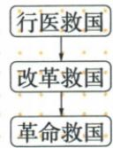

## 讲解

### 判据

材料出现上书、华侨团体、广州准备或海外活动时，先判途径和具体阶段，再按原年配组织与地点。不能只看都与孙有关便合成同一件事。

### 流程

1.读原图行医→改良→革命，先区分帮助个人、寄望旧政改革、推翻专制三种途径；图不附每阶段年份，不补年份。2.1894上书冷遇对应从改良转向革命的原叙述，用当时遭遇说明转向依据，不拿1898后事作先因。3.同年十一月檀香山华侨兴中会，记组织和口号，区别1905东京同盟。4.1895广州准备十月事泄失败，按陆皓东牺牲核人物，不能换1911黄花岗黄兴。5.再接海外考察与发展组织，说明失败后行动延续，既不改失败结果，也不把海外活动说成放弃救国。

## 例题

本课无匹配独立设问，以下按原陈述、原表或原图分析，不包装为补编题。

**原资料与图（Y8-S01、S04，非独立题）完整保留：**1894夏孙上书李鸿章遭冷遇，认识只有推翻清专制才能救中国；1894十一月在檀香山联合华侨立兴中会，提振兴中华，号召驱除鞑虏、恢复中国、创立合众政府。1895准备广州武装起义，十月事泄陆皓东等捕牺牲、失败。此后流亡日美英等考察社会实际、发展革命组织。原图顺为行医救国→改良救国→革命救国。

**完整分析补写：**图概括救国途径变化，行医指医疗帮助，改良寄望改变旧政，革命选择推翻专制建立新政；不同途径仍围绕国家困境，不能说救国愿望全互不相干。上书冷遇为原列思想转变节点，不把1894同后来1898戊戌政变因果倒置。兴中会为革命团体，海外创立与后来东京同盟会不同地点组织；广州准备失败与海外继续活动又说明失败不等从此退出革命。原广州1895非1911黄花岗，陆牺牲不能换黄兴；原未给图中医疗阶段精确日期，不自行填写。

## 易错

原图路径不等每条都已有精确日期；兴中恢复中国与同盟恢复中华按各原句保留；相同广州地名不保证相同年份起义。

### 来源定位

- Y8-S01：full.md（历史扫描分册101-150），L2595–L2603，1894上书革命思想兴中会广州失败海外四段；6484926a-d709-4079-96ba-4a8c4b0a1b00_origin.pdf，实际PDF第43页。
- Y8-S04：full.md（历史扫描分册101-150），L2623–L2626，行医改良革命思想变化原图；6484926a-d709-4079-96ba-4a8c4b0a1b00_origin.pdf，实际PDF第43页。
