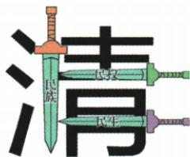

## 讲解

### 判据

看到驱除恢复、共和国平等选举、地价税收收买，分别找统治压迫、政治制度、经济利益对象。三民对应不能按四句话机械排四类。

### 流程

1.驱除鞑虏恢复中华两句合看推清统治反民族压迫，归民族；原对象统治者，不扩大整个满族。2.创立民国及国民平等选举，回答新政治安排，归民权；不是分田方案，也不等权利已落实。3.平均地权及核价征税收买，回答土地利益与贫富，归民生；不是按人口分相同亩数。4.回原图核四句对应三类及民族、政治、社会革命标签，不能自动少一分支或补第四主义。5.评价分层：指导思想提供共同方向，原未明确反帝和彻底土地革命保局限；不能因有作用便宣布全实现，也不能因有限便说没有革命意义。

## 例题

本课无匹配独立设问，以下按原陈述、原表或原图分析，不包装为补编题。

**原内容与关系（Y8-S07、S09，非独立题）：**三民为民族、民权、民生，是同盟会纲领另一表达、资产阶级革命指导思想。图前两句驱除鞑虏恢复中华合对应民族，创立民国对应民权，平均地权对应民生；下方分别标民族革命、政治革命、社会革命。原提醒三民未明确提反帝、未提出彻底反封建土地革命纲领。

**完整分析补写：**四句纲领并非四个主义，因前两句合答推翻压迫统治的问题；民权回答建什么政治制度，民生回答经济社会贫富问题，三类各有侧重。指导思想是提供行动方向，不等纲领已全面实现；原图革命类别为该纲领的表达，不能无条件套后来不同年代同名概念。民族二字不能自动补成明确反一切帝国主义，民生也不能自动补没收均分田地；原局限限定本课早期表达，不将以后重新解释后的纲领混入1905原表。

**原民族内容与易错（Y8-S06、S09，非独立题）：**民族主义推清统治、反民族压迫，对应驱除鞑虏恢复中华。原解释鞑虏在这里指清朝统治者，不是整个满族，放当时条件有反封建进步意义。

**完整分析补写：**对象按原明确范围理解为统治者及压迫，而非把民族群众全等同统治集团，更不能以历史带贬词对今天族群作判断。两句纲领回答推谁和恢复什么政治共同体，不能因民族主义名称便忽略原未明确反帝的局限。反清政治目标与建立何种新制度相连，但三类纲领仍各答不同面向；推清不等当时国家已摆脱全部外国特权，主张有意义也不证明所有实际行动都无局限。

**原民权内容（Y8-S09，非独立题）：**推君主专制、建资产阶级民主共和国，国民一律平等，总统与议员由国民选举，图对应创立民国、政治革命。

**完整分析补写：**君主专制主要权力与最高职位依皇权，共和国主张把国家政治权力和职位形成改为国民与选举原则，故民权侧重政治制度、不是减地租方案。此为原纲领目标，不等所有平等权利已经实际落实，也不等1912临时政府与整个民国永远同一个机构。它与维新借清改良区别在推翻专制、建共和路径；原未列具体选举资格规则，不擅说每个年龄性别均已在现实普选，也不将制度目标同取得国家主权独立全混。

**原民生详表（Y8-S09，非独立题）完整保留：**核定全国地价，国家根据核定地价征地租税，同时逐步向地主收买土地，实现土地国有，解决贫富不均等社会问题；对应平均地权、社会革命。原提醒未提出彻底反封建土地革命纲领。

**完整分析补写：**这里围绕土地价值、税收和收买调整经济利益，平均地权不是将每人马上分到等亩土地，核地价也不等核每人年龄人口。原土地国有为方案概括，不说明同盟会成立即将所有土地实际归国；未提出彻底土地革命说明没有明确原表之外的没收并按农民人口分配方案。孙中山1912年相关演说也明确区别平均地权与计口授田，并说明地价税和收买；该演说用于术语边界核查，不能把1912全部细节说成1905本课原条文。[原演说核查](https://www.sunyat-sen.org/portal/article/index.html?cid=19&id=24406) 本课与太平天朝田亩的人口年龄分地理想为不同方法，不能仅见平均就合并概念。

### 单元原题1识三民再判阶级并逐项排除

**单元原题1（原书标2023四川绵阳中考，未另核真题身份）：**下图反映了近代中国一次民主运动。它体现的反清思想属于（ ）

A.农民阶级；B.无产阶级；C.地主阶级洋务派；D.资产阶级革命派。

**原答案：D。原解题思路：**图片信息民族、民权、民生体现三民主义，孙中山提出、代表资产阶级革命派。

**逐项解析补写：**原图三剑分别有民族民权民生，以清字为对象，先识三民再回孙的推清建共和国纲领，故D。A农民反清可有太平天国，不代表同一种三民纲领，原图不见天朝人口分地依据，排除不等农民绝不反清。B本图人物纲领属于资产革命派，不是无产阶级思想，不能因都是反清或革命一词便换阶级。C洋务地主官员以技术自强维护清统治，和图中推清的制度方向不同，也非三民提出者。D三个关键词与孙同盟纲领共同支持，不能只凭清字一条判断任何反清都属资产阶级。原识别把民生误为民工，已核实际48页恢复民生，不以占位摘要代原图。

## 易错

这里用早期纲领，后来的重新阐释不能倒填；名称中的民族不自动意味着明确反帝；政治平等目标不证明当时每人现实普选。

### 来源定位

- Y8-S06：full.md（历史扫描分册101-150），L2634–L2640，鞑虏所指统治者与维新革命路径原易错；6484926a-d709-4079-96ba-4a8c4b0a1b00_origin.pdf，实际PDF第43页。
- Y8-S07：full.md（历史扫描分册101-150），L2642–L2649，三民主义内容指导作用及反帝土地局限；6484926a-d709-4079-96ba-4a8c4b0a1b00_origin.pdf，实际PDF第44页。
- Y8-S09：full.md（历史扫描分册101-150），L2659–L2663，三民详内容与四纲对应原嵌表图；6484926a-d709-4079-96ba-4a8c4b0a1b00_origin.pdf，实际PDF第44页。
- Y3-Q01：full.md（历史扫描分册101-150），L2883–L2907，三民图思想阶级选择原题原答原解；6484926a-d709-4079-96ba-4a8c4b0a1b00_origin.pdf，实际PDF第48页。
