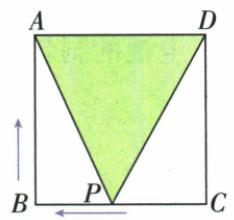
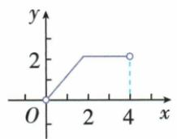
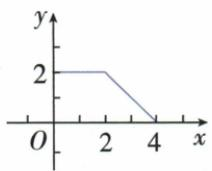
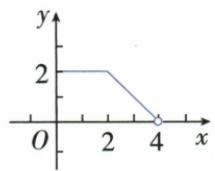
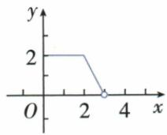

## 错法

原矩形CD段面积恒1便猜P停了，或P恒速就让面积一直升。混淆点运动与底高积变化，未分析到固定底的垂距。

## 正解

点沿CD移动，CD平行AB，垂高始终1；底AB2固定，面积1也固定。平台表示所画输出不变，不等于所有量不变。正方形CB段同理面积2；转BA后才高变，必须分边写式。

## 例题

### 矩形沿边运动面积先增后恒定

> 来源ID Q13-10；第13章一次函数；101-150/full.md 第3644–3658行。原答案与解析定位：101-150/full.md 第3660–3662行。

例5 如图,在长方形 ABCD 中,AB=2,BC=1,动点 P 从点 B 出发,沿路线 $B \rightarrow C \rightarrow D$ 做匀速运动,那么 $\triangle ABP$ 的面积 S 与点 P 运动的路程 x 之间的函数图象大致是 ( )

  
A

  
B

  
C

  
D

**原资料答案与解析：**

解析 当点 $P$ 在 $BC$ 上(不包含点 $B$ 、点 $C$ ) 时, $\triangle PAB$ 的面积 $S = \frac{1}{2} AB \cdot PB$ , 即 $S = \frac{1}{2} \times 2x = x$ , 此时 $0 < x < 1$ . 当点 $P$ 在 $CD$ 上时, $\triangle PAB$ 的面积 $S = \frac{1}{2} AB \cdot BC = \frac{1}{2} \times 2 \times 1 = 1$ , 面积是定值, 此时 $1 \leqslant x \leqslant 3$ . 故选 B.

答案B

**展开解析（依据原详解补足理由与步骤）：**

AB=2、BC=1，P从B沿BC、CD到D，路程x从0到3。BC段BP=x、BP⊥AB，△ABP面积=(1/2)×2×x=x，0≤x≤1；B处三点退化，面积延拓为0。CD段P到直线AB距离始终1，面积=(1/2)×2×1=1，1≤x≤3，两段x=1都给1。所以先升至(1,1)再水平至(3,1)，B对。A始终升错在CD高不变；C从高处下降不符起点面积0；D转折或平台高度2把底高积漏除2。原只讨论非退化三角形时可不称起点为三角形，但面积图的起点取0不改变后段。

### 正方形沿边运动面积与开放端点

> 来源ID Q13-42；第13章一次函数；151-200/full.md 第485–509行。原答案与解析定位：151-200/full.md 第511–513行。

例4 如图, 正方形 ABCD 的边长为 2 , 动点 P 从 C 出发, 在正方形的边上沿着 $C \rightarrow B \rightarrow A$ 的方向运动 (点 P 与 A 不重合). 设点 P 的运动路程为 x, $\triangle ADP$ 的面积为 y, 则下列图象中能表示 y 关于 x 的函数关系的是 ()

  
A

  
B

  
C

  
D

**原资料答案与解析：**

解析 当 $P$ 在 $BC$ 上时, $\triangle ADP$ 的面积 $y = \frac{1}{2} AD \cdot CD = 2$ , 面积是定值, 此时 $0 \leqslant x \leqslant 2$ . 当 $P$ 在 $AB$ 上 (点 $P$ 不与点 $A$ 、点 $B$ 重合) 时, $\triangle ADP$ 的面积 $y = \frac{1}{2} AD \cdot AP = 4 - x$ , $y$ 随 $x$ 的增大而减小, 此时 $2 < x < 4$ . 据此可知选项 C 能反映这一变化过程.

答案 C

**展开解析（依据原详解补足理由与步骤）：**

正方形边2，P从C经B到A，P≠A，路程0≤x<4。底AD=2，CB段P到AD垂距恒2，所以面积y=(1/2)×2×2=2，0≤x≤2。BA段走出CB的2后，余BA距离2−(x−2)=4−x，它是高，面积=(1/2)×2×(4−x)=4−x，所以2≤x<4时y=4−x。两式在x=2都给2，连接无跳；x=4对应A，题排除，(4,0)应空心。图C正确。A初段从0增，不符C到AD已有2；B把终点实心收A；D折点不在走完边长2的位置。
