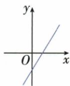
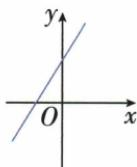
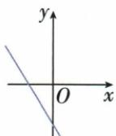
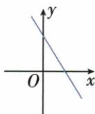
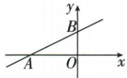
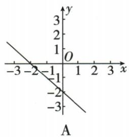
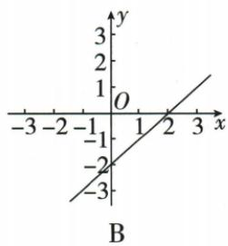
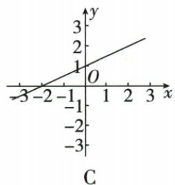
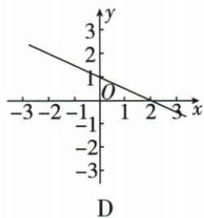

## 讲解

### 是什么

y轴交点是(0,b)，x轴交点是(−b/k,0)。k的符号定左右升降，b的符号定y轴交点上下，两者共同定整直线经过哪些象限。b=0另按正比例处理，不把轴点算某象限。

$$
\text{纵轴交点}\ (0,b),\qquad\text{横轴交点}\ \left(-\frac{b}{k},0\right)
$$

### 怎么来的

求y截距代横0，得y=b；求x截距代纵0，kx+b=0后除非零k，x=−b/k。k>0、b>0时x截距负，线过ⅠⅡⅢ；k>0、b<0时x截距正，过ⅠⅢⅣ；k<0、b>0过ⅠⅡⅣ；k<0、b<0过ⅡⅢⅣ。这些可由两截点和向左向右延长判断，每区间再核横纵符号，不需盲背。原y=2x+m不进Ⅱ，允许m=0，因为负x给负y。

### 什么时候能用

表述整直线经过的象限时默认x遍全实数，若实际只x≥0或有限区间须再裁剪。m=0轴交重合O，不能沿用b≠0的三象限表。题用距离OA=2而A在负半轴，实际截点横−2，距离2不可直接当坐标。

## 例题

### 一次函数不经过第二象限允许零截距

> 来源ID Q13-17；第13章一次函数；101-150/full.md 第3870–3870行。原答案与解析定位：101-150/full.md 第3872–3880行。

例1 已知一次函数 $y=2x+m$ 的图象不经过第二象限, 求 m 的取值范围.

**原资料答案与解析：**

解析 $\because k = 2 > 0, \therefore$ 图象必过第一、三象限，当 $m < 0$ 时，图象过第一、三、四象限；

当 m=0 时, 图象过原点及第一、三象限;

当 m>0 时, 图象过第一、二、三象限, 不合题意.

综上, $m \leqslant 0$ .

注意 本题中当 m=0 时，函数为正比例函数，正比例函数是特殊的一次函数，此时图象亦不经过第二象限.

**展开解析（依据原详解补足理由与步骤）：**

y=2x+m，斜率2>0。若m>0，取靠近0的负x，有y>0，经过第二象限；因此需m≤0。m=0时负x必负y，仅ⅠⅢ象限，也不经过Ⅱ，不能漏掉0。m<0时x<0给2x+m<0，也不进Ⅱ。故m≤0，不是只m<0。

### 负斜率函数四项综合判断

> 来源ID Q13-18；第13章一次函数；101-150/full.md 第3884–3889行。原答案与解析定位：101-150/full.md 第3891–3891行。

例2 关于函数 $y = -2x + 1$ ，下列结论正确的是（）

A. 图象必经过点 $(-2,1)$   
B. 图象经过第一、二、三象限  
C. 当 $x > \frac{1}{2}$ 时, y < 0   
D.y 随 x 的增大而增大

**原资料答案与解析：**

答案 C

**展开解析（依据原详解补足理由与步骤）：**

y=−2x+1。A点(−2,1)代入应y=4+1=5，非1，错。B图过ⅠⅡⅢ不对：y截距1正、x截距1/2正、斜率负，过ⅠⅡⅣ，不进Ⅲ。C x>1/2时−2x<−1，两边加1得y<0，正确。D随x增大y增大，错，因为k=−2<0应减小。选C，每项分别查代点、象限、符号、增减，不由一项正确推出其他性质。

### 参数范围先判真正斜率和截距选图

> 来源ID Q13-24；第13章一次函数；101-150/full.md 第4035–4047行。原答案与解析定位：101-150/full.md 第4049–4051行。

例5 若 $m < -2$ ，则一次函数 $y = (m + 1)x + 1 - m$ 的图象可能是 （）

  
A

  
B

  
C

  
D

**原资料答案与解析：**

解析 $\because m < -2, \therefore m + 1 < 0, 1 - m > 0, \therefore$ 一次函数 $y = (m + 1)x + 1 - m$ 的图象经过第一、二、四象限.

答案 D

**展开解析（依据原详解补足理由与步骤）：**

m<−2，所以m+1<−1<0，斜率负，直线从左往右下降；1−m>3>0，y截距正。两者共同锁定D。A斜率正且截距负，B斜率正，C虽下降却截距负，都违反至少一项。不能见m负就认为截距1−m也负，减负数反而增。

### 正斜率负截距函数四项辨析

> 来源ID Q13-29；第13章一次函数；151-200/full.md 第41–46行。原答案与解析定位：151-200/full.md 第62–64行。

例3 (2024 湖南长沙) 对于一次函数 y=2x-1, 下列结论正确的是 ()

A.它的图象与y轴交于点(0,-1)  
B. $y$ 随 $x$ 的增大而减小  
C. 当 $x > \frac{1}{2}$ 时, y < 0   
D. 它的图象经过第一、二、三象限

**原资料答案与解析：**

例3 解析 A. y=2x-1 的图象与 y 轴交点为 $(0,-1)$ ，故 A 正确；B. k=2>0, y 随 x 的增大而增大，故 B 不正确；C. 当 $x=\frac{1}{2}$ 时， $y=2\times\frac{1}{2}-1=0$ ，∵ y 随 x 的增大而增大，∴ 当 $x>\frac{1}{2}$ 时，y>0，故 C 不正确；D. 该一次函数图象经过第一、三、四象限，故 D 不正确.

答案 A

**展开解析（依据原详解补足理由与步骤）：**

y=2x−1。A交y轴横0给纵−1，(0,−1)正确。B随x增y减错误，系数2>0应增。C x>1/2时2x−1>0，不是负。D过ⅠⅡⅢ错误：负x时2x−1负，绝不进Ⅱ；实际ⅠⅢⅣ。选A。

### 负半轴截距距离读一次方程根

> 来源ID Q13-36；第13章一次函数；151-200/full.md 第261–263行。原答案与解析定位：151-200/full.md 第241–243行。

例1（2024江苏扬州）如图，已知一次函数 $y = kx + b (k \neq 0)$ 的图象分别与 $x, y$ 轴交于 $A, B$ 两点，若 $OA = 2, OB = 1$ ，则关于 $x$ 的方程 $kx + b = 0$ 的解为 \_\_\_\_.

**原资料答案与解析：**

例1 解析 $\because OA=2,\therefore$ 一次函数 $y=kx+b(k\neq0)$ 的图象与 x 轴相交于点 $A(-2,0),\therefore$ 关于 x 的方程 $kx+b=0$ 的解为 x=-2.

答案 $x = -2$

**展开解析（依据原详解补足理由与步骤）：**

图中A在x负半轴，OA=2故A横−2，不是+2；B在y正半轴、OB=1。kx+b=0的根为x轴交点横，x=−2。图给的是距离2，需要依所在半轴添负号。

### 不等式小于零解集反选截点方向

> 来源ID Q13-38；第13章一次函数；151-200/full.md 第279–352行。原答案与解析定位：151-200/full.md 第255–257行。

例3（2024 广东）已知不等式 $kx + b < 0$ 的解集是 x < 2，则一次函数 y = kx + b 的图象大致是（）

**原资料答案与解析：**

例3 解析 A. 由图象可得, 不等式 $kx + b < 0$ 的解集是 $x > -2$ , 不符合题意; B. 由图象可得, 不等式 $kx + b < 0$ 的解集是 $x < 2$ , 符合题意; C. 由图象可得, 不等式 $kx + b < 0$ 的解集是 $x < -2$ , 不符合题意; D. 由图象可得, 不等式 $kx + b < 0$ 的解集是 $x > 2$ , 不符合题意.

答案 B

**展开解析（依据原详解补足理由与步骤）：**

解集x<2表示线在横2左侧处于x轴下，横2时纵0，故应从左下往右上、在正半轴2交轴的B。A下降且交−2，下方在x>−2；C上升交−2，下方x<−2；D下降交2，下方x>2。既核零点又核哪侧低于轴，不能仅见交2就选D。

## 易错

原m<−2使1−m正不是负；“不过第二象限”收0截距，严格“过某象限”则要区内存在非轴点。
