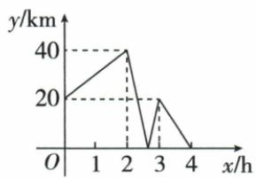

## 讲解

### 是什么

同一路线上两车间距离是它们位置差的绝对值。距离0表示相遇；过相遇点后前后关系互换，距离图可由降变升，即使两车仍按原方向走。图的斜率大小反映相对速度，不一定是任一车实际速度。

### 怎么来的

乙休息时位置固定，甲的移动直接改变两车距离。原2至3小时，距离40→0→20，甲先走40赶上乙，再走20超过，合计60而非末初差−20。原时间区间一小时，甲速60；再按甲4小时原全程推240。若两车均运动，同向距离变化率大小为速度差，反向为和，须先读题方向与休息信息。

### 什么时候能用

仅凭距离折线不能唯一复原各车位置和速度，需原题给方向、谁停、恒速或全程时刻。距离纵值非负，曲线折点不必车辆掉头，0点是位置相同。车辆途中停止会改变阶段斜率，必须按时间段拆开。

## 例题

### 两车间距离图识别相遇与相对速度

> 来源ID Q13-43；第13章一次函数；151-200/full.md 第525–544行。原答案与解析定位：151-200/full.md 第550–560行。

例1（2024山东威海）同一条公路连接 $A, B, C$ 三地， $B$ 地在 $A, C$ 两地之间。甲、乙两车分别从 $A$ 地、 $B$ 地同时出发前往 $C$ 地。甲车速度始终保持不变，乙车中途休息一段时间，继续行驶。下图表示甲、乙两车之间的距离 $y(\mathrm{km})$ 与时间 $x(\mathrm{h})$ 的函数关系。下列结论正确的是（）

A.甲车行驶 $\frac{8}{3}\mathrm{h}$ 与乙车相遇  
B.A,C 两地相距 220 km   
C.甲车的速度是 $70 \mathrm{~km} / \mathrm{h}$   
D.乙车中途休息36分钟

**原资料答案与解析：**

例1 解析 乙车休息时间为 3-2 = 1(h)，故 D 选项错误，

∵ 中间两段折线表示甲车行驶的路程为 $40+20=60(\text{km})$ ,

∴ 甲车的速度为 $60 \div (3 - 2) = 60 \, (\text{km/h})$ ，故 C 选项错误，

∴ A, C 两地相距 $4 \times 60 =$ 240(km), 故 B 选项错误,

甲、乙中途相遇的时间为 $2+40\div60=\frac{8}{3}(h)$ ，故 A 选项正确.

答案 A

**展开解析（依据原详解补足理由与步骤）：**

原两车距离图依次读(0,20)、(2,40)、(8/3,0)、(3,20)、(4,0)。乙2至3小时休息共1小时，此时甲继续走，两车距离先40降0再升20，说明甲先赶上再超过，并未掉头；甲此小时走40+20=60千米，甲速60千米/小时。甲4小时走全程AC=60×4=240千米。第一次相遇在8/3小时，A正确。B的220千米与全程240不符；C的70千米/小时不符休息段60；D把1小时算36分钟也错，实际60分钟。距离斜率取绝对相对速度，过零后符号改变使折线转向，不能把距离折点当车辆转弯。

## 易错

休息段跨相遇，要加两个正距离40与20而不是作20−40；总图时间4小时不代表两车各走相同全程，原用甲的条件求AC。
