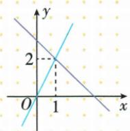

## 讲解

### 是什么

方程f(x)=c对应函数图与水平线y=c交点的横坐标；f(x)=g(x)对应两图公共点的横坐标。不等式f(x)<c看图在该水平线下的全部输入，f(x)<g(x)看同一横位置第一图在第二图下。等号是否收入由题的不等号决定。

$$
f(x)=g(x)\ \Longleftrightarrow\ \text{同一输入处两图纵坐标相等}
$$

### 怎么来的

图点纵就是函数值，固定输入处的上下比较即输出大小。原kx+b=2不用x轴，而看y=2；原两线在横1相交，左侧上升线低于下降线，故小于的范围x<1。原y=−3x+12交横4，右侧在轴下；代数除负数翻向与图右降互相验证。

### 什么时候能用

读图必须涵盖全部允许区间，等式可能多交点、无交点或重合。对本章完整一次线，唯一交点左右一次换高低；后续曲线不能只查一个交点。严格号排交点，非严格号收交点，还要保函数本身定义域。

## 例题

### 两条水平比较线读一次方程的根

> 来源ID Q13-31；第13章一次函数；151-200/full.md 第90–92行。原答案与解析定位：151-200/full.md 第94–94行。

例1 一次函数 $y = kx + b$ 的图象如图所示, 则关于 x 的方程 $kx + b = 0$ 的解为 \_\_\_\_, 关于 x 的方程 $kx + b = 2$ 的解为 \_\_\_\_.

**原资料答案与解析：**

答案 $x = -1; x = 0$

**展开解析（依据原详解补足理由与步骤）：**

原一次线与x轴交于(−1,0)，与y轴交于(0,2)。解kx+b=0，就是读纵0的交点横−1；解kx+b=2，读纵2交点横0。答案依次−1与0。第二问右边2不是0，不能仍盯x轴；图点纵2不是该方程所求x。

### 两线纵向比较读取不等式范围

> 来源ID Q13-33；第13章一次函数；151-200/full.md 第120–120行。原答案与解析定位：151-200/full.md 第171–172行。

例3 在平面直角坐标系 $xOy$ 中，一次函数 $y = kx$ 和 $y = mx + n$ 的图象如图所示，则关于 $x$ 的一元一次不等式 $kx < mx + n$ 的解集是 \_\_\_\_.

**原资料答案与解析：**

  
答案 $x < 1$

**展开解析（依据原详解补足理由与步骤）：**

原两线交在横1处，向右升的kx+b线在交点左侧低于下降的mx+n线，因此kx+b<mx+n的解为x<1。x=1两纵相等，严格小于不收；x>1高低相反。比较的是同一个横坐标上两线谁更低，不是看某线是否在x轴下。

### 画直线并从横轴上下求正负范围

> 来源ID Q13-34；第13章一次函数；151-200/full.md 第187–189行。原答案与解析定位：151-200/full.md 第191–205行。

例1 画出函数 $y = -3x + 12$ 的图象, 利用图象解决下列问题:

(1) 求不等式 $-3x + 12 > 0$ 的解集. (2) 求不等式 $-3x + 12 \leqslant 0$ 的解集.

**原资料答案与解析：**

解析 画出函数 $y=-3x+12$ 的图象, 如图所示.

(1)由图可知,不等式 $-3x+12>0$ 的解集是x<4.  
(2) 由图可知, 不等式 $-3x + 12 \leqslant 0$ 的解集是 $x \geqslant 4$ .

**展开解析（依据原详解补足理由与步骤）：**

y=−3x+12，取x=0得(0,12)；取y=0解−3x+12=0，x=4得(4,0)，两不同点定线。−3x+12>0移项得−3x>−12，除负3反向得x<4；图上对应交点左侧线在x轴上。−3x+12≤0同理解x≥4，含(4,0)等值。不能把y≤0写x≤4而忽略斜率负，也不采自动图表的错误(4,2)。

### 负半轴截距距离读一次方程根

> 来源ID Q13-36；第13章一次函数；151-200/full.md 第261–263行。原答案与解析定位：151-200/full.md 第241–243行。

例1（2024江苏扬州）如图，已知一次函数 $y = kx + b (k \neq 0)$ 的图象分别与 $x, y$ 轴交于 $A, B$ 两点，若 $OA = 2, OB = 1$ ，则关于 $x$ 的方程 $kx + b = 0$ 的解为 \_\_\_\_.

**原资料答案与解析：**

例1 解析 $\because OA=2,\therefore$ 一次函数 $y=kx+b(k\neq0)$ 的图象与 x 轴相交于点 $A(-2,0),\therefore$ 关于 x 的方程 $kx+b=0$ 的解为 x=-2.

答案 $x = -2$

**展开解析（依据原详解补足理由与步骤）：**

图中A在x负半轴，OA=2故A横−2，不是+2；B在y正半轴、OB=1。kx+b=0的根为x轴交点横，x=−2。图给的是距离2，需要依所在半轴添负号。

### 不等式小于零解集反选截点方向

> 来源ID Q13-38；第13章一次函数；151-200/full.md 第279–352行。原答案与解析定位：151-200/full.md 第255–257行。

例3（2024 广东）已知不等式 $kx + b < 0$ 的解集是 x < 2，则一次函数 y = kx + b 的图象大致是（）

**原资料答案与解析：**

例3 解析 A. 由图象可得, 不等式 $kx + b < 0$ 的解集是 $x > -2$ , 不符合题意; B. 由图象可得, 不等式 $kx + b < 0$ 的解集是 $x < 2$ , 符合题意; C. 由图象可得, 不等式 $kx + b < 0$ 的解集是 $x < -2$ , 不符合题意; D. 由图象可得, 不等式 $kx + b < 0$ 的解集是 $x > 2$ , 不符合题意.

答案 B

**展开解析（依据原详解补足理由与步骤）：**

解集x<2表示线在横2左侧处于x轴下，横2时纵0，故应从左下往右上、在正半轴2交轴的B。A下降且交−2，下方在x>−2；C上升交−2，下方x<−2；D下降交2，下方x>2。既核零点又核哪侧低于轴，不能仅见交2就选D。

## 易错

不等式比较两函数时不能改成看某线负不负；题要求kx+b<0范围x<2，既指定零点2也指定正斜率，不只查截距位置。
