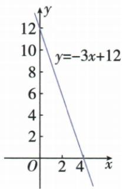

## 讲解

### 判据

已给明确一次式作图，选便于算的两个不同合法点；完成直线后按原允许输入保对应部分。

### 流程

1. 定横纵单位、原点、正方向与输入范围。
2. 常取x0求纵与y0求横，原y=−3x+12得(0,12)、(4,0)。
3. 若两点同O，另取(1,k)而不是用一个点画任意方向。
4. 两点连成直线，方向与k符号核对，截点与b核对。
5. 区间端是否含、实际整数点是否离散分别标，不能把非法点连成合法模型。

## 例题

### 画直线并从横轴上下求正负范围

> 来源ID Q13-34；第13章一次函数；151-200/full.md 第187–189行。原答案与解析定位：151-200/full.md 第191–205行。

例1 画出函数 $y = -3x + 12$ 的图象, 利用图象解决下列问题:

(1) 求不等式 $-3x + 12 > 0$ 的解集. (2) 求不等式 $-3x + 12 \leqslant 0$ 的解集.

**原资料答案与解析：**

解析 画出函数 $y=-3x+12$ 的图象, 如图所示.

(1)由图可知,不等式 $-3x+12>0$ 的解集是x<4.  
(2) 由图可知, 不等式 $-3x + 12 \leqslant 0$ 的解集是 $x \geqslant 4$ .

**展开解析（依据原详解补足理由与步骤）：**

y=−3x+12，取x=0得(0,12)；取y=0解−3x+12=0，x=4得(4,0)，两不同点定线。−3x+12>0移项得−3x>−12，除负3反向得x<4；图上对应交点左侧线在x轴上。−3x+12≤0同理解x≥4，含(4,0)等值。不能把y≤0写x≤4而忽略斜率负，也不采自动图表的错误(4,2)。

### 剧院座位线性规律先建模再筛整数排

> 来源ID Q13-39；第13章一次函数；151-200/full.md 第402–408行。原答案与解析定位：151-200/full.md 第410–414行。

例1 某剧院的观众席的座位按下列方式设置：

| 排数(x) | 1 | 2 | 3 | 4 | ... |
| --- | --- | --- | --- | --- | --- |
| 座位数(y) | 50 | 53 | 56 | 59 | ... |

(1) 写出座位数 $y$ 与排数 $x$ 之间的关系式.

(2) 按照上表所示的规律, 某一排可能有 90 个座位吗? 请说明理由.

**原资料答案与解析：**

解析（1）从第2排开始，每一排比它前面一排多3个座位，则第 $x$ 排比第1排多 $3(x - 1)$ 个座位，从而得到 $y$ 与 $x$ 之间的关系式为 $y = 50 + 3(x - 1)$ ，即 $y = 3x + 47$

(2) 不可能. 理由: 当 $y = 90$ 时, $3x + 47 = 90$ , 解得 $x = \frac{43}{3}$ ,

因为 $\frac{43}{3}$ 不是正整数,所以某一排不可能有90个座位.

**展开解析（依据原详解补足理由与步骤）：**

第1排50座，第2排53，之后每排增3。第x排从第一排走了x−1次增加，y=50+3(x−1)=3x+47，其中x为正整数。若90座，3x+47=90，3x=43，x=43/3不是整数，所以没有一排恰好90座。直线解析式代小数虽可算，但小数排并不在实际取值范围；也不能四舍五入说第14排。

## 易错

首值不一定纵截距，剧院第1排50对应x1而非x0；原OCR错误(4,2)不能替代精确截点。
