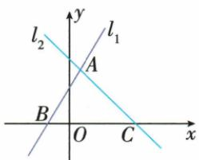

## 讲解

### 判据

两函数与x轴围成三角形，先联立两线得顶点，再分别置y0得两个底端；底高用坐标量，不量示意图。

### 流程

1. 两线联立原y=2x+3与y=−x+5，得顶点横2/3纵13/3。
2. 各线令y0，得底端−3/2与5，都在x轴。
3. 底长|5−(−3/2)|=13/2，负端坐标必须完整括号。
4. 高是顶点到x轴垂距|13/3|，不是斜边长或横2/3。
5. 面积底高/2得169/12，若两根重合或顶点在轴须说明退化，不强称正面积。

## 例题

### 两直线与x轴围成三角形求底高

> 来源ID Q13-26；第13章一次函数；101-150/full.md 第4074–4089；另接151-200/full.md 第1–2行行。原答案与解析定位：151-200/full.md 第4–14行。

例7 如图,已知直线 $l_{1}:y=2x+3$ , 直线 $l_{2}:y=-x+5$ , 直线 $l_{1},l_{2}$ 分别交 x 轴于 B、C 两点, $l_{1},l_{2}$ 相交于点 A.

(1) 求 A、B、C 三点的坐标.  
(2) 求 $\triangle ABC$ 的面积.

**原资料答案与解析：**

解析（1）令 $2x + 3 = 0$ ，得 $x = -\frac{3}{2},\therefore$ 点 $B$ 的坐标为 $\left(-\frac{3}{2},0\right)$

令 $-x+5=0$ , 得 x=5, ∴ 点 C 的坐标为 $(5,0)$ ,

$\because l_{1},l_{2}$ 相交于点A, $\therefore$ 解方程组 $\left\{\begin{aligned}y=2x+3,\\ y=-x+5,\end{aligned}\right.$ 得 $\left\{\begin{aligned}x=\frac{2}{3},\\ y=\frac{13}{3},\end{aligned}\right.$ $\therefore$ 点A的坐标为 $\left(\frac{2}{3},\frac{13}{3}\right).$

(2)∵点B的坐标为 $\left(-\frac{3}{2},0\right)$ ，点C的坐标为 $(5,0)$ ，∴ $BC=5-\left(-\frac{3}{2}\right)=\frac{13}{2}$

$$
\therefore S _ {\triangle A B C} = \frac {1}{2} B C \times | y _ {A} | = \frac {1}{2} \times \frac {1 3}{2} \times \frac {1 3}{3} = \frac {1 6 9}{1 2}.
$$

**展开解析（依据原详解补足理由与步骤）：**

联立2x+3=−x+5，两边加x减3得3x=2，x=2/3；代2x+3得y=4/3+3=13/3，因此A(2/3,13/3)。令第一线y=0，2x+3=0，B(−3/2,0)；第二线0=−x+5，C(5,0)。BC在x轴，长5−(−3/2)=13/2，A到x轴高13/3，面积=(1/2)×(13/2)×(13/3)=169/12。底跨原点须相加两侧长度，不能用5−3/2。

## 易错

跨O底长是两侧正长度和；负纵顶点若在轴下高仍取绝对值，不能负面积。
