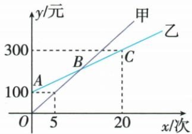

## 讲解

### 判据

题已说明一次或正比例类型，给两点、轴交点、对称点或函数值，先转完整坐标条件再解系数。

### 流程

1. 普通一次设y=kx+b，正比例设y=kx，不添加未知截距。
2. 读图轴交点横或纵为0，距离结合半轴定符号；对称先恢复准确点。
3. 两点分别代入，横不同才有两个独立条件；相减消b后除横差求k。
4. 回一式求b，检查k≠0，再用全部点复验。
5. 写原变量式和适用范围、单位，预测依题已定类型，而非保证现实永远线性。

## 例题

### 两点代入消元确定一次式

> 来源ID Q13-19；第13章一次函数；101-150/full.md 第3907–3907行。原答案与解析定位：101-150/full.md 第3909–3911行。

例3 已知 y 是 x 的一次函数, 当 x = -2 时, y = -3; 当 x = 1 时, y = 3. 求这个一次函数的解析式.

**原资料答案与解析：**

解析 设这个一次函数的解析式为 $y=kx+b(k\neq0)$ .

由题意得 $\left\{\begin{aligned}-2k+b&=-3,\\ k+b&=3,\end{aligned}\right.$ 解得 $\left\{\begin{aligned}k&=2,\\ b&=1,\end{aligned}\right.$ ∴ 这个一次函数的解析式为 $y = 2x + 1$ .

**展开解析（依据原详解补足理由与步骤）：**

设y=kx+b，把(−2,−3)、(1,3)依次代入，−2k+b=−3、k+b=3。第二式减第一式，3k=6，k=2；代k+b=3得b=1，因此y=2x+1。回代第一点−4+1=−3，第二点2+1=3均符；横坐标不同保证可消出唯一k。

### 过原点截距和递增各自反求参数

> 来源ID Q13-23；第13章一次函数；101-150/full.md 第4015–4019行。原答案与解析定位：101-150/full.md 第4021–4029行。

例4 已知直线 $y = (1 - 3k)x + 2k - 1$ .

(1) 当 k 为何值时, 直线过原点?  
(2) 当 k 为何值时, 直线与 y 轴的交点坐标为 $(0, -2)$ ?  
(3) 当 k 为何值时, y 随 x 的增大而增大?

**原资料答案与解析：**

解析（1）∵ 直线 $y=(1-3k)x+2k-1$ 经过原点，∴ 2k-1=0，解得 $k=\frac{1}{2}$ .

(2)∵ 直线 $y=(1-3k)x+2k-1$ 与 y 轴的交点坐标为 $(0,-2)$ ,

$$
\therefore 2 k - 1 = - 2, \text { 解得 } k = - \frac {1}{2}.
$$

(3) $\because y$ 随x的增大而增大, $\therefore 1-3k>0,\therefore k<\frac{1}{3}.$

**展开解析（依据原详解补足理由与步骤）：**

y=(1−3k)x+2k−1，表达中的k是参数，真正斜率1−3k、截距2k−1。（1）过O代x=y=0，2k−1=0，k=1/2，斜率−1/2非零。（2）交y轴于(0,−2)，2k−1=−2，2k=−1，k=−1/2。（3）随x增y增要1−3k>0；减1得−3k>−1，除负数−3反向，k<1/3。k=1/3时斜率0是水平直线，没有严格递增，也不是一次函数。

### 原点对称的比例函数两点求参数

> 来源ID Q13-27；第13章一次函数；151-200/full.md 第25–30行。原答案与解析定位：151-200/full.md 第56–58行。

例1 (2024 陕西)一个正比例函数的图象经过点 $A(2, m)$ 和点 $B(n, -6)$ . 若点 $A$ 与点 $B$ 关于原点对称, 则这个正比例函数的表达式为 ( )

A. $y = 3x$   
B. $y = -3x$   
C. $y=\frac{1}{3}x$   
D. $y=-\frac{1}{3}x$

**原资料答案与解析：**

例1 解析 由题意知点 A 的坐标为(2,6).设正比例函数的表达式为 $y=kx(k\neq0)$ ，则 6=2k，解得 k=3，∴ 正比例函数的表达式为 y=3x.

答案 A

**展开解析（依据原详解补足理由与步骤）：**

A(2,m)与B(n,−6)关于原点对称，两坐标对应相反，所以n=−2、m=6；点A代正比例y=kx得6=2k，k=3，A正确。B的−3误把正点比值反号；C的1/3倒置y/x成x/y；D同时倒置且加负号。原点对称本来使两点y/x相同，不会使直线比例系数变相反。

### 两种游园费用求式比较临界次数

> 来源ID Q13-40；第13章一次函数；151-200/full.md 第420–436行。原答案与解析定位：151-200/full.md 第438–450行。

例2 某生态体验园推出了甲、乙两种消费卡,设入园次数为 x 时所需费用为 y 元,选择这两种消费卡时,y 与 x 之间的函数关系如图所示,解答下列问题.

(1) 分别求出选择这两种消费卡时, y 关于 x 的函数表达式.

(2)请根据入园次数确定选择哪种消费卡比较合算.

**原资料答案与解析：**

解析（1）设 $y_{\text{甲}}=k_{1}x(k_{1}\neq0)$ ,

把(5,100)代入得 $5k_{1}=100$ ，解得 $k_{1}=20,\therefore y_{\text{甲}}=20x$ ;

设 $y_{\text{乙}}=k_{2}x+100(k_{2}\neq0)$ ,

把(20,300)代入得 $20k_{2}+100=300$ ，解得 $k_{2}=10,\therefore y_{2}=10x+100.$

(2)①令 $y_{\text{甲}} < y_{\text{乙}}$ ，即 $20x < 10x + 100$ ，解得 $x < 10$ ，故入园次数小于10时，选择甲种消费卡比较合算：

②令 $y_{\text{甲}} = y_{\text{乙}}$ ，即 $20x = 10x + 100$ ，解得 $x = 10$ ，故入园次数等于10时，选择两种消费卡花费一样；

③令 $\gamma_{\text{甲}} > \gamma_{\text{乙}}$ ，即 $20x > 10x + 100$ ，解得 x > 10，故入园次数大于 10 时，选择乙种消费卡比较合算。

**展开解析（依据原详解补足理由与步骤）：**

原甲费用线过O与(5,100)，设y甲=k甲x，100=5k甲得k甲=20，所以y甲=20x。乙线过(0,100)、(20,300)，截距100，代点300=20k乙+100，减100除20得k乙=10，y乙=10x+100。甲便宜要20x<10x+100，减10x除10得x<10；相等x=10；乙便宜x>10。入园次数为非负整数，10次是同费200元，不能把相等也归某卡“更便宜”。乙100是固定办卡部分，不能误当一次入园价。

### 电量读初值及耗电斜率再同程相减

> 来源ID Q13-44；第13章一次函数；151-200/full.md 第591–606行。原答案与解析定位：151-200/full.md 第562–564行。

例2 (2024 山东济南) 某公司生产了 $A, B$ 两款新能源电动汽车. 如图, $l_{1}, l_{2}$ 分别表示 $A$ 款, $B$ 款新能源电动汽车充满电后电池的剩余电量 $y(\mathrm{kW} \cdot \mathrm{h})$ 与汽车行驶路程 $x(\mathrm{km})$ 的关系. 当两款新能源电动汽车的行驶路程都是 $300 \mathrm{~km}$ 时, $A$ 款新能源电动汽车电池的剩余电量比 $B$ 款新能源电动汽车电池的剩余电量多 $\mathrm{kW} \cdot \mathrm{h}$ .

**原资料答案与解析：**

例2 解析 由图象可知, $l_{1}$ 的解析式为 $y_{1}=80-0.16x$ , $l_{2}$ 的解析式为 $y_{2}=80-0.2x$ . 当 x=300 时, $y_{1}=32$ , $y_{2}=20$ , $32-20=12(kW\cdot h)$ , ∴当两款新能源电动汽车的行驶路程都是 300 km 时, A 款新能源电动汽车电池的剩余电量比 B 款新能源电动汽车电池的剩余电量多 12 kW·h.

答案 12

**展开解析（依据原详解补足理由与步骤）：**

两车初电量80千瓦时，图在200千米处A剩48、B剩40。A每千米变化(48−80)/200=−0.16千瓦时，yA=80−0.16x；B为(40−80)/200=−0.2，yB=80−0.2x。300千米处A剩80−48=32、B剩80−60=20，相差12千瓦时，填12。差也可(−0.16+0.2)×300=0.04×300=12。初值都80在差中抵消。只在原图匀速耗电模型及电量非负允许路程用，不将线无限外延负电量。

### 广告费用与利润两点确定模型预测

> 来源ID Q13-45；第13章一次函数；151-200/full.md 第610–610行。原答案与解析定位：151-200/full.md 第566–572行。

例3 (2024 上海) 某种商品的销售额 $y$ (万元) 与广告投入 $x$ (万元) 成一次函数关系, 当投入 10 万元时销售额为 1000 万元, 当投入 90 万元时销售额为 5000 万元, 则投入 80 万元时, 销售额为 \_\_\_\_ 万元.

**原资料答案与解析：**

例3 解析 设 $y=kx+b(k\neq0)$ ,

由题意得 $\left\{\begin{aligned}10k+b&=1\ 000,\\ 90k+b&=5\ 000,\end{aligned}\right.$ 解得 $\left\{\begin{aligned}k=50,\\ b=500,\end{aligned}\right.\therefore y=50x+500.$

当 x = 80 时, $y = 50 \times 80 + 500 = 4500$ .

答案 4 500

**展开解析（依据原详解补足理由与步骤）：**

设y=kx+b，题给(10,1000)、(90,5000)，代得10k+b=1000、90k+b=5000。相减80k=4000，k=50；回第一式b=1000−500=500，所以y=50x+500。x=80时y=4000+500=4500万元。这是题明定一次模型下预测，不能由现实两次观测自行保证永远线性；x、y均按原万元单位。

## 易错

乙费用100是固定截距；原广告两观测本身不足断现实线性，但题明确成一次关系才可求4500。
