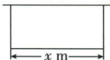
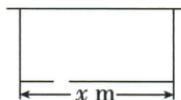
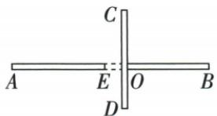

## 错法

原面积主段轴9.8直接当最优，而OA只到8，延伸后墙量不再按x−1.4增长；或留门2就把最优25直接变27，将新增几何周长全给一方向。

## 正解

每条面积式绑定可用墙阶段，超过墙端必须另付延伸料。主段x≤8取8，其他段另比，最优46.4。留门使三边可长总52，重新配方得平行边26，增加1不是2。预算逐边回验，不能只验某个漂亮顶点。

## 例题

### 靠墙三边总料与留门两种面积最大

> 来源ID Q14-32；第14章二次函数；151-200/full.md 第1610–1620行。原答案与解析定位：151-200/full.md 第1621–1624行。

例1 某农场拟建一间长方形种牛饲养室,饲养室的一面靠墙(墙足够长),已知计划中的建筑材料可建围墙的总长为 $50 \, m$ , 设饲养室与现有墙平行的一边长为 $x \, m$ , 占地面积为 $y \, m^{2}$ .

(1)如图①所示,问饲养室与现有墙平行的一边长为多少米时,占地面积最大?  
(2)如图②所示,现要求在图中所示位置留2 m宽的门,且仍使饲养室的占地面积最大,小敏说:“只要饲养室与现有墙平行的一边长比(1)中的长多2 m就行了.”请你通过计算,判断小敏的说法是否正确.

  
图①

  
图②

**原资料答案与解析：**

解析 (1) $\because y = x \cdot \frac{50 - x}{2} = -\frac{1}{2}(x - 25)^2 + \frac{625}{2}, \therefore$ 当 $x = 25$ 时, $y$ 最大, 即饲养室与现有墙平行的一边长为 $25 \mathrm{~m}$ 时, 占地面积最大.

(2) $\because y = x \cdot \frac{50 - (x - 2)}{2} = -\frac{1}{2} (x - 26)^2 + 338, \therefore$ 当 $x = 26$ 时, $y$ 最大, 即饲养室与现有墙平行的一边长为 $26 \mathrm{~m}$ 时, 占地面积最大. $\because 26 - 25 = 1 \neq 2, \therefore$ 小敏的说法不正确.

**展开解析（依据原详解补足理由与步骤）：**

（1）平行墙边x，另两边相等设z。只建三边，x+2z=50，z=(50−x)/2，0<x<50。面积y=xz=−x²/2+25x=−(x−25)²/2+625/2，顶点25合法，最大625/2平方米，两短边12.5米。（2）门宽2在新建的平行墙边上，实际用材料x−2+2z=50，z=(52−x)/2；须x≥2且z>0，边框意义若门须内部可x>2，最优26在内不受该端点影响。面积y=−x²/2+26x=−(x−26)²/2+338，最大取x26，两短边13。平行边只比25多1非2，小敏错误。空门使可围三边总几何长增2，最佳尺寸由两方向共同重新分配，不是全给一边。

### 缺口围墙分区域和延伸段比较最大面积

> 来源ID Q14-36；第14章二次函数；151-200/full.md 第1691–1704行。原答案与解析定位：151-200/full.md 第1717–1736行。

例3 (2024 四川自贡) 九(1) 班劳动实践基地内有一块面积足够大的平整空地, 地上两段围墙 $AB \perp CD$ 于点 $O$ (如图), 其中 $AB$ 上的 $EO$ 段围墙空缺. 同学们测得 $AE = 6.6 \mathrm{~m}, OE = 1.4 \mathrm{~m}, OB = 6 \mathrm{~m}, OC = 5 \mathrm{~m}, OD = 3 \mathrm{~m}$ , 班长买来可切断的围栏 $16 \mathrm{~m}$ , 准备利用已有围墙, 围出一块封闭的矩形菜地, 则该菜地最大面积是 $\underline{\quad} \mathrm{m}^{2}$ .

**原资料答案与解析：**

例3 解析 设矩形在射线 OA 上的一段长为 x m, 围出矩形菜地的面积为 $S \, m^{2}$ .

$$
\begin{array}{l} S = x \cdot \frac {1 6 - x - 1 . 4 + 5}{2} = - \frac {1}{2} x ^ {2} + 9. 8 x \\ = - \frac {1}{2} (x - 9. 8) ^ {2} + 4 8. 0 2, \\ \end{array}
$$

(1) 当 $x \leqslant 8$ 时，

当 x=8 时, S 取得最大值, 最大值为 46.4.

(2) 当 $x > 8$ 时，

$$
\begin{array}{l} S = x \cdot \left(\frac {1 6 + 6 . 6 + 5}{2} - x\right) = - x ^ {2} + \\ 1 3. 8 x = - (x - 6. 9) ^ {2} + 4 7. 6 1, \end{array}
$$

在 x>8 的范围内, S 均小于 46.4.
由(1)(2)得该菜地最大面积为 $46.4 \, m^{2}$ .

答案 46.4

**展开解析（依据原详解补足理由与步骤）：**

原OA=AE+EO=6.6+1.4=8米，OB6、OC5、OD3。围栏可切断，总长不超16。先按利用两垂直墙为相邻边的矩形分类，O为其共同角，另两边需新栏；墙不够长及EO空缺也需新栏。记沿OA方向边x、沿OC方向边z。

左上区域中，1.4<x≤8且z>5时，左向墙可用x−1.4，上向墙只能用5，新栏总长2x+2z−(x−1.4)−5=x+2z−3.6≤16，所以z≤9.8−x/2。最大可能面积x(9.8−x/2)=−(x−9.8)²/2+48.02；在1.4<x≤8范围，x在轴9.8左侧，随x增面积增，故x8、z5.8取得46.4。回围栏：对面横8、对面竖5.8、补缺口1.4、补上墙延伸0.8，总16，面积8×5.8=46.4。

不能只看无约束顶点9.8。还须把该区域其他情况收齐：若x≤1.4，无可用OA墙，z≤5时面积≤1.4×5=7；z>5时2x+2z−5≤16，面积≤x(10.5−x)≤1.4×9.1=12.74。若1.4<x≤8但z≤5，面积≤8×5=40。若x>8、z≤5，两可用墙最多6.6和z，新栏2x+z−6.6≤16，面积≤z(11.3−z/2)，在0<z≤5递增，至多5×8.8=44。若x>8且z>5，两可用墙总6.6+5=11.6，新栏2(x+z)−11.6≤16，x+z≤13.8；面积≤x(13.8−x)，在x>8处递减，小于8×5.8=46.4。由此左上区域最大确46.4。

再比其他位置，避免原详解只考虑射线OA就宣称全局。右上可用墙最长6+5=11，故周长≤16+11=27，任何长方形面积≤(27/4)²=45.5625；该面积上界来自两边和固定时(两边差)²≥0。左下可用墙最多6.6+3=9.6，周长≤25.6，面积≤40.96；右下可用墙最多6+3=9，面积≤(25/4)²=39.0625，均小于46.4。

若只让一条边利用墙，CD整条最多8米，最优面积不超32：边长u≤8时另一边≤(16−u)/2，面积u(16−u)/2≤32；u>8最多省8墙长，面积≤u(12−u)<32。利用AB一段、不跨缺口时最长连续墙6.6，同理最大不超32；跨EO时u≤14可用墙至多u−1.4，面积≤u(14.6−u)/2≤26.645，u>14最多省12.6墙长，面积≤u(14.3−u)<4.2。完全不以墙作边时周长≤16，面积≤16。两垂直墙同时作相邻边必回四区域模型，若墙只在矩形内部不替代边界则不省该段围栏。所有位置比较后全局最大46.4平方米，与原答案一致；其他区域与单墙界限是依据原数据补足的论证。
