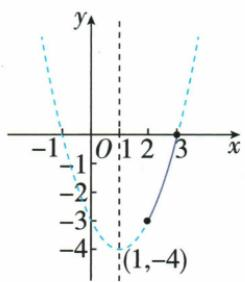

## 错法

原0<x<2函数(x−1)²−4把边界x0或2的−3说最大，然而两端明确不合法。只看数值上界没有看能否取到。

## 正解

合法输入|x−1|<1给y<−3，任何合法值仍可更靠端点而增加，−3不能取得，所以无最大；轴x=1合法最小−4可取。闭区间2到3则端点合法，才最小−3最大0。

## 例题

### 开闭区间分别核顶点端点与无最大值

> 来源ID Q14-13；第14章二次函数；151-200/full.md 第1082–1086行。原答案与解析定位：151-200/full.md 第1087–1114行。

例3 分别在下列范围内求函数 $y=x^{2}-2x-3$ 的最大值和最小值.

(1)0<x<2.   
(2) $2 \leqslant x \leqslant 3.$

**原资料答案与解析：**

解析 $y = x^{2} - 2x - 3 = (x - 1)^{2} - 4.$

(1) $\because x=1$ 在 0<x<2 的范围内,且 a=1>0,

∴ 当 x=1 时, y 有最小值, $y_{\text{最小值}}=-4$ .

在 0<x<2 范围内, y 没有最大值.

(2) 函数 $y = x^{2} - 2x - 3 (2 \leqslant x \leqslant 3)$ 的图象是抛物线 $y = x^{2} - 2x - 3$ 的一部分.

∵ a=1>0, ∴ 抛物线 $y=x^{2}-2x-3$ 开口向上, 如图所示,

当 x>1 时, y 随 x 的增大而增大.

∴ 当 x=3 时, y 取最大值, $y_{\text{最大值}}=3^{2}-2\times3-3=0$ ,

当 $x = 2$ 时， $y$ 取最小值， $y_{\text{最小值}} = 2^2 - 2 \times 2 - 3 = -3$ .

**展开解析（依据原详解补足理由与步骤）：**

配方y=(x−1)²−4，a正。（1）0<x<2，x=1合法使平方0，最小−4。该范围|x−1|<1故y<−3；能接近−3而端点0、2都排掉，没有任何合法x得到−3。任意非顶点候选再向更近端点移动可增大y，所以无最大值，不能答最大−3。（2）2≤x≤3全部在轴1右侧递增，最小取2：4−4−3=−3，最大取3：9−6−3=0。原图标(1,−4)、(2,−3)、(3,0)，自动表的(2,−4)误读不采用。
