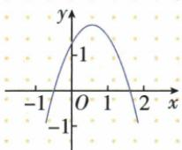
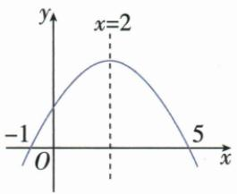

## 讲解

### 是什么

a看开口，c=f(0)看纵截距，b结合轴$h=-b/(2a)$与a判断；不能只看轴方向就独立定b。含a、b、c的特殊组合常是函数在特定横处的值，如$a-b+c=f(-1)$、$4a-2b+c=f(-2)$。

### 怎么来的

轴在左h<0，−b/(2a)<0说明a与b同号；轴在右则异号，这就是左同右异的来源。特殊组合由直接代横：平方贡献a x²、一次项b x、常数c，原x−2给4a−2b+c。图知该横处在轴下才判负，不能从图上几个系数符号直接猜和的正负。原轴2给−b/(2a)=2，等式乘2a得4a+b=0。

### 什么时候能用

图上明确标刻度或位置才据其严格大小，如原c交点高于1才得c>1；示意未标处不能当精准数。同一题a参数可能还出现在直线里，各图给的符号约束必须统一。特殊组合不是恰某函数值时可从轴不等式另推，勿硬套所有表达。

## 例题

### 从实际抛物线图判四条系数信息

> 来源ID Q14-10；第14章二次函数；151-200/full.md 第980–982行。原答案与解析定位：151-200/full.md 第984–984行。

例5 小强从如图所示的二次函数 $y=ax^{2}+bx+c$ 的图象中, 观察得出了下面四条信息: (1) a<0; (2) c>1; (3) b>0; (4) $a-b+c>0$ . 其中正确的是 \_\_\_\_. (填序号)

**原资料答案与解析：**

答案 (1)(2)(3)

**展开解析（依据原详解补足理由与步骤）：**

实际图开口向下，a<0，（1）对。与y轴交点明确高于刻度1，c=f(0)>1，（2）对。对称轴在y轴右侧，h=−b/(2a)>0，a负使2a负，乘不等式反向得−b<0、b>0，（3）对。a−b+c=f(−1)，图在x−1处落x轴下，f(−1)<0，因此（4）>0错。答（1）（2）（3）。不从图猜未标精确a、b、c。

### 根轴开口交纵轴判四个代数式

> 来源ID Q14-15；第14章二次函数；151-200/full.md 第1134–1155行。原答案与解析定位：151-200/full.md 第1157–1179行。

例5 二次函数 $y = ax^{2} + bx + c (a \neq 0)$ 的图象如图所示, 下列结论: ① $b^{2} - 4ac > 0$ ; ② $abc < 0$ ; ③ $4a + b = 0$ ; ④ $4a - 2b + c > 0$ . 其中正确结论的个数是 ( )

A.4

B.3

C.2

D.1

**原资料答案与解析：**

解析 由题图知,抛物线与 x 轴有两个交点,

∴ 方程 $ax^{2}+bx+c=0(a\neq0)$ 有两个不相等的实数根，

$\therefore b^{2}-4ac>0,$ 故①正确；

由题图知,抛物线的开口向下, $\therefore a<0$ ,

∵ 抛物线的对称轴在 y 轴右侧, ∴ b > 0,

∵ 抛物线与 y 轴的交点在 y 轴的正半轴上，

∴ c>0, ∴ abc<0, 故②正确;

由题图知,抛物线的对称轴为直线 x=2,

$\therefore -\frac{b}{2a} = 2, \therefore 4a + b = 0$ ，故③正确；

由题图知, 当 x = -2 时, y < 0, ∴ $4a - 2b + c < 0$ , 故④错误.

∴ 正确的结论有 3 个.

# 答案 B

**展开解析（依据原详解补足理由与步骤）：**

图开口下，a<0；两横轴交点−1、5不同，Δ>0，①对。轴x2在右，a<0给b>0；纵截点在正半轴c>0，三者乘负，abc<0，②对。轴公式−b/(2a)=2，两边乘2a（等式不需翻向）给−b=4a，4a+b=0，③对。④4a−2b+c=f(−2)，原−2比左根−1更左，开口下在两根外纵负，<0非>0，④错。正确3条选B；A4多收④，C2漏对项，D1漏更多。

### 同一参数的直线和抛物线共存

> 来源ID Q14-16；第14章二次函数；151-200/full.md 第1185–1203行。原答案与解析定位：151-200/full.md 第1205–1211行。

例6 在同一直角坐标系中, 直线 $y = ax + 1$ 与二次函数 $y = ax^{2} + bx + 1$ 的图象可能是 ( )

**原资料答案与解析：**

解析 A. 一次函数图象与 y 轴的交点不是 $(0,1)$ ，故 A 选项错误，不符合题意；

B. 根据二次函数的图象知 a<0，但是根据一次函数的图象知 a>0，故 B 选项错误，不符合题意；  
C. 根据图象知两个函数图象与 y 轴的交点坐标为 $(0,1)$ ，且 a>0，故 C 选项正确；  
D. 根据一次函数的图象知 a<0，但是根据二次函数的图象知 a>0，故 D 选项错误，不符合题意.

答案 C

**展开解析（依据原详解补足理由与步骤）：**

两式纵截距均1，先看是否都过(0,1)，然后同一参数a既是直线斜率又是抛物线二次系数。A直线不交纵轴1，错。B抛物线下开要求a负而直线升要求a正，冲突。C两图同过(0,1)，上开且直线上升均a正，可共存。D直线下降a负、抛物线上开a正，冲突。选C；b未被这两条件锁死，不因顶点横位置不同随意否定C。

### 给顶点和正纵截距判四个系数结论

> 来源ID Q14-20；第14章二次函数；151-200/full.md 第1274–1290行。原答案与解析定位：151-200/full.md 第1229–1233行。

例4（2024 湖北）已知抛物线 $y=ax^{2}+bx+c(a,b,c$ 为常数, $a\neq0$ ）的顶点坐标为 $(-1,-2)$ ，与 y 轴的交点在 x 轴上方，下列结论正确的是（）

$$
\mathrm{A.} a <   0
$$

$$
\mathrm{B.} c <   0
$$

$$
\mathrm{C}. a - b + c = - 2
$$

$$
\mathrm{D}. b ^ {2} - 4 a c = 0
$$

**原资料答案与解析：**

例4 解析 易知 a>0, c>0, 抛物线与 x 轴有两个交点, $\therefore \Delta = b^{2} - 4ac > 0$ ,

∵ 抛物线 $y = ax^{2} + bx + c$ 的顶点坐标为 $(-1, -2)$ , ∴ $a - b + c = -2$ .

答案 C

**展开解析（依据原详解补足理由与步骤）：**

顶点(−1,−2)，其纵是负，而f(0)=c>0说明离轴后值比顶点更大，所以a>0，不是A a<0；B c<0与已给正截距反。代顶点横−1得f(−1)=a−b+c=−2，C正确。上开且顶点在轴下，左右各穿横轴一次，Δ>0非D0。选C。也可c=a(0+1)²−2=a−2>0得a>2，支持上开，不仅凭示意。

## 易错

原a−b+c>0在图−1处实为负；4a−2b+c对应−2不是2，负号代入时平方项正4而一次项负2b。
