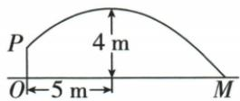

## 讲解

### 是什么

已明定二次类型，按信息设一般式、顶点式或实根交点式，再把各点代入求待定系数。一般式通常需三个横不同点；已知a则两独立点；顶点式已定h、k只需轴外一点定a；两根式需另一非根点定a。

### 怎么来的

一般式每点给a x²+b x+c=y一个方程，三横不同保证这些条件能唯一确定二次以内多项式。若两候选规则同过三点，它们之差至多二次，却有三不同根；非零二次至多两根，所以差只能为零。唯一得到a=0则原数据只确定一次或常值，不满足二次假设。原三点含x0先定c，±1两式加减定a、b；顶点或两根先消大半未知量更直接。

### 什么时候能用

重复点不算独立条件，同横异纵与函数唯一性冲突。顶点外点与已有根外点要可除非零量。若给很多点，其余点回代作一致性核，不能任选三点后忽略原其他数据冲突。

## 例题

### 三种已知条件选对应形式定二次系数

> 来源ID Q14-03；第14章二次函数；151-200/full.md 第704–708行。原答案与解析定位：151-200/full.md 第710–726行。

例2 根据下列条件,分别求出对应的二次函数的表达式.

(1)二次函数的图象经过点 $(0,-1)$ ， $(1,0)$ ， $(-1,2)$ .  
(2)抛物线的顶点坐标为 $(1,-3)$ ，且与y轴交于点 $(0,1)$ .  
(3) 抛物线与 x 轴交于点 $(-3,0)$ ， $(5,0)$ ，且与 y 轴交于点 $(0,-3)$ .

**原资料答案与解析：**

解析（1）设二次函数的表达式为 $y=ax^{2}+bx+c$ .

因为这个函数的图象过点 $(0, -1)$ ，所以 $c = -1$ ，又因为其图象过点 $(1, 0), (-1, 2)$ ，

所以有 $\left\{\begin{aligned}a+b-1=0,\\ a-b-1=2,\end{aligned}\right.$ 解得 $\left\{\begin{aligned}a=2,\\ b=-1,\end{aligned}\right.$ 所以所求二次函数的表达式是 $y=2x^{2}-x-1$ .

(2) 因为抛物线的顶点坐标为 $(1, -3)$ ，所以设二次函数的表达式为 $y = a(x - 1)^{2} - 3$ .

又因为抛物线经过点 $(0,1)$ ，所以 $1=a(0-1)^{2}-3$ ，解得a=4.

所以所求二次函数的表达式是 $y = 4(x - 1)^2 - 3 = 4x^2 - 8x + 1$ .

(3) 因为抛物线与 $x$ 轴交于点 $(-3,0)$ , $(5,0)$ , 所以设二次函数的表达式为 $y = a(x + 3)(x - 5)$ .

又因为抛物线经过点 $(0,-3)$ ，所以 $-3=a(0+3)\times(0-5)$ ，解得 $a=\frac{1}{5}$ .

所以所求二次函数的表达式是 $y = \frac{1}{5} (x + 3)(x - 5) = \frac{1}{5} x^2 -\frac{2}{5} x - 3.$

**展开解析（依据原详解补足理由与步骤）：**

（1）设y=ax²+bx+c。过(0,−1)给c=−1；过(1,0)给a+b=1；过(−1,2)给a−b=3。两式加得2a=4、a=2，再a+b=1得b=−1。故y=2x²−x−1，三原点回代分别−1、0、2。（2）顶点(1,−3)设y=a(x−1)²−3；代(0,1)：1=a−3，a=4。展开(x−1)²=x²−2x+1，乘4再减3，y=4x²−8x+1。（3）两根−3、5设y=a(x+3)(x−5)，代(0,−3)：−3=−15a，a=1/5。两因子乘得x²−2x−15，乘1/5得y=x²/5−2x/5−3。各法系数都非零，指定类型成立。

### 已知二次项系数只待定另外两系数

> 来源ID Q14-05；第14章二次函数；151-200/full.md 第764–766行。原答案与解析定位：151-200/full.md 第770–774行。

例 (2024 福建节选) 已知二次函数 $y = x^{2} + bx + c$ 的图象与 $x$ 轴交于 $A, B$ 两点，与 $y$ 轴交于点 $C$ ，其中 $A(-2,0), C(0,-2)$ . 求二次函数的表达式.

**原资料答案与解析：**

例 解析 将 $A(-2,0), C(0,-2)$

代入 $y=x^{2}+bx+c$ ，得 $\left\{\begin{aligned}4-2b+c=0,\\ c=-2,\end{aligned}\right.$

解得 $\left\{\begin{aligned}b&=1,\\ c&=-2,\end{aligned}\right.$ 所以二次函数的表达式为 $y=x^{2}+x-2$ .

**展开解析（依据原详解补足理由与步骤）：**

原已给二次系数1，只求b、c。C(0,−2)代得c=−2；A(−2,0)代0=4−2b−2，即2−2b=0，b=1。所以y=x²+x−2。验证A4−2−2=0、C−2，条件皆符；无需把已知1再次作待定a。附小钥匙为装饰不作题图。

### 从多组原数据求式再逐项核性质

> 来源ID Q14-18；第14章二次函数；151-200/full.md 第1257–1266行。原答案与解析定位：151-200/full.md 第1221–1223行。

例2（2024陕西）已知一个二次函数 $y = ax^{2} + bx + c$ 的自变量 $x$ 与函数 $y$ 的几组对应值如下表：

| x | ... | -4 | -2 | 0 | 3 | 5 | ... |
| --- | --- | --- | --- | --- | --- | --- | --- |
| y | ... | -24 | -8 | 0 | -3 | -15 | ... |

则下列关于这个二次函数的结论正确的是 （）

A. 图象的开口向上  
B. 当 x>0 时, y 的值随 x 值的增大而减小  
C. 图象经过第二、三、四象限  
D. 图象的对称轴是直线 $x = 1$

**原资料答案与解析：**

例2 解析 易得二次函数的解析式为 $y=-x^{2}+2x,\because a=-1<0,\therefore$ 抛物线的开口向下, 故 A 选项错误; $\because y=-x^{2}+2x=-(x-1)^{2}+1,\therefore$ 抛物线的对称轴为直线 x=1, 当 x>1 时, y 随 x 的增大而减小, 故 B 选项错误, D 选项正确; 令 y=0, 得 $-x^{2}+2x=0$ , 解得 $x_{1}=0,x_{2}=2$ , $\therefore$ 抛物线与 x 轴的交点坐标为 $(0,0)$ 和 $(2,0)$ . 又∵ 抛物线的顶点坐标为 $(1,1)$ , ∴ 抛物线经过第一、三、四象限, 故 C 选项错误.

答案 D

**展开解析（依据原详解补足理由与步骤）：**

原x0、y0给c=0；x−2、y−8给4a−2b=−8；x3、y−3给9a+3b=−3。第一式乘3得12a−6b=−24，第二式乘2得18a+6b=−6，相加30a=−30、a=−1，回第一式−4−2b=−8、b=2。式y=−x²+2x=−(x−1)²+1。其余原点−4→−24、5→−15均验。A上开错；B x>0全部减错，在0到1反而增；CⅡⅢⅣ错，负横纵负，实际ⅠⅢⅣ；D轴x1对，选D。

### 门洞取中心地面建系用竹竿点定式

> 来源ID Q14-31；第14章二次函数；151-200/full.md 第1580–1582行。原答案与解析定位：151-200/full.md 第1584–1597行。

例如图所示,某建筑物有一抛物线形的门洞,小强想知道该门洞的高度,他先测出门洞的宽度AB=8 m,然后用一根长为4 m的小竹竿CD竖直地接触地面和门洞的内壁,并测得AC=1 m,则门洞高为\_\_\_\_m.

**原资料答案与解析：**

解析 根据题意建立如图所示的坐标系,由题意得抛物线的解析式为 $y=-\frac{4}{7}(x+4)(x-4)$ , 令 x=0, 得 $y=\frac{64}{7}$ , ∴ $OE=\frac{64}{7}m$ .

答案 $\frac{64}{7}$

**展开解析（依据原详解补足理由与步骤）：**

取地面AB中点O为原点，AB为x轴、向上y轴。宽8给A(−4,0)、B(4,0)；AC1说明竹竿脚C横−3，竿长4给D(−3,4)。设y=a(x+4)(x−4)，代D：4=a×1×(−7)=−7a，a=−4/7。于是y=−(4/7)(x²−16)=−4x²/7+64/7，对称轴0，最高在O上方x0，门洞高64/7米。竹竿4是离中心3米处高度，不是顶高；坐标原点换法可不同但实际高须同。

### 抛物线出手点和顶点求落地距离筛根

> 来源ID Q14-35；第14章二次函数；151-200/full.md 第1685–1687行。原答案与解析定位：151-200/full.md 第1710–1715行。

例2 (2024 广西)如图,壮壮同学投掷实心球,出手(点 P 处)的高度 OP 是 $\frac{7}{4}$ m, 出手后实心球沿一段抛物线运行, 到达最高点时, 水平距离是 5 m, 高度是 4 m. 若实心球落地点为 M, 则 OM 为 \_\_\_\_ m.

**原资料答案与解析：**

例2 解析 以点 O 为坐标原点，
直线 OM 为 x 轴，直线 OP 为 y 轴，建立平面直角坐标系，
由题意得抛物线的解析式为 $y = -\frac{9}{100}(x - 5)^{2} + 4$ . 令 y = 0，解得 $x_{1} = \frac{35}{3}$ , $x_{2} = -\frac{5}{3}$ （不合题意，舍去），
∴ $OM = \frac{35}{3}m.$

答案 $\frac{35}{3}$

**展开解析（依据原详解补足理由与步骤）：**

以O为原点、地面OM为x轴，竖直OP为y轴，P(0,7/4)，顶点(5,4)。设y=a(x−5)²+4，代P得7/4=25a+4，25a=−9/4，a=−9/100。落地y0：0=−9(x−5)²/100+4，移平方项、乘100/9得(x−5)²=400/9，x−5=±20/3，x=35/3或−5/3。球从x0向前落地，只取正向35/3米，负根是模型向后延伸的横轴点不合题运动段。不能两根都当本次落地距离；OP7/4不是顶点4。

## 易错

原福建题a1已定，不需设三未知；原表五点先三点求式再验−4、5两余点，不能只凭看似对称猜。
