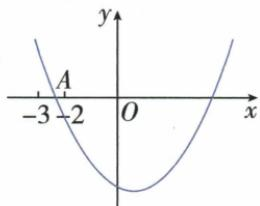

## 讲解

### 是什么

两个不同实根r、s的轴横h=(r+s)/2，所以s=2h−r。已知一根区间可用这个反射关系推另一根区间，轴不是0时不能只取相反数或绝对值。

### 怎么来的

轴两侧同纵0的点互为镜像，水平距h−r=s−h，移项得r+s=2h；代数根和−b/a也恰是轴−b/(2a)的两倍。原h=1、−3<r<−2，乘−1得2<−r<3，再加2得4<s<5。完整说明翻向来自乘负数，不“看图应该在4附近”跳过区间来源。

### 什么时候能用

只有另一实零点存在时谈两根对应；重根两横相同，不用左右不同点语言。有限实际轨迹若只含一根，另一根是数学延伸点，如投掷题负根不作本次落地。根和范围并不是每个区间内值都独立可选，原轴固定已将两根绑定。

## 例题

### 两横轴公共点求对称轴的中点

> 来源ID Q14-22；第14章二次函数；151-200/full.md 第1346–1346行。原答案与解析定位：151-200/full.md 第1348–1348行。

例2 已知抛物线 $y=ax^{2}+bx+c$ 与 x 轴的公共点是 $(-4,0)$ ， $(2,0)$ ，则这条抛物线的对称轴是直线 \_\_\_\_。

**原资料答案与解析：**

答案 $x = -1$

**展开解析（依据原详解补足理由与步骤）：**

两点(−4,0)、(2,0)纵相同且横不同，在抛物线对称轴两侧对称；轴横为两横平均(−4+2)/2=−1，写直线x=−1。也由根和−2等−b/a，轴−b/(2a)恰根和一半。不能将(−1,0)点坐标当整条对称轴，轴不是x轴本身。

### 由负根所在区间及对称轴推正根区间

> 来源ID Q14-27；第14章二次函数；151-200/full.md 第1458–1479行。原答案与解析定位：151-200/full.md 第1481–1483行。

例4 如图,以(1,-4)为顶点的二次函数 $y=ax^{2}+bx+c$ 的图象与 x 轴负半轴交于 A 点,则一元二次方程 $ax^{2}+bx+c=0$ 的正数解的范围是 ( )

A.2<x<3

B.3<x<4

C.4<x<5

D.5<x<6

**原资料答案与解析：**

解析 $\because$ 二次函数 $y = ax^{2} + bx + c$ 的顶点为 $(1, -4)$ , $\therefore$ 对称轴为直线 $x = 1$ , 又对称轴左侧图象与 $x$ 轴交点横坐标的取值范围是 $-3 < x < -2$ , $\therefore$ 右侧交点横坐标的取值范围是 $4 < x < 5$ .

答案 C

**展开解析（依据原详解补足理由与步骤）：**

轴横1给两根u、v满足(u+v)/2=1，v=2−u。图负根−3<u<−2；乘−1反向得2<−u<3，再加2，4<v<5，C正确。A2到3、B3到4、D5到6都与对称映射后的区间不符。不是直接取负根绝对值2到3，那只适用于轴0；本题要关于x1反射。

### 抛物线出手点和顶点求落地距离筛根

> 来源ID Q14-35；第14章二次函数；151-200/full.md 第1685–1687行。原答案与解析定位：151-200/full.md 第1710–1715行。

例2 (2024 广西)如图,壮壮同学投掷实心球,出手(点 P 处)的高度 OP 是 $\frac{7}{4}$ m, 出手后实心球沿一段抛物线运行, 到达最高点时, 水平距离是 5 m, 高度是 4 m. 若实心球落地点为 M, 则 OM 为 \_\_\_\_ m.

**原资料答案与解析：**

例2 解析 以点 O 为坐标原点，
直线 OM 为 x 轴，直线 OP 为 y 轴，建立平面直角坐标系，
由题意得抛物线的解析式为 $y = -\frac{9}{100}(x - 5)^{2} + 4$ . 令 y = 0，解得 $x_{1} = \frac{35}{3}$ , $x_{2} = -\frac{5}{3}$ （不合题意，舍去），
∴ $OM = \frac{35}{3}m.$

答案 $\frac{35}{3}$

**展开解析（依据原详解补足理由与步骤）：**

以O为原点、地面OM为x轴，竖直OP为y轴，P(0,7/4)，顶点(5,4)。设y=a(x−5)²+4，代P得7/4=25a+4，25a=−9/4，a=−9/100。落地y0：0=−9(x−5)²/100+4，移平方项、乘100/9得(x−5)²=400/9，x−5=±20/3，x=35/3或−5/3。球从x0向前落地，只取正向35/3米，负根是模型向后延伸的横轴点不合题运动段。不能两根都当本次落地距离；OP7/4不是顶点4。

## 易错

原正根范围4到5，不是负根绝对值2到3；平均算负号完整，(−4+2)/2=−1不是1。
