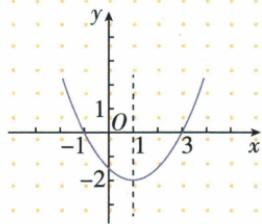
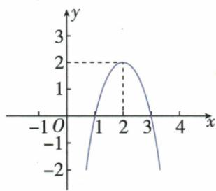

## 讲解

### 判据

要求二次值正负或给图解范围，先确认根数，再排序根与a符号，最后按严格或非严格处理边界。

### 流程

1. 将所比较右侧移到左，确认仍为二次式且合法范围。
2. 两实根r<s时因式a(x−r)(x−s)，两根外因子同号、内异号，再乘a。
3. 若Δ=0，除唯一零点外全同a；若Δ为负，全同a，不用两个虚构实根。
4. >、<排零点，≥、≤收相应零点；外两段用或，内段用双向且。
5. 原半系数根−1、3上开外正内负；下开根1、3反为内正，图与乘积交叉核。

## 例题

### 上开抛物线横轴上下三范围

> 来源ID Q14-23；第14章二次函数；151-200/full.md 第1352–1372行。原答案与解析定位：151-200/full.md 第1373–1378行。

例3 观察函数 $y=\frac{1}{2}x^{2}-x-\frac{3}{2}$ 的
图象, 回答下列问题:

(1) 当 x 取什么值时, y > 0?  
(2) 当 x 取什么值时, y=0?  
(3) 当 x 取什么值时, y < 0?

**原资料答案与解析：**

解析（1）当 $x < -1$ 或 $x > 3$ 时， $y > 0$ .

(2) 当 x=3 或 x=-1 时, y=0.

(3) 当 -1 < x < 3 时, y < 0.

**展开解析（依据原详解补足理由与步骤）：**

函数=(1/2)(x²−2x−3)=(1/2)(x+1)(x−3)，根−1、3，a正。x<−1两因子都负，乘积正；−1<x<3一正一负，乘积负；x>3两正乘积正。因此y>0对应x<−1或x>3；y0对应−1或3；y<0对应−1<x<3。图真实根与顶点(1,−2)一致，自动表的伪点不采用。严格正负不含根，两个外区间用或不写且。

### 下开图同时解零点正值减小区间与水平交线

> 来源ID Q14-26；第14章二次函数；151-200/full.md 第1427–1446行。原答案与解析定位：151-200/full.md 第1448–1452行。

例3 二次函数 $y = ax^{2} + bx + c (a \neq 0)$ 的图象如图所示,根据图象解答下列问题:

(1) 写出方程 $ax^{2} + bx + c = 0$ 的两个根. (2) 写出不等式 $ax^{2} + bx + c > 0$ 的解集.  
(3) 写出 y 随 x 的增大而减小时 x 的取值范围.  
(4) 若方程 $ax^{2}+bx+c=k$ 有两个不相等的实数根, 求 k 的取值范围.

**原资料答案与解析：**

解析（1）方程 $ax^2 + bx + c = 0$ 的两个根是1,3.

(2) 不等式 $ax^{2}+bx+c>0$ 的解集是 1<x<3.  
(3) 当 x > 2 时, y 随 x 的增大而减小.  
(4)作直线 $y = k$ ，当 $k > 2$ 时，直线 $y = k$ 与抛物线 $y = ax^{2} + bx + c$ 无公共点，这时方程 $ax^2 +bx + c = k$ 无实数根；当 $k = 2$ 时，直线 $y = k$ 过抛物线 $y = ax^{2} + bx + c$ 的顶点，这时方程 $ax^2 +bx + c = k$ 有两个相等的实数根；当 $k <   2$ 时，直线 $y = k$ 与抛物线 $y = ax^{2} + bx + c$ 有两个公共点，这时方程 $ax^2 +bx + c = k$ 有两个不相等的实数根.故 $k <   2$

**展开解析（依据原详解补足理由与步骤）：**

原图横根1、3，轴2，顶点(2,2)，开口下。（1）方程y0根1、3。（2）在根中间图在轴上，严格正对应1<x<3。（3）下开在轴右侧随横增纵减，对应x>2；轴点可作该递减半区的端点，但按原回答用严格右侧范围。（4）给水平线y=k，低于峰值2时左右各交一点，有两个不等根，k<2；k2只贴顶点一个不同点、重根；k>2不交。不能把方程右边k仍当0只读原两根。

### 存在与所有参数断言以平方及乘积范围辨析

> 来源ID Q14-30；第14章二次函数；151-200/full.md 第1513–1518行。原答案与解析定位：151-200/full.md 第1501–1503行。

例3（2024福建）已知二次函数 $y = x^{2} - 2ax + a (a \neq 0)$ 的图象经过 $A\left(\frac{a}{2}, y_{1}\right), B(3a, y_{2})$ 两点，则下列判断正确的是（）

A. 可以找到一个实数 $a$ , 使得 $y_{1} > a$   
B.无论实数 $a$ 取什么值，都有 $y_{1} > a$   
C. 可以找到一个实数 $a$ ，使得 $y_{2} < 0$   
D.无论实数 a 取什么值,都有 $y_{2}<0$

**原资料答案与解析：**

例3 解析 由题意得 $y_{1}=-\frac{3}{4}a^{2}+a, y_{2}=3a^{2}+a$ ，当 $y_{1}>a$ 时， $-\frac{3}{4}a^{2}+a>a$ ，即 $-\frac{3}{4}a^{2}>0$ ，此式不成立，故 A, B 选项均不正确，当 $y_{2}<0$ 时， $3a^{2}+a<0, \therefore -\frac{1}{3}<a<0$ ，故 C 选项正确，D 选项不正确.

答案 C

**展开解析（依据原详解补足理由与步骤）：**

代A横a/2：y₁=a²/4−a²+a=−3a²/4+a；因a≠0平方严格正，y₁−a=−3a²/4<0，绝不>0，因此A“存在”与B“所有”均错。代B横3a：y₂=9a²−6a²+a=3a²+a=a(3a+1)。乘积<0在−1/3<a<0，非空且不含a0，确有合法a，C对；并非每个a都在此区间，D全称错。边界−1/3与0输出0不收，不另编具体试值充当原题。

## 易错

图上方所取是横坐标集合而不是纵>0这一句答案；原提取表格残缺不能照抄根区间。
