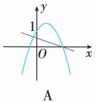
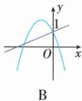
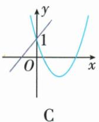
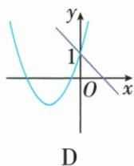

## 讲解

### 判据

直线与抛物线式含同一个a，不能把两图的a当两独立参数；各图方向与公共常数项给共同条件。

### 流程

1. 原直线y=ax+1，a是斜率；抛物线y=ax²+bx+1，a是二次系数。
2. 两者都x=0时纵1，任何一图不交(0,1)立即排，原A因此错。
3. 直线升降给a正负，抛物线上下开也给a正负，若相反则不可能，排B、D。
4. C两图同截1且直线升、抛物线上开，a正一致，可成立。
5. 不从题未共享的b乱加直线条件；先排必然矛盾，不把一处符合当所有图必然存在。

## 例题

### 同一参数的直线和抛物线共存

> 来源ID Q14-16；第14章二次函数；151-200/full.md 第1185–1203行。原答案与解析定位：151-200/full.md 第1205–1211行。

例6 在同一直角坐标系中, 直线 $y = ax + 1$ 与二次函数 $y = ax^{2} + bx + 1$ 的图象可能是 ( )

**原资料答案与解析：**

解析 A. 一次函数图象与 y 轴的交点不是 $(0,1)$ ，故 A 选项错误，不符合题意；

B. 根据二次函数的图象知 a<0，但是根据一次函数的图象知 a>0，故 B 选项错误，不符合题意；  
C. 根据图象知两个函数图象与 y 轴的交点坐标为 $(0,1)$ ，且 a>0，故 C 选项正确；  
D. 根据一次函数的图象知 a<0，但是根据二次函数的图象知 a>0，故 D 选项错误，不符合题意.

答案 C

**展开解析（依据原详解补足理由与步骤）：**

两式纵截距均1，先看是否都过(0,1)，然后同一参数a既是直线斜率又是抛物线二次系数。A直线不交纵轴1，错。B抛物线下开要求a负而直线升要求a正，冲突。C两图同过(0,1)，上开且直线上升均a正，可共存。D直线下降a负、抛物线上开a正，冲突。选C；b未被这两条件锁死，不因顶点横位置不同随意否定C。

## 易错

同一参数必须同符号，不能说B“直线a正抛物线a负各自都合理”就收；两个函数同纵截距也不可漏。
