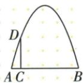
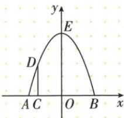

## 讲解

### 判据

门洞给宽与某处竖高，先选地面中点为O简化根，再把从端点距离换成相对O横，不能把竹竿当最高点。

### 流程

1. 地面AB中点O作原点，AB为x轴、向上y轴。
2. 宽8给根−4与4，AC1给C横−3；竖竿4给D(−3,4)。
3. 设a(x+4)(x−4)，代D给4=−7a、a=−4/7，a负上方拱下开。
4. 顶部在轴x0，代式得64/7；由于地面是y0，此纵恰实际高。
5. 核地面两根与竿点，其他建系也须最终换成地面到顶实际距离，不答任意坐标纵。

## 例题

### 门洞取中心地面建系用竹竿点定式

> 来源ID Q14-31；第14章二次函数；151-200/full.md 第1580–1582行。原答案与解析定位：151-200/full.md 第1584–1597行。

例如图所示,某建筑物有一抛物线形的门洞,小强想知道该门洞的高度,他先测出门洞的宽度AB=8 m,然后用一根长为4 m的小竹竿CD竖直地接触地面和门洞的内壁,并测得AC=1 m,则门洞高为\_\_\_\_m.

**原资料答案与解析：**

解析 根据题意建立如图所示的坐标系,由题意得抛物线的解析式为 $y=-\frac{4}{7}(x+4)(x-4)$ , 令 x=0, 得 $y=\frac{64}{7}$ , ∴ $OE=\frac{64}{7}m$ .

答案 $\frac{64}{7}$

**展开解析（依据原详解补足理由与步骤）：**

取地面AB中点O为原点，AB为x轴、向上y轴。宽8给A(−4,0)、B(4,0)；AC1说明竹竿脚C横−3，竿长4给D(−3,4)。设y=a(x+4)(x−4)，代D：4=a×1×(−7)=−7a，a=−4/7。于是y=−(4/7)(x²−16)=−4x²/7+64/7，对称轴0，最高在O上方x0，门洞高64/7米。竹竿4是离中心3米处高度，不是顶高；坐标原点换法可不同但实际高须同。

## 易错

原竿4只是距中心3处高；从左端1米不是横1，中心坐标应−3。
