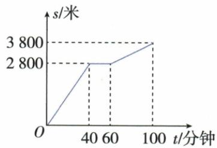
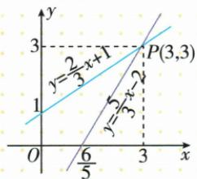
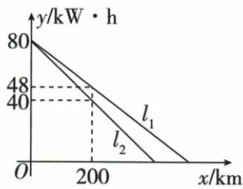

## 讲解

### 是什么

列表把选定输入与输出成对列出；解析式给按输入计算输出的规则；图象收集全部允许对应点(x,y)。三者说明同一对应的不同方面。表中一项、图上一点必须横输入纵输出，单位分别对应各轴。

### 怎么来的

列表保所列读数，通常没有未列时刻的信息；解析式在规定范围可直接求任何合法输入；图象直观看增减、转折、相等或范围，但未标点的示意读数可能近似。原爬山图给端点与匀速线段才允许差量计算，不能凭粗图量任意坐标就当精确。点(a,b)在图上意味着a合法且代规则得到b；代值相等但a不在原定义域仍不能收。

### 什么时候能用

描点后是否连线由允许范围和规则决定。时间连续、规则在段内连续可按规律连；礼盒、排号为整数，只取离散点，小数位置不表示真实件数或排。有限观测值并不能唯一决定所有未观测值，资料所说气温通常用表图而不能给解析式，应理解为“未有已定简单规则”，不是逻辑上绝不可能建立近似模型。

## 例题

### 登山图分辨累计路程与休息时间

> 来源ID Q13-08；第13章一次函数；101-150/full.md 第3579–3597行。原答案与解析定位：101-150/full.md 第3599–3605行。

例3 今年“五一”节,小明外出爬山,他从山脚爬到山顶的过程中,中途休息了一段时间.设他从山脚出发后所用时间为 t 分钟,所走的路程为 s 米,s 与 t 之间的函数关系如图所示.下列说法错误的是 ( )

A. 小明中途休息用了 20 分钟  
B. 小明休息前爬山的平均速度为每分钟 70 米  
C. 小明在上述过程中所走的路程为 6600 米

D. 小明休息前爬山的平均速度大于休息后爬山的平均速度

**原资料答案与解析：**

解析 从题图可看出小明中途休息了 60-40=20(分钟)，所以 A 选项说法正确；

小明休息前爬山的平均速度为 $\frac{2\ 800}{40}=70$ （米/分钟），休息后爬山的平均速度为 $\frac{3\ 800-2\ 800}{100-60}=25$ （米/分钟），所以小明休息前爬山的平均速度大于休息后爬山的平均速度，B、D选项说法正确；

从题图看出小明所走的总路程为 3800 米, 所以 C 选项说法错误, 故选 C.

答案 C

**展开解析（依据原详解补足理由与步骤）：**

核原图关键点(0,0)、(40,2800)、(60,2800)、(100,3800)，时间单位分钟、累计路程单位米。40至60分累计路程不变，休息60−40=20分，A对。前40分平均爬山速度2800/40=70米/分；后段60至100分只走3800−2800=1000米，用40分，速度25米/分，故前段快且前速70，B对。最后累计路程读3800米，不是把2800与3800相加成6600米，C错。70>25说明休息前平均速度大于休息后，D对。选C；分段斜率看“累计路程差/时间差”，不用末累计路程直接除该段时间。

### 两点代入消元确定一次式

> 来源ID Q13-19；第13章一次函数；101-150/full.md 第3907–3907行。原答案与解析定位：101-150/full.md 第3909–3911行。

例3 已知 y 是 x 的一次函数, 当 x = -2 时, y = -3; 当 x = 1 时, y = 3. 求这个一次函数的解析式.

**原资料答案与解析：**

解析 设这个一次函数的解析式为 $y=kx+b(k\neq0)$ .

由题意得 $\left\{\begin{aligned}-2k+b&=-3,\\ k+b&=3,\end{aligned}\right.$ 解得 $\left\{\begin{aligned}k&=2,\\ b&=1,\end{aligned}\right.$ ∴ 这个一次函数的解析式为 $y = 2x + 1$ .

**展开解析（依据原详解补足理由与步骤）：**

设y=kx+b，把(−2,−3)、(1,3)依次代入，−2k+b=−3、k+b=3。第二式减第一式，3k=6，k=2；代k+b=3得b=1，因此y=2x+1。回代第一点−4+1=−3，第二点2+1=3均符；横坐标不同保证可消出唯一k。

### 两函数公共交点就是二元组解

> 来源ID Q13-32；第13章一次函数；151-200/full.md 第98–99行。原答案与解析定位：151-200/full.md 第101–116行。

例2 利用作图的方法解方程
组 $\left\{\begin{aligned}&2x-3y+3=0,\\ &5x-3y-6=0.\end{aligned}\right.$

**原资料答案与解析：**

解析 由 $2x - 3y + 3 = 0$ 得 $y = \frac{2}{3} x + 1$ . 由 $5x - 3y - 6 = 0$ 得 $y = \frac{5}{3} x - 2$ . 在同一直角坐标系中作出直线 $y = \frac{2}{3} x + 1$ 和 $y = \frac{5}{3} x - 2$ , 如图所示, 得交点 $P$ 的坐标为 (3,3).

所以方程组 $\left\{\begin{aligned}&2x-3y+3=0,\\ &5x-3y-6=0\end{aligned}\right.$ 的解为 $\left\{\begin{aligned}x=3,\\ y=3.\end{aligned}\right.$

**展开解析（依据原详解补足理由与步骤）：**

将原方程各化为y=(2/3)x+1、y=(5/3)x−2，图真实标P(3,3)，故候选(x,y)=(3,3)。验证第一式2+1=3，第二式5−2=3，两者同时成立。也可将两右端相等：2x/3+1=5x/3−2，减2x/3加2得3=x，回代y=3。自动图描述表中的其他伪读数不采用。交点横是x纵是y，不将(3,3)说成两个独立x根。

### 电量读初值及耗电斜率再同程相减

> 来源ID Q13-44；第13章一次函数；151-200/full.md 第591–606行。原答案与解析定位：151-200/full.md 第562–564行。

例2 (2024 山东济南) 某公司生产了 $A, B$ 两款新能源电动汽车. 如图, $l_{1}, l_{2}$ 分别表示 $A$ 款, $B$ 款新能源电动汽车充满电后电池的剩余电量 $y(\mathrm{kW} \cdot \mathrm{h})$ 与汽车行驶路程 $x(\mathrm{km})$ 的关系. 当两款新能源电动汽车的行驶路程都是 $300 \mathrm{~km}$ 时, $A$ 款新能源电动汽车电池的剩余电量比 $B$ 款新能源电动汽车电池的剩余电量多 $\mathrm{kW} \cdot \mathrm{h}$ .

**原资料答案与解析：**

例2 解析 由图象可知, $l_{1}$ 的解析式为 $y_{1}=80-0.16x$ , $l_{2}$ 的解析式为 $y_{2}=80-0.2x$ . 当 x=300 时, $y_{1}=32$ , $y_{2}=20$ , $32-20=12(kW\cdot h)$ , ∴当两款新能源电动汽车的行驶路程都是 300 km 时, A 款新能源电动汽车电池的剩余电量比 B 款新能源电动汽车电池的剩余电量多 12 kW·h.

答案 12

**展开解析（依据原详解补足理由与步骤）：**

两车初电量80千瓦时，图在200千米处A剩48、B剩40。A每千米变化(48−80)/200=−0.16千瓦时，yA=80−0.16x；B为(40−80)/200=−0.2，yB=80−0.2x。300千米处A剩80−48=32、B剩80−60=20，相差12千瓦时，填12。差也可(−0.16+0.2)×300=0.04×300=12。初值都80在差中抵消。只在原图匀速耗电模型及电量非负允许路程用，不将线无限外延负电量。

## 易错

不采用OCR附带自动图表覆盖真实图片，如车辆图额外伪读数。画一次函数有解析式时两不同点定直线；没有既定规则的一般观测图不能仅靠两点断言线性。
