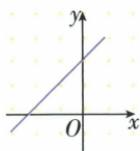
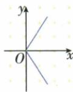
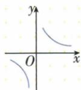
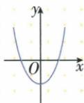
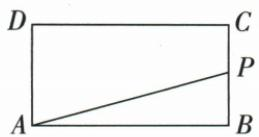
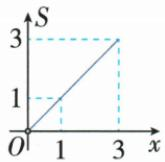
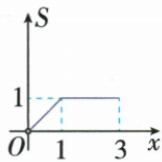
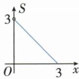
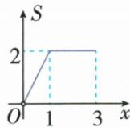

## 讲解

### 是什么

规定x的允许范围和对应规则；对其中每个确定x，y恰有一个确定值，称y是x的函数，x为自变量。关键方向是“给x定y”。不同x可给相同y，y在一段保持不变也可以是函数；函数不要求每次x改变y都改变。

### 怎么来的

函数使输入能够唯一确定结果，才可问某x时值是多少。原y²=2x只定平方，在正x处有正负两个结果，不额外指定分支就不能定y；而|x|对正负输入均给唯一非负数，成立。图上竖直线固定横坐标，交两点表示同x两y；水平线交多点只是多x同y，不违背定义。原动点面积平台给多个路程同面积，仍是同一个函数的组成段。常值也为函数，核查见[清华大学出版社教材预览](https://www.tup.tsinghua.edu.cn/upload/books/yz/092594-01.pdf)的常函数说明；这里仅用输入输出唯一性，不引入拓展运算。

### 什么时候能用

必须在允许输入中检查，不要求范围外如分母零的x有输出。关系反向可能失去唯一性，不能从“y是x的函数”直接换成“x是y的函数”。有图断成几支不自动失败，要看同一允许x是否落多点。若题指定正根分支可改变原关系的性质，但不能自行增添原未给条件。

## 例题

### 竖直截线检验四图函数唯一性

> 来源ID Q13-02；第13章一次函数；101-150/full.md 第3424–3436行。原答案与解析定位：101-150/full.md 第3438–3438行。

例2 下列不能表示 y 是 x 的函数的是 ( )

  
A

  
B

  
C

  
D

**原资料答案与解析：**

答案 B

**展开解析（依据原详解补足理由与步骤）：**

对每个允许的横坐标x，沿竖直线找图上纵坐标。A直线每个x仅一个y；B向右张开的折线，在一些正x处上下两点，给同一x两个不同y，因此B不能表示y是x的函数。C虽分左右两支，但每个非零x只落所属一支得到一个y，x=0不是其允许输入；D抛物线同一x只有一个y，左右不同x可同y，不影响函数唯一性。选择B。不能要求整图连成一支，也不能反过来要求每个y只对应一个x。

### 四种对应关系逐一检验函数

> 来源ID Q13-06；第13章一次函数；101-150/full.md 第3540–3548行。原答案与解析定位：101-150/full.md 第3550–3552行。

例1 关于变量 x, y 有如下关系: ①x - y = 5; ② $y^{2} = 2x$ ; ③y = |x|; ④ $y = \frac{3}{x}$ . 其中 y 是 x 的函数的是 ( )

A.①②③

B.①②③④

C.①③

D.①③④

**原资料答案与解析：**

解析 对于①x-y=5, ③y=|x|, ④ $y=\frac{3}{x}$ , 根据函数的定义可知, 满足对于 x 的每一个取值, y 都有唯一确定的值与之对应, 据此可确定它们都是函数. 在 $y^{2}=2x$ 中, 当 x=1 时, $y=\pm\sqrt{2}$ , 即 x 取一个值, y 有两个值与之对应, 故② $y^{2}=2x$ 不是函数.

答案D

**展开解析（依据原详解补足理由与步骤）：**

①x−y=5，两边加y再减5得y=x−5，每个实数x唯一y，成立。②y²=2x在x>0时y=√(2x)或−√(2x)，同一x给两个y，不成立；不能只擅取正根。③y=|x|，每x的绝对值唯一，负、正输入可同输出，不妨碍函数，成立。④y=3/x，在x≠0的允许范围各x给唯一y，成立；不需强令x=0有值。故①③④，选D；A、B含②错误，C遗漏④。

### 矩形沿边运动面积先增后恒定

> 来源ID Q13-10；第13章一次函数；101-150/full.md 第3644–3658行。原答案与解析定位：101-150/full.md 第3660–3662行。

例5 如图,在长方形 ABCD 中,AB=2,BC=1,动点 P 从点 B 出发,沿路线 $B \rightarrow C \rightarrow D$ 做匀速运动,那么 $\triangle ABP$ 的面积 S 与点 P 运动的路程 x 之间的函数图象大致是 ( )

  
A

  
B

  
C

  
D

**原资料答案与解析：**

解析 当点 $P$ 在 $BC$ 上(不包含点 $B$ 、点 $C$ ) 时, $\triangle PAB$ 的面积 $S = \frac{1}{2} AB \cdot PB$ , 即 $S = \frac{1}{2} \times 2x = x$ , 此时 $0 < x < 1$ . 当点 $P$ 在 $CD$ 上时, $\triangle PAB$ 的面积 $S = \frac{1}{2} AB \cdot BC = \frac{1}{2} \times 2 \times 1 = 1$ , 面积是定值, 此时 $1 \leqslant x \leqslant 3$ . 故选 B.

答案B

**展开解析（依据原详解补足理由与步骤）：**

AB=2、BC=1，P从B沿BC、CD到D，路程x从0到3。BC段BP=x、BP⊥AB，△ABP面积=(1/2)×2×x=x，0≤x≤1；B处三点退化，面积延拓为0。CD段P到直线AB距离始终1，面积=(1/2)×2×1=1，1≤x≤3，两段x=1都给1。所以先升至(1,1)再水平至(3,1)，B对。A始终升错在CD高不变；C从高处下降不符起点面积0；D转折或平台高度2把底高积漏除2。原只讨论非退化三角形时可不称起点为三角形，但面积图的起点取0不改变后段。

## 易错

原B横向张开的两支同x上下两y，失败；双曲线左右分支因x正负区间不重叠可成立。y²=2x不能只取正值，y=|x|不能因不同x同y而否定。
