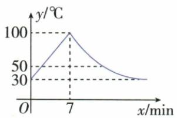

## 讲解

### 是什么

一个函数可在不同输入区间采用不同规则。每条式必须连同区间读，区间覆盖原过程且同一输入仍只给一个输出。动点过拐角、容器截面换层、行程休息开始结束，常是换式界限；变化对象未必每段都增减。

$$
S=\begin{cases}x,&0\le x\le1,\\1,&1<x\le3.\end{cases}
$$

### 怎么来的

原矩形P走BC时高BP随x增长，CD时到底AB的垂距固定，故面积先x后1。正方形P走CB再BA，面积先2后4−x，界限是第一边长度2，不是图中点名或总路程的一半猜测。代界限验证两式同值，说明物体连续移动时面积未跳。正方形P≠A排总路程4，即使后式算得0也不能实收终点。

### 什么时候能用

区间来自题定方向、速度、边长、收费档，不能把题未给的阶段添入。恒速移动不意味着面积恒速，面积由底高决定；水位恒速则还要该层可用截面积恒定。分段函数只是一个函数的分段定义，不能因式不同误认为同x多输出。

### 本章补充：重复程序要用本轮时间

饮水机单周期结束后立即重启，局部时间u重新从0计。若全程t已有n个完整周期L=70/3，则本轮u=t−nL，升温段使用10u+30，冷却段使用700/u。这不是把下一轮全程时间继续代旧700/t；后者会一直降而不能重启。交接点u=7两式均100，周期接点上一轮u=L与下一轮u=0都30，所以温度没有由分段记号凭空跳变。50的严格阈值还必须排u=2、14两个等号点，详见本章原例题。

## 例题

### 匀速注水从面积变化匹配容器

> 来源ID Q13-09；第13章一次函数；101-150/full.md 第3611–3634行。原答案与解析定位：101-150/full.md 第3636–3638行。

例4 均匀地向一个容器内注水,在注满水的过程中,水面的高度 h 与时间 t 之间的函数关系如图所示,则该容器可能是 ( )

  
A

  
B

  
C

  
D

**原资料答案与解析：**

解析 当高度与时间的函数图象是直线时, 直线的倾斜程度体现了高度变化的速度, 直线越缓, 说明高度变化的速度越慢; 直线越陡, 说明高度变化的速度越快. 由题图可以看出, 前一个阶段用时较少, 高度增加较快, 结合选项可知选 D.

答案 D

**展开解析（依据原详解补足理由与步骤）：**

匀速注水指相同时间进入相同体积，不意味着高度等速。截面积A固定的一层，新增体积=A×高度增量，所以高度增量=新增体积/A，截面越小水位上升越快。题图先较陡、后较缓且各段近直线，要求下部小恒截面、上部大恒截面，D符合。A等截面圆柱应一路同斜率；B下大上小应先缓后陡；C腰部渐变，截面随高度连续改变，不能形成题示两个恒速区段。不能根据容器总高度猜形状。

### 矩形沿边运动面积先增后恒定

> 来源ID Q13-10；第13章一次函数；101-150/full.md 第3644–3658行。原答案与解析定位：101-150/full.md 第3660–3662行。

例5 如图,在长方形 ABCD 中,AB=2,BC=1,动点 P 从点 B 出发,沿路线 $B \rightarrow C \rightarrow D$ 做匀速运动,那么 $\triangle ABP$ 的面积 S 与点 P 运动的路程 x 之间的函数图象大致是 ( )

  
A

  
B

  
C

  
D

**原资料答案与解析：**

解析 当点 $P$ 在 $BC$ 上(不包含点 $B$ 、点 $C$ ) 时, $\triangle PAB$ 的面积 $S = \frac{1}{2} AB \cdot PB$ , 即 $S = \frac{1}{2} \times 2x = x$ , 此时 $0 < x < 1$ . 当点 $P$ 在 $CD$ 上时, $\triangle PAB$ 的面积 $S = \frac{1}{2} AB \cdot BC = \frac{1}{2} \times 2 \times 1 = 1$ , 面积是定值, 此时 $1 \leqslant x \leqslant 3$ . 故选 B.

答案B

**展开解析（依据原详解补足理由与步骤）：**

AB=2、BC=1，P从B沿BC、CD到D，路程x从0到3。BC段BP=x、BP⊥AB，△ABP面积=(1/2)×2×x=x，0≤x≤1；B处三点退化，面积延拓为0。CD段P到直线AB距离始终1，面积=(1/2)×2×1=1，1≤x≤3，两段x=1都给1。所以先升至(1,1)再水平至(3,1)，B对。A始终升错在CD高不变；C从高处下降不符起点面积0；D转折或平台高度2把底高积漏除2。原只讨论非退化三角形时可不称起点为三角形，但面积图的起点取0不改变后段。

### 叠放圆柱注水按可用水面面积分三段

> 来源ID Q13-14；第13章一次函数；101-150/full.md 第3710–3724行。原答案与解析定位：101-150/full.md 第3740–3742行。

例4（2024 湖北武汉）如图，一个圆柱体水槽底部叠放两个底面半径不等的实心圆柱体，向水槽匀速注水。下列图象能大致反映水槽中水的深度 h 与注水时间 t 的函数关系的是（）

  
A

  
B

  
C

  
D

**原资料答案与解析：**

例4 解析 下层实心圆柱底面半径大,最初水面上升快,上层实心圆柱底面半径稍小,所以水没过下层圆柱后水面上升变慢,水没过上层圆柱后,水面上升更慢,所以对应图象是第一段比较陡,第二段比第一段缓,第三段比第二段缓.

答案 D

**展开解析（依据原详解补足理由与步骤）：**

缸内下方大圆柱、上方小圆柱固定放置。水未淹大柱时可容水的水平截面积=缸面积−大柱面积；越过大柱顶仍未淹小柱时=缸面积−小柱面积；超过全部柱时=缸面积。三者逐次增大，等流量下水位速度逐次减小，图应连续、三段由陡到缓，D对。A越往后越陡，顺序反；B后段又陡，未体现截面积继续增；C中段比前段更陡，也反。分段界限来自两柱顶高度，不是随意把时间平分三段。

### 正方形沿边运动面积与开放端点

> 来源ID Q13-42；第13章一次函数；151-200/full.md 第485–509行。原答案与解析定位：151-200/full.md 第511–513行。

例4 如图, 正方形 ABCD 的边长为 2 , 动点 P 从 C 出发, 在正方形的边上沿着 $C \rightarrow B \rightarrow A$ 的方向运动 (点 P 与 A 不重合). 设点 P 的运动路程为 x, $\triangle ADP$ 的面积为 y, 则下列图象中能表示 y 关于 x 的函数关系的是 ()

  
A

  
B

  
C

  
D

**原资料答案与解析：**

解析 当 $P$ 在 $BC$ 上时, $\triangle ADP$ 的面积 $y = \frac{1}{2} AD \cdot CD = 2$ , 面积是定值, 此时 $0 \leqslant x \leqslant 2$ . 当 $P$ 在 $AB$ 上 (点 $P$ 不与点 $A$ 、点 $B$ 重合) 时, $\triangle ADP$ 的面积 $y = \frac{1}{2} AD \cdot AP = 4 - x$ , $y$ 随 $x$ 的增大而减小, 此时 $2 < x < 4$ . 据此可知选项 C 能反映这一变化过程.

答案 C

**展开解析（依据原详解补足理由与步骤）：**

正方形边2，P从C经B到A，P≠A，路程0≤x<4。底AD=2，CB段P到AD垂距恒2，所以面积y=(1/2)×2×2=2，0≤x≤2。BA段走出CB的2后，余BA距离2−(x−2)=4−x，它是高，面积=(1/2)×2×(4−x)=4−x，所以2≤x<4时y=4−x。两式在x=2都给2，连接无跳；x=4对应A，题排除，(4,0)应空心。图C正确。A初段从0增，不符C到AD已有2；B把终点实心收A；D折点不在走完边长2的位置。

### 周期饮水机局部时间与严格高于温度的端点

> 来源ID Q15-22；第15章反比例函数；151-200/full.md 第2439–2455行。原答案与解析定位：151-200/full.md 第2457–2465行。

例3 教室里的饮水机接通电源就进入自动程序,开机加热时每分钟上升10℃,加热到100℃停止加热,水温开始下降,此时水温 $y(\mathrm{C})$ 与开机后用时 $x(\mathrm{min})$ 成反比例关系,直至水温降至30℃,饮水机关机,饮水机关机后即刻自动开机,重复上述自动程序.若在水温为30℃时接通电源,水温 $y(\mathrm{C})$ 与时间 $x(\mathrm{min})$ 的关系如图所示.

(1) 分别写出水温上升和下降阶段 y 与 x 之间的函数关系式.  
(2)怡萱同学想接高于50℃的热水,请问她最多需要等待多长时间?

**原资料答案与解析：**

解析（1）观察图象，可知当 $x = 7$ 时， $y = 100$ 。当 $0 \leqslant x \leqslant 7$ 时，设 $y$ 关于 $x$ 的函数关系式为 $y = kx + b (k \neq 0)$ ，则 $\left\{ \begin{array}{l} b = 30, \\ 7k + b = 100, \end{array} \right.$ 解得 $k = 10$ ，故当 $0 \leqslant x \leqslant 7$ 时， $y$ 关于 $x$ 的函数关系式为 $y = 10x + 30$ .

当 $x \geqslant 7$ 时，设 $y = \frac{a}{x} (a \neq 0)$ ，由题图知 $100 = \frac{a}{7}$ ，解得 $a = 700$ ，故当 $x \geqslant 7$ 时， $y$ 关于 $x$ 的函数关系式为 $y = \frac{700}{x}$ ，当 $y = 30$ 时， $x = \frac{70}{3}$ .

$\therefore y$ 与 $x$ 之间的函数关系式为 $y = \left\{ \begin{array}{l}10x + 30(0\leqslant x\leqslant 7),\\ \frac{700}{x}\left(7 <   x\leqslant \frac{70}{3}\right). \end{array} \right.$

(2) 将 $y = 50$ 代入 $y = 10x + 30$ , 得 $x = 2$ , 将 $y = 50$ 代入 $y = \frac{700}{x}$ , 得 $x = 14$ .

$\because\frac{70}{3}-14+2=\frac{34}{3}(\min),\therefore$ 怡萱同学想接高于50℃的热水,她最多需要等待 $\frac{34}{3}$ min.

**展开解析（依据原详解补足理由与步骤）：**

（1）把每次开机起算的时间记为$u$分钟，水温记为$y$℃。初温30℃，每分钟升10℃，所以升温式为$y=10u+30$。令$y=100$，得$10u+30=100$；减30、除10，得到$u=7$，升温范围为$0\le u\le7$。

冷却按题给条件写$y=a/u$，本轮开机7分钟时温度100℃，代入得$100=a/7$，两边乘7，$a=700$，因此$y=700/u$。冷却到30℃时，$700/u=30$；乘正数$u$得$700=30u$，再除30，$u=70/3$。单周期长度为$L=70/3$分钟，冷却式只用于$7<u\le70/3$；下一轮从30℃重新开机，局部时间重置为0。

（2）升温到50℃：$10u+30=50$，减30得$10u=20$，除10得$u=2$。冷却到50℃：$700/u=50$，乘$u$得$700=50u$，除50得$u=14$。本轮严格高于50℃的时段为$2<u<14$。

从本轮$u=14$到下一轮$u=2$的临界低温间隔，长度为$L-14+2=70/3-14+2=34/3$分钟。原答案给$34/3$分钟并称“最多需要等待”，但要核对严格条件：恰在本轮$u=14$到达，等$34/3$分钟后恰到下一轮$u=2$，水温仍为50℃，尚不满足“高于50℃”。

在连续理想模型中，还需再等任意小正时间才能合格；对此临界到达情形，不存在可取得的最早严格高温时刻。因此$34/3$是跨越低温段的临界长度，若允许取50℃才是可达到的最大等待；不能断言按原严格条件恰等$34/3$分钟即可。以上为原答案的端点勘误，原题、原答案和原详解均保留，未改变题目措辞。

## 易错

路程x是已走总长，第二边上的已走量为x−第一边长，不能直接把x当该边距离。空心终点由允许范围决定，非因为输出0就自动排。
