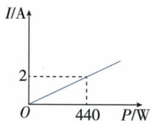
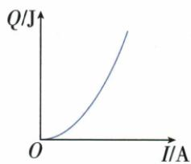

## 讲解

### 是什么

直线段中每单位x变化对应的y变化，可用两点纵差除横差表示：k=(y₂−y₁)/(x₂−x₁)，横差非零。k正为右升、负为右降、0为水平；含单位时k单位是纵单位/横单位。累计路程对时间的斜率表示该段平均速度，剩电对路程斜率表示每千米剩电变化。

$$
k=\frac{y_2-y_1}{x_2-x_1}\quad(x_2\ne x_1)
$$

### 怎么来的

同一段从第一点到第二点经历的是横坐标差，而非第二个横数；输出实际增的是纵差，而非末纵数。原登山后段从60到100分钟、累计从2800到3800米，因此每分(3800−2800)/(100−60)=25。剩电从80到48经过200千米，k=(48−80)/200为负，耗电量率则取其相反正数。直线的各小段同一增量比，曲线则不能由“递增”推出固定比。

### 什么时候能用

只在原明确直线或恒率段内使用一个恒定斜率。横纵单位或图轴刻度变了，视觉陡缓不可直接跨图比较数值；比较同图同尺度可判变化快慢。平台仅代表所画量不变，不一定对象停止，如动点移动时面积可恒定。

## 例题

### 登山图分辨累计路程与休息时间

> 来源ID Q13-08；第13章一次函数；101-150/full.md 第3579–3597行。原答案与解析定位：101-150/full.md 第3599–3605行。

例3 今年“五一”节,小明外出爬山,他从山脚爬到山顶的过程中,中途休息了一段时间.设他从山脚出发后所用时间为 t 分钟,所走的路程为 s 米,s 与 t 之间的函数关系如图所示.下列说法错误的是 ( )

A. 小明中途休息用了 20 分钟  
B. 小明休息前爬山的平均速度为每分钟 70 米  
C. 小明在上述过程中所走的路程为 6600 米

D. 小明休息前爬山的平均速度大于休息后爬山的平均速度

**原资料答案与解析：**

解析 从题图可看出小明中途休息了 60-40=20(分钟)，所以 A 选项说法正确；

小明休息前爬山的平均速度为 $\frac{2\ 800}{40}=70$ （米/分钟），休息后爬山的平均速度为 $\frac{3\ 800-2\ 800}{100-60}=25$ （米/分钟），所以小明休息前爬山的平均速度大于休息后爬山的平均速度，B、D选项说法正确；

从题图看出小明所走的总路程为 3800 米, 所以 C 选项说法错误, 故选 C.

答案 C

**展开解析（依据原详解补足理由与步骤）：**

核原图关键点(0,0)、(40,2800)、(60,2800)、(100,3800)，时间单位分钟、累计路程单位米。40至60分累计路程不变，休息60−40=20分，A对。前40分平均爬山速度2800/40=70米/分；后段60至100分只走3800−2800=1000米，用40分，速度25米/分，故前段快且前速70，B对。最后累计路程读3800米，不是把2800与3800相加成6600米，C错。70>25说明休息前平均速度大于休息后，D对。选C；分段斜率看“累计路程差/时间差”，不用末累计路程直接除该段时间。

### 电热图不把递增误认等差增加

> 来源ID Q13-15；第13章一次函数；101-150/full.md 第3766–3805行。原答案与解析定位：101-150/full.md 第3744–3746行。

例5 (2024 河南) 把多个用电器连接在同一个插线板上, 同时使用一段时间后, 插线板的电源线会明显发热, 存在安全隐患. 数学兴趣小组对这种现象进行研究, 得到时长一定时, 插线板电源线中的电流 $I$ 与使用电器的总功率 $P$ 的函数图象 (如图 1), 插线板电源线产生的热量 $Q$ 与 $I$ 的函数图象 (如图 2). 下列结论中错误的是 ( )

图1

图 2

A. 当 P=440 W 时, I=2 A  
B.Q 随 I 的增大而增大  
C. $I$ 每增加 $1 \mathrm{~A}, Q$ 的增加量相同  
D.P 越大,插线板电源线产生的热量 Q 越多

**原资料答案与解析：**

例5 解析 由题图1可知A中结论正确;由题图2可知B中结论正确;由题图2可知图象是曲线,故I每增加1A,Q的增加量不相同,故C中结论错误;由题图1知P越大,I越大,由题图2知I越大,Q越大,故D中结论正确.

答案 C

**展开解析（依据原详解补足理由与步骤）：**

原I−P图为过原点直线，标注P=440瓦对应I=2安，所以A正确。原Q−I图向右升，电流增则热量增，B正确；但该曲线越来越陡，相同电流增量对应热量增量并不相同，C错误。沿P增使I增、I增使Q增两层对应，知功率增时热量增，D正确。选C。差相同需要恒定斜率，仅递增不够；不从未标刻度曲线猜热量数。

### 电量读初值及耗电斜率再同程相减

> 来源ID Q13-44；第13章一次函数；151-200/full.md 第591–606行。原答案与解析定位：151-200/full.md 第562–564行。

例2 (2024 山东济南) 某公司生产了 $A, B$ 两款新能源电动汽车. 如图, $l_{1}, l_{2}$ 分别表示 $A$ 款, $B$ 款新能源电动汽车充满电后电池的剩余电量 $y(\mathrm{kW} \cdot \mathrm{h})$ 与汽车行驶路程 $x(\mathrm{km})$ 的关系. 当两款新能源电动汽车的行驶路程都是 $300 \mathrm{~km}$ 时, $A$ 款新能源电动汽车电池的剩余电量比 $B$ 款新能源电动汽车电池的剩余电量多 $\mathrm{kW} \cdot \mathrm{h}$ .

**原资料答案与解析：**

例2 解析 由图象可知, $l_{1}$ 的解析式为 $y_{1}=80-0.16x$ , $l_{2}$ 的解析式为 $y_{2}=80-0.2x$ . 当 x=300 时, $y_{1}=32$ , $y_{2}=20$ , $32-20=12(kW\cdot h)$ , ∴当两款新能源电动汽车的行驶路程都是 300 km 时, A 款新能源电动汽车电池的剩余电量比 B 款新能源电动汽车电池的剩余电量多 12 kW·h.

答案 12

**展开解析（依据原详解补足理由与步骤）：**

两车初电量80千瓦时，图在200千米处A剩48、B剩40。A每千米变化(48−80)/200=−0.16千瓦时，yA=80−0.16x；B为(40−80)/200=−0.2，yB=80−0.2x。300千米处A剩80−48=32、B剩80−60=20，相差12千瓦时，填12。差也可(−0.16+0.2)×300=0.04×300=12。初值都80在差中抵消。只在原图匀速耗电模型及电量非负允许路程用，不将线无限外延负电量。

## 易错

原电热曲线上升且越来越陡，电流等增量并非热量等增量；登山用末3800除后段40会把前段路程重复计入。
